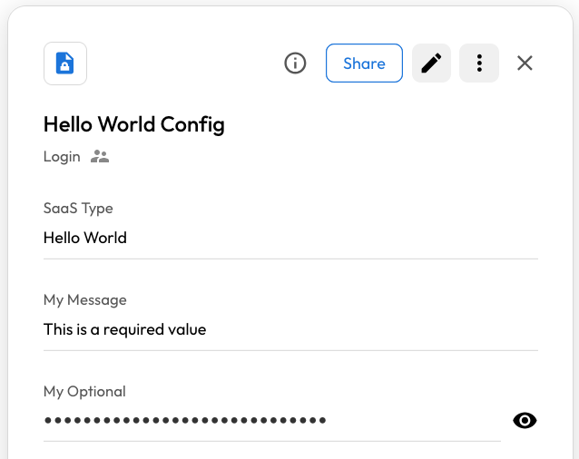
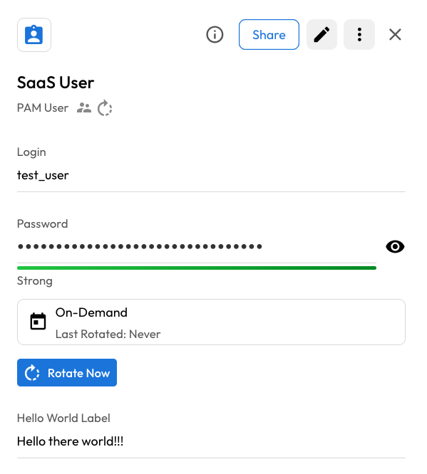

# KeeperPAM SaaS Rotation Plugin Development Environment

This is the development environment to build and test plugins for
KeeperPAM automated credential rotations.

## Documentation

See: [KeeperPAM SaaS Rotation Plugin Documentation](https://docs.keeper.io/en/keeperpam/privileged-access-manager/password-rotation/rotation-use-cases/saas-plugins)

## Setup

Currently, the setup guide is focused on Linux and macOS. 

### Get the Development Environment

It is assumed that Python 3.8, or greater, has been installed on your system.
The setup will create a Python virtual environment that needs to be activated before
  working on the plugin.

```shell
python -m venv venv
. ./venv/bin/activate
pip install --upgrade pip
git clone git@github.com:Keeper-Security/discovery-and-rotation-saas-dev.git
cd discovery-and-rotation-saas-dev
pip install .
cd ..
```

### Plugin Structure

#### Work Directory

Create a directory in your preferred location. 
The directory needs to be named the same as your plugin.
In the example below, the touch will create an empty `my_plugin.py` file.
This is where the Python plugin will be created and edited.

```shell
mkdir my_plugin
cd my_plugin
touch my_plugin.py
```

Next you need a Keeper Secrets Manager configuration.

* Have, or create, an Application using the Vault's Secret Manager. 
  The Application being used for a Gateway will work.
* Remember a Shared Folder UID using in the Application. 
  Click on the folder, and then click on the **ⓘ**, and then click on the **UID** value.
* For the Application, add a new device on the Devices tab. 
  For the Method, select Configuration File and JSON, and then click the Download button.
  This will download `config.json`. 
* Moved `config.json` to your work directory, or you can specify the path using 
  `--config` for the commands.

```shell
cp /path/to/downloaded/config.json .
```

#### Unit Test

Tests are required.
There is a minimum limit of 70% coverage.
Any unit test in the work directory will be run when a PR is created.

If special modules are needed for testing. They can be included in `requirements_test.txt`.

#### Project Structure

The final structure should look like this.

```script
% tree
.
└── my_plugin
    ├── config.json
    ├── my_plugin_test.py
    ├── my_plugin.py
    ├── README.md
    └── requirements_test.txt
```
The `config.json` is in the `.gitignore`. 
However, if you managed to add it to the repo, the PR validation will fail.

## Test with Hello World

Copy the `hello_world.py` file from the `examples` directory to your work directory. 

```shell
cd /path/to/my_work_dir/hello_world
cp /path/to/discovery-and-rotation-saas-dev/exmaples/hello_world.py .
```

### SaaS Config Record

Currently, the SaaS Config record is a **Login** record with custom fields that are
  used to configure the SaaS rotation.

The command `plugin_test config` is used to make a SaaS Config record in your Vault.
It will prompt you to enter required and optional values.

```shell
(venv) user@machine:~$ plugin_test config --help
Usage: plugin_test config [OPTIONS]

  Create a config file

Options:
  -f, --file TEXT               Plugin python file  [required]
  -s, --shared-folder-uid TEXT  Shared folder UID  [required]
  -t, --title TEXT              SaaS config record tile  [required]
  --config TEXT                 KSM configuration file
  --help                        Show this message and exit.
```
#### Required
* `-f`, `--file` = The Python file
* `-s`, `--shared-folder-uid` = The Shared Folder UID for your Application where 
                               you want to create the SaaS Config record.
* `-t`, `--title` = The title for the SaaS Config record.
#### Optional
*  `--config` = Path to KSM Configuration JSON, if not in the work directory.

Here is an example of the command being run.

```shell
(venv) user@machine:~$ plugin_test config -f hello_world.py -t "Hello World Config" -s XXXX
Required: My Message
This is the message that will be displayed. The field is required.
Enter Value : > This is a required value

Optional: My Optional
This is an optional field, but is secret if it exists
Enter Value  (default: This is a secret): > This is optional, and a secret.

Configuration record UID is YYYY
```
A **record UID** is displayed at the end. This will be needed when using the `plugin_test run`
command.


Here is what the record looks like in the Vault.



### Test the Plugin

The following command wil run the plugin.

```shell
(venv) user@machine:~$ plugin_test run --help
Usage: plugin_test run [OPTIONS]

  Run the plugin

Options:
  -f, --file TEXT               Plugin python file  [required]
  -u, --user-uid TEXT           UID of PAM User record  [required]
  -c, --plugin-config-uid TEXT  UID of plugin config record  [required]
  --configuration-uid TEXT      UID of configuration record
  --fail                        Force run to fail
  --new-password TEXT           New password
  --old-password TEXT           Old password
  --no-old-password             Do not use old password
  --config TEXT                 KSM configuration file
  --help                        Show this message and exit.
                 Show this message and exit.
```
#### Required
* `-f`, `--file` = The Python file
* `-u`, `--user-uid` = The record UID of a PAM User record.
* `-c`, `--plugin-config-uid` = The record UID of the SaaS Config record.
#### Optional
* `--configuration-uid` - If the plugin uses AWS or Azure, the credentials from the
                          configuration record can be supplied to the plugin by setting 
                          this param.
* `--fail` = Force the plugin to fail password rotation.
             This will trigger a rollback of the password change, if plugin supports
             rollback.
* `--new-password` = Manually set the new password.
                     If not set, a random password will be generated.
* `--old-password` = Manually set the old password.
                     If not set, the password on the user record will be used.
* `--no-old-password` = Make the old password blank. 
                        Do not read from user record.
* `--config` = Path to KSM Configuration JSON, if not in the work directory.

Here is an example of the command being run.

```shell
(venv) user@machine:~$ plugin_test run -f hello_world.py -u ZZZZ -c YYYY
2025-04-23 22:41:00,809 kdnrm  INFO: starting rotating of the Hello World user
2025-04-23 22:41:00,809 kdnrm  INFO: rotating the user in Hello World was a success
2025-04-23 22:41:00,809 kdnrm  DEBUG: there were return custom fields
2025-04-23 22:41:00,809 kdnrm  DEBUG: setting the return custom field 'Hello World Label' to value 'Hello there world!!!'
2025-04-23 22:41:00,809 kdnrm  DEBUG: found existing 'Hello World Label' custom field in user record, updating type and value
2025-04-23 22:41:00,809 kdnrm  DEBUG: updating the user record.
Rotation was successful
```
The hello_world.py example sets return values.
These values are added to the PAM User record as custom fields.




# Using the Keeper PAM Gateway

In order to use the plugin with the Gateway, a plugin directory needs to be created.
To tell this Gateway with directory exists the absolute path to the directory needs set on the
  PAM configuration record.
This is done using the custom field `SaaS Plugins Dir`.

Custom fields can be added to a PAM configuration record using 
  the [Commander CLI](https://docs.keeper.io/en/enterprise-guide/commander-cli).
Currently, the Vault can not add custom fields to a PAM configuration.

The Commander CLI command is
```
My Vault> record-update -r <CONFIGURATION RECORD UID> "text.SaaS Plugins Dir=/path/to/dir"
```

If running the Keeper PAM Gateway inside a container, and the plugin directory is outside, you
will need to use `volumes` to map the external directory and internal directory.

In the example below, in the directory that contains the `docker-compose.yml` file, 
  the `outside_saas_plugins` is created.
This is the directory the SaaS plugin Python file can be copied.
This directory will be mounted inside the container at `/inside_saas_plugins`

```dockerfile
services:
  keeper-gateway:
    platform: linux/amd64
    image: keeper/gateway:preview
    shm_size: 2g
    security_opt:
      - "seccomp:docker-seccomp.json"
    restart: always
    volumes:
      - ./outside_saas_plugins:/inside_saas_plugins
    environment:
      ACCEPT_EULA: Y    # KCM Guacd Accept EULA
      GATEWAY_CONFIG: XXXX
```

And then when setting the plugin directory, use the inside directory path.
```
My Vault> record-update -r <CONFIGURATION RECORD UID> "text.SaaS Plugins Dir=/inside_saas_plugins"
```

## Using PAM configuration information.

If your plugin uses AWS, Azure, etc. connection information from the PAM Configuration.
By default, you will not be able to access this information in the plugin unless included in list of
  approved plugins.

This is controlled by the custom field `Allow SaaS Access`, which is a multiline fields.
To allow your plugin to access the PAM configuration information, the customer will need to
  add the name of your plugin to this list.

```
My Vault> record-update -r <CONFIGURATION RECORD UID> "multiline.Allow SaaS Access=My Plugin\nMy Other Plugin"```
```
