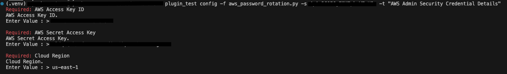
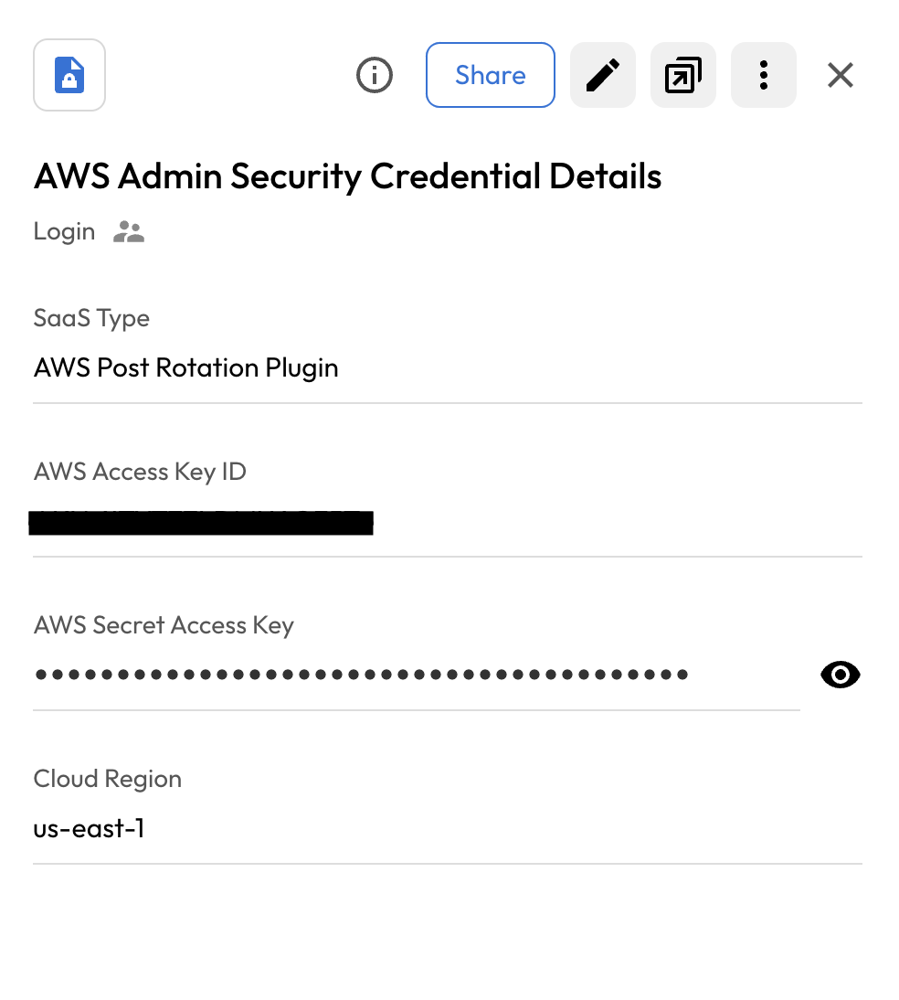
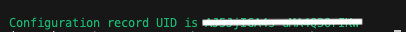
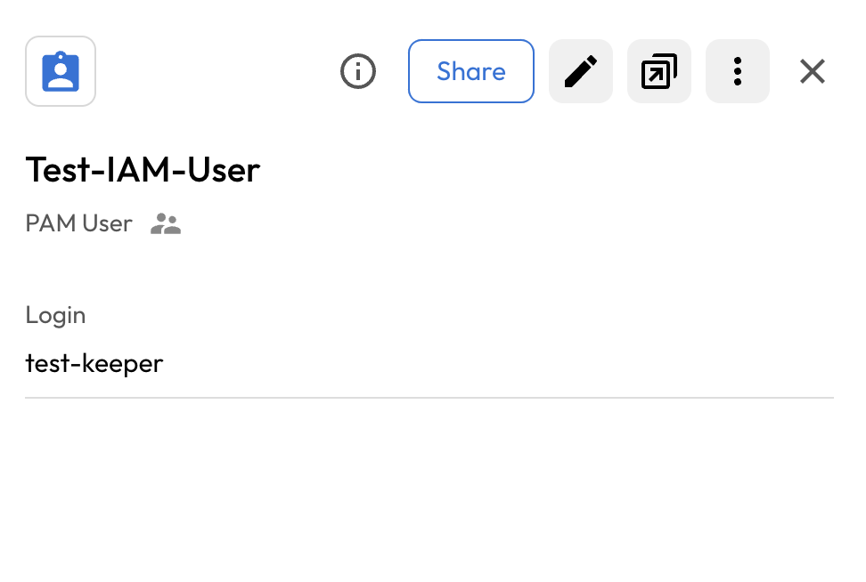
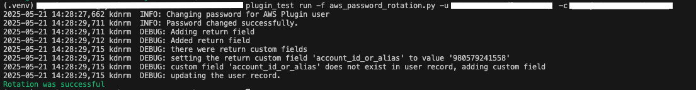
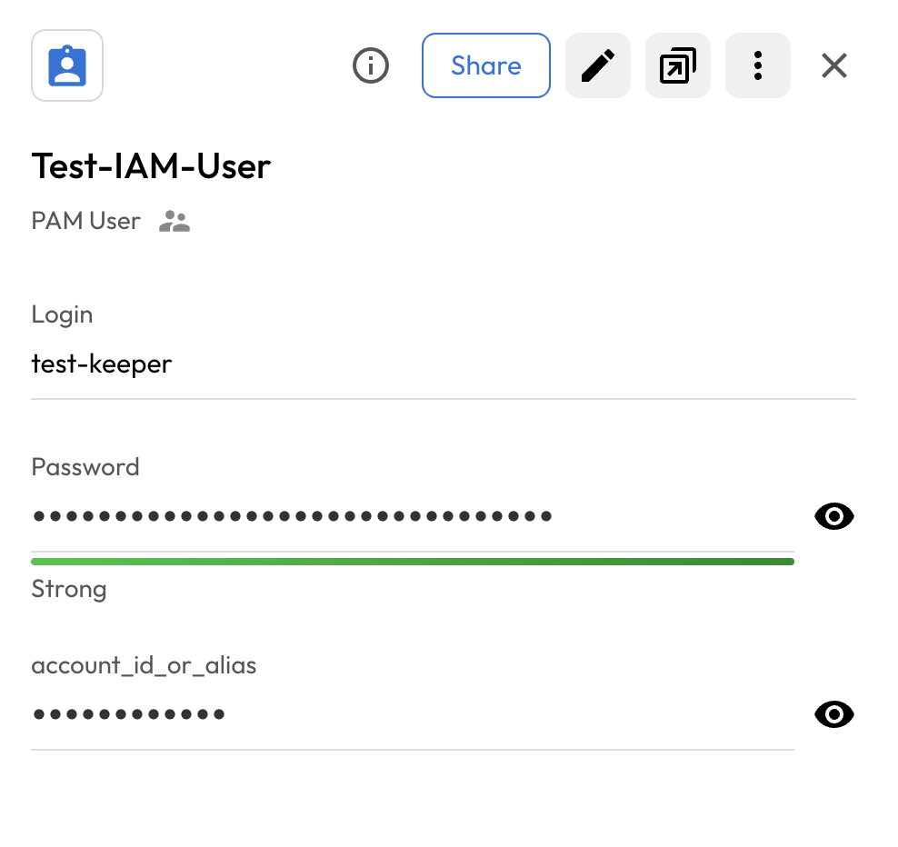

#  User Guide | Keeper Security / AWS IAM User 

## Overview

This user guide covers the post-rotation script for the Keeper Security / AWS IAM User integration. Details on how to use the post-rotation script are available at the [_Keeper Security online documentation_](https://github.com/Keeper-Security/discovery-and-rotation-saas-dev) and will not be repeated here.

## AWS IAM
In AWS, an IAM user is an identity within your AWS account that you create to grant access to resources and services. IAM users have a unique username, password, and can be given different levels of permissions by the administrator, determining what they can access and do.

## Pre-requisites

In order to use the post-rotation script, you will need the following prerequisites:

**1. boto3 Library:** Ensure that the boto3 connector library is installed in your python environment.

    pip install boto3

**2. AWS Security Credentials:**
AWS uses the security credentials to authenticate and authorize your requests. To rotate password here we need admin security credentials [**aws_access_key_id, aws_secret_access_key**].

**3. IAM Policies Permission List:** 
The following IAM permissions are additionally required by AWS users to perform password rotation.
    
- [iam:UpdateLoginProfile](https://docs.aws.amazon.com/IAM/latest/APIReference/API_UpdateLoginProfile.html)
- [iam:GetLoginProfile](https://docs.aws.amazon.com/IAM/latest/APIReference/API_GetLoginProfile.html)

## Steps to create Keeper security records and AWS Cognito

### 1.  Execute the script and create config in keeper security:
- Please open a terminal with the virtual environment activated, and execute the following command.

- To enable password rotation for a user, you must first create a configuration inside shared folder within Keeper Vault. This configuration securely stores the credentials needed for automated password rotation. Without setting up this configuration in Keeper Vault, the system will not have the necessary context or access to perform password updates on the target account or system.

      plugin_test config -f <aws_iam_python_script> -s <UID_Shared_Folder> -t "AWS Admin Security Credential Details"

      Required: AWS Access Key ID
      AWS Access Key ID.
      Enter Value : > 

      Required: AWS Secret Access Key
      AWS Secret Access Key.
      Enter Value : > 

      Required: Cloud Region
      Cloud Region.
      Enter Value : > 

    - AWS Access Key ID: Admin Security credentials.
    - AWS Secret Access Key: Admin Security credentials.
    - Cloud Region: Cloud region where user is located.

Please provide the requested details, and this will create a record in the shared folder.

Above command create a Login record inside keeper-vault shared folder.

### 2. Copy the UID:
Executing the above command will generate a UID. Copy this UID as it will be used later.

### 3. Create and add details in New Rotation Record of type PAM User:
To rotate the user's password, you need to create a PAM user record and add the username in the login field. 

## Executing the script for rotating password

Once you have your pre-requisites ready, make sure you cover the following:

- Execute the following command in activtated virtual environment.

        plugin_test run -f <aws_iam_python_script> -u <created_pam_user_record> -c <copied_uid_from_step_2>

    

- The above command rotate the aws iam user's password and add account id.

    