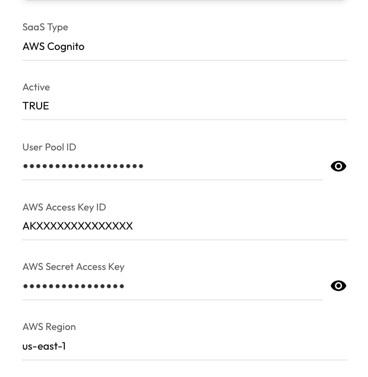

# User Guide | Keeper Security / AWS Cognito 

## Overview

This user guide covers the post-rotation script for the Keeper Security / AWS Cognito integration. 
Details on how to use the post-rotation script are available at the 
  [_Keeper Security online documentation_](https://github.com/Keeper-Security/discovery-and-rotation-saas-dev) and 
  will not be repeated here.

## AWS Cognito
[AWS Cognito](https://docs.aws.amazon.com/cognito/latest/developerguide/what-is-amazon-cognito.html) is a managed 
  identity service that helps developers easily add user sign-up, sign-in, and access control  to their web and 
  mobile applications. 
It acts as a user directory, authentication server, and authorization service, allowing users to authenticate 
  from built-in user pools or federate with external identity providers like Google or Facebook. 

### Required Setup/Information

#### IAM Policy

In order to change the password of an AWS Cognito user, a IAM policy must include
  the `cognito-idp:AdminSetUserPassword` permission.
Either a new policy needs to be created, or the permission should be added to an existing role.
The policy needs to be attached to an IAM user or a role.

```json
{
  "Effect": "Allow",
  "Action": [
    "cognito-idp:AdminSetUserPassword",
  ],
  "Resource": "arn:aws:cognito-idp:{region}:{account_id}:userpool/{user_pool_id}"
}
```

#### AWS Credentials

There are three ways to set the AWS credentials in the plugin.

##### SaaS Configuration Record in the Vault

When setting up a SaaS Configuration Record in the Vault, custom fields can be added to the record to hold
  the AWS Access Key ID, Secret Access Key, and Region. 
The AWS Access Key ID and Secret Access Key are created for an IAM user.



##### AWS PAM Configuration

If an AWS Configuration is being used with the Keeper Gateway, the plugin can get the credentials from the 
configuration. 
If multiple region names are specified in the AWS Configuration, the first one will be used.
If custom fields in the Vault record are set, the plugin will use those over the AWS Configuration.

#### Attached EC2 Role

A role can be attached to an EC2 instance.
If no AWS Access Key ID or Secret Access Key are set, the session will be checked.
Since an attached role does not specify AWS region name, it must be set in the Vault record or AWS Configuration, 
  if using.


## Commander

### Create SaaS Configuration Record

In Commander, the `pam action saas config` command is used to create a SaaS Configuration record.
This record currently is a **Login** record where the custom fields are used for settings.

First check if the **AWS Cognito** plugin is available.
Using the `pam action saas config` command with `--list` flag will show all plugins available to your Keeper Gateway.

```
My Vault> pam action saas config -g <GATEWAY UID> --list

Available SaaS Plugins
 * AWS Cognito (Catalog)
 * Cisco APIC (Catalog)
...
 * REST (Builtin)
 * Snowflake (Builtin)
```

If **AWS Cognito** is in the list, you can use this plugin.

Before creating the SaaS Configuration Record, you can get a preview of fields you will be prompted for values.
Next use `pam action saas config`, with `--info` flag and `-p "AWS Cognito"`, to get information about this plugin.
```
My Vault> pam action saas config -g <GATEWAY> -p "AWS Cognito" --info

AWS Cognito
  Type: catalog
  Author: Keeper Security (pam@keepersecurity.com)
  Summary: Change a users password in AWS Cognito.
  Documents: https://github.com/Keeper-Security/discovery-and-rotation-saas-dev/blob/main/integrations/aws_cognito/README.md

  Fields
   * Required: User Pool ID - User Pool ID. 
   * Optional: AWS Access Key ID - AWS Access Key ID. Required if not using a PAM AWS Configuration.
   * Optional: AWS Secret Access Key - AWS Secret Access Key. Required if not using a PAM AWS Configuration.
   * Optional: AWS Region - AWS Region. Required if not using a PAM AWS Configuration.
```

Next use `pam action saas config`, with `--create` flag and `-p "AWS Cognito"`, to create a SaaS Configuration Record.
You will be prompted to enter values for the fields.
Any optional fields that do not have a value will not be added to the record.

```
My Vault> pam action saas config -g <GATEWAY UID> -p "AWS Cognito" --create

User Pool ID
Description: User Pool ID.
Field is required.
Enter value > us-east-2_XXXXXXX

AWS Access Key ID
Description: AWS Access Key ID.
Enter value > AWXXXXXXXXXXXXXXXX

AWS Secret Access Key
Description: AWS Secret Access Key.
Enter value > SECRETKEY

AWS Region
Description: AWS Region.
Enter value > us-east-2

Title for the SaaS configuration record> AWS Cognito Config

Created SaaS configuration record with UID of XXXXXXXXXXXXXX

Assign this configuration to a user using the following command.
  pam action saas add -c XXXXXXXXXXXXXX -u <PAM User Record UID>
  See pam action saas add --help for more information.
```

Once you have a SaaS Configuration record, it can be assigned to a user using the `pam action saas add` command.

```
My Vault> pam action saas add -c XXXXXXXXXXXXXX -u YYYYYYYYYYYY

Added AWS Cognito rotation to the user record.
```

Now when the user's password is rotated, the user's password in AWS Cognito will also be updated.

## Keeper Vault

Currently Keeper Vault does not support SaaS management.


