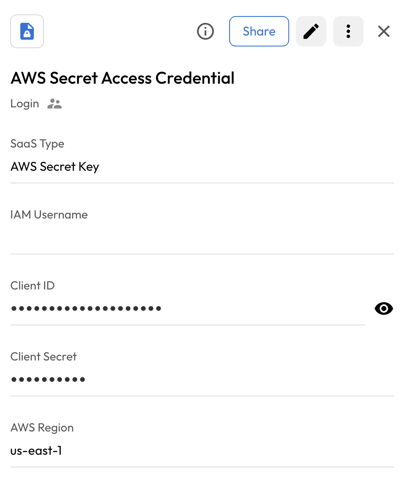

# User Guide | Keeper Security / AWS Secret Key

## Overview

This user guide covers the post-rotation script for the Keeper Security / AWS Secret Key integration. 
Details on how to use the post-rotation script are available at the 
  [_Keeper Security online documentation_](https://github.com/Keeper-Security/discovery-and-rotation-saas-dev) and 
  will not be repeated here.

## AWS Secret Key

[AWS Identity and Access Management (IAM)](https://docs.aws.amazon.com/iam/latest/userguide/what-is-iam.html) is a web service that helps you securely control access to AWS resources. 
Access keys consist of an access key ID and secret access key, which are used to sign programmatic requests to AWS.
This plugin automates the rotation of AWS access keys for IAM users by creating new access keys and deleting old ones.

### Required Setup/Information

#### IAM Policy

In order to rotate access keys for an AWS IAM user, an IAM policy must include the following permissions:
- `iam:ListAccessKeys` - to list existing access keys
- `iam:CreateAccessKey` - to create new access keys  
- `iam:DeleteAccessKey` - to delete old access keys
- `iam:GetUser` - to verify the user exists

Either a new policy needs to be created, or these permissions should be added to an existing role.
The policy needs to be attached to an IAM user or a role.

```json
{
  "Version": "2012-10-17",
  "Statement": [
    {
      "Effect": "Allow",
      "Action": [
        "iam:ListAccessKeys",
        "iam:CreateAccessKey", 
        "iam:DeleteAccessKey",
        "iam:GetUser"
      ],
      "Resource": "arn:aws:iam::{account_id}:user/{username}"
    }
  ]
}
```

#### AWS Credentials

There are three ways to set the AWS credentials in the plugin.

##### SaaS Configuration Record in the Vault

When setting up a SaaS Configuration Record in the Vault, custom fields can be added to the record to hold
  the AWS Access Key ID, Secret Access Key, and Region. 
The AWS Access Key ID and Secret Access Key are created for an IAM user with the required permissions.

##### AWS PAM Configuration

If an AWS Configuration is being used with the Keeper Gateway, the plugin can get the credentials from the 
configuration. 
If multiple region names are specified in the AWS Configuration, the first one will be used.
If custom fields in the Vault record are set, the plugin will use those over the AWS Configuration.


### Access Key Rotation Process

The plugin follows these steps to rotate access keys:

1. **Verify User Exists**: Checks if the specified IAM user exists
2. **List Current Keys**: Gets a list of existing access keys for the user
3. **Manage Key Limits**: AWS allows maximum 2 access keys per user. If at limit, deletes the old key from AWS before creating new one
4. **Create New Key**: Creates a new access key pair in AWS IAM
5. **Update PAM Records**: Stores the new access key ID and secret access key in the PAM user record fields
6. **Delete Old Key**: Removes the previous access key from AWS to complete the rotation

### Rollback Support

This plugin has rollback disabled (`can_rollback = False`) by design. AWS access key rotation creates new credentials that completely replace the old ones, making traditional rollback unnecessary. If rotation fails, the old access key remains valid until the process completes successfully.


## Pre-requisites
In order to use the post-rotation script, you will need the following prerequisites:

**1. boto3, botocore Library:** Ensure that the boto3 and botocore library is installed in your Python environment. This library is necessary for making API requests to AWS Cloud.
```bash
pip install boto3
pip install botocore
```

## Steps to Test AWS Secret Key
### 1. Create a IAM User in AWS
Perform the below steps that will create an IAM User in AWS
- Search for **IAM** in the AWS Management Console.
- Click on **"Users"** from the IAM dashboard.
- Select **"Add users"** or **"Create user"** to start the process.
- Fill in the required **user details** (e.g., username, access type).
- Enter any **account-specific information** as needed.
- Attach the **above IAM policies** to grant permissions.
- Click **"Create user"** to finalize the user setup.

### 2. Create Security Credentials 
- Click on your **profile icon** in the top-right corner of the AWS Management Console.
- Select **"Security credentials"** from the dropdown menu.
- Scroll to the **Access keys** section.
- Click on **"Create access key"**.

    

- Choose the **intended use case**, such as **"Third-party service"**.

    

- Check the **confirmation box**, then click **"Next"**.
- Provide a **description** for the access key to help identify its purpose.
- Click on **"Create access key"** to generate it.
- **Store the secret access key** securely, as it will not be shown again.

    

> 💡 Create two access keys:
> - One for **client creation**
> - One for **key rotation**

## Steps to Create Keeper Security Records and AWS Secret Key
### 1. Create a config record 
- Execute the following command to create config record in keeper vault:
    ```bash
    plugin_test config -f aws_secret_key.py -t "AWS Secret Key Credential" -s "shared_folder_uid"

    Required: IAM Username
    AWS IAM username for which to rotate access keys.
    Enter Value : > 

    Required: Client ID
    AWS Client ID for authentication.
    Enter Value : > 

    Required: Client Secret
    AWS Client Secret for authentication.
    Enter Value : > 

    Required: AWS Region
    AWS Region. Required if not using a PAM AWS Configuration.
    Enter Value : > 

    - Client ID : The Client ID generated from security credetials
    - Client Secret : The Client Secret generated from security credetials
    - AWS Region : Cloud region where user is present.
    ```

  

- The above command will create the Login config record in keeper vault 

  

### 2. Create and Add Details in New Rotation Record of type PAM User:
- Create a record of type **PAM User** inside the Keeper Vault.
- Enter the username. 
- Add the custom field **aws_acess_key_id** and add the client id from security credentials.

    


## Executing the Script for Rotating Password
Once you have your pre-requisites ready, make sure you cover the following:

- Execute the following command in your activated virtual environment:

    ```bash
    plugin_test run -f aws_secret_key.py -u <pam_user_record_uid> -c <config_record_uid>
    ```

- The above command rotate the AWS Secret Access Key

    

- Keeper Vault PAM User Record is updated.

    
