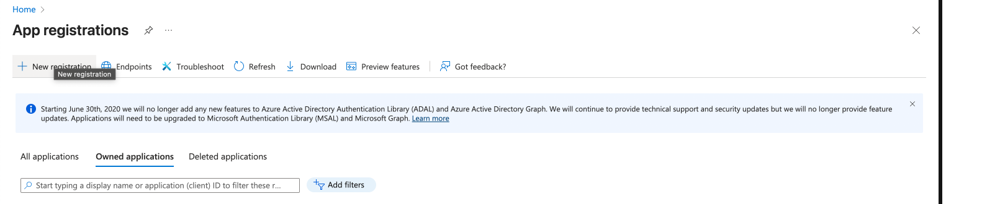
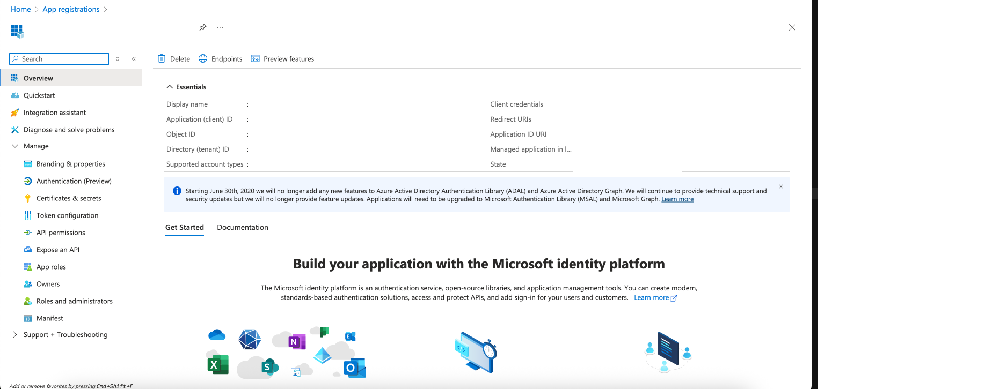
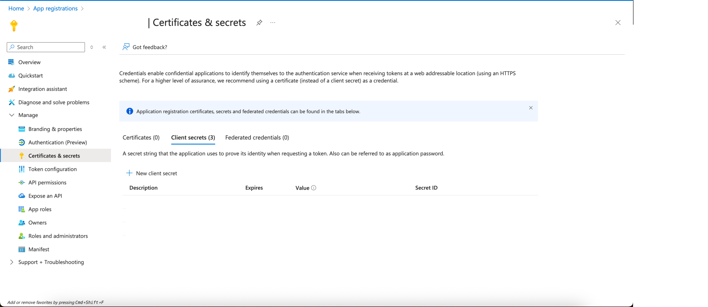
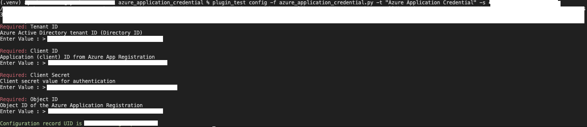
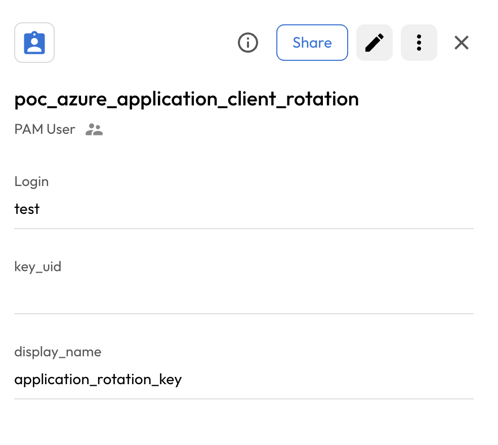
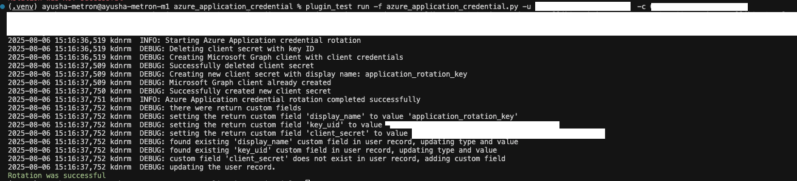
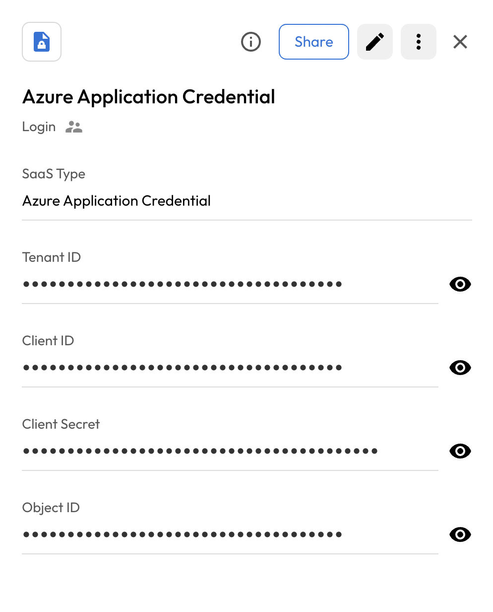

# User Guide | Keeper Security / Azure Application Credential

## Overview

This user guide covers the post-rotation script for the Keeper Security / Elasticsearch User integration. 
Details on how to use the post-rotation script are available at the 
  [_Keeper Security online documentation_](https://github.com/Keeper-Security/discovery-and-rotation-saas-dev) and 
  will not be repeated here.

## Azure Application Credential

[Azure Application Registration](https://docs.microsoft.com/en-us/azure/active-directory/develop/quickstart-register-app) allows you to register applications in Azure Active Directory (Azure AD) and manage their credentials including client secrets.


### Required Setup/Information

The SaaS configuration requires values from your Azure Active Directory application registration.

#### Azure Application Registration Setup

1. **Navigate to Azure Portal**: Go to [Azure Portal](https://portal.azure.com) and sign in with an account that has permissions to register applications.

2. **Access App Registrations**: 
   - In the Azure portal, search for and select "App registrations"
   - Select your existing application or create a new one

      

3. **Gather Required Information**:

   

   - **Tenant ID**: 
     - Go to "Azure Active Directory" > "Properties"
     - Copy the "Tenant ID" (also called Directory ID)

   - **Client ID**: 
     - In your App Registration, go to "Overview"
     - Copy the "Application (client) ID"

   - **Object ID**:
     - In your App Registration, go to "Overview" 
     - Copy the "Object ID"

   - **Client Secret**:
     - In your App Registration, go to "Certificates & secrets"
     - Under "Client secrets", click "New client secret"
     - Add a description and select expiration
     - Click "Add" and copy the secret value immediately (it won't be shown again)

         
      


#### Required Permissions

The application used for authentication must have the following Microsoft Graph API permissions:

- `Application.ReadWrite.All` - To read and write application properties
- `Application.ReadWrite.OwnedBy` - To manage applications owned by the service principal

#### Required Roles:
The application must have the `Cloud Application administrator` role.
- Inside application, go to **Roles and administrators** and check the required role.

To grant these permissions:
1. Go to your **App Registration** > **API permissions**
2. Click **Add a permission**
3. Select **Microsoft Graph**
4. Choose **Application permissions**
5. Add the required permissions listed above
6. Click **Grant admin consent** for your tenant by you account admin.

### User Fields Configuration

The PAM user record must contain the following custom fields:

- **key_uid**: The current client secret key ID that should be deleted during rotation
- **display_name**: The display name for the new client secret that will be created

## Steps to Create Keeper Security Records for Azure Application Credential

### 1. Execute the config command to create admin record:

- Execute the following command to create config record in keeper vault:
   ```bash
    plugin_test config -f azure_application_credential.py -t "Azure Application Credential" -s "shared_folder_uid"

    - Tenant ID : Azure Active Directory tenant ID (Directory ID)
   - Client ID : Application (client) ID from Azure App Registration
   - Client Secret : Client secret value for authentications
   - Object ID : Object ID of the Azure Application Registration
   ```

   


### 2. Create and Add Details in New Rotation Record of type PAM User:
- Create a record of type **PAM User** inside the Keeper Vault. 
- Add 2 custom fields **key_uid** and **display_name** and edit the respective details for the first time.
- Click on **Save** and this create will create a user config record.

   

## Executing the Script for Rotating Password
Once you have your pre-requisites ready, make sure you cover the following:

- Execute the following command in your activated virtual environment:

    ```bash
    plugin_test run -f azure_application_credential.py -u <pam_user_record_uid> -c <config_record_uid>
    ```

   

- The above command deletes the old key and create a new one with the saved name of pam user record.

- Keeper Vault PAM User Record is updated.

   