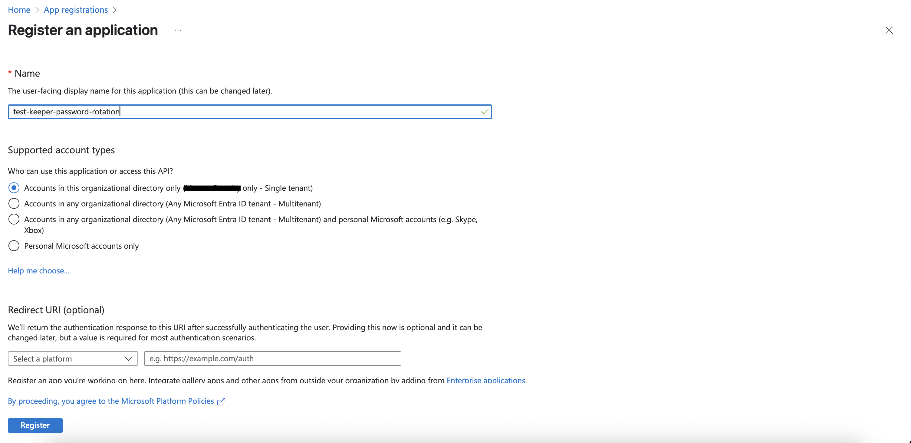
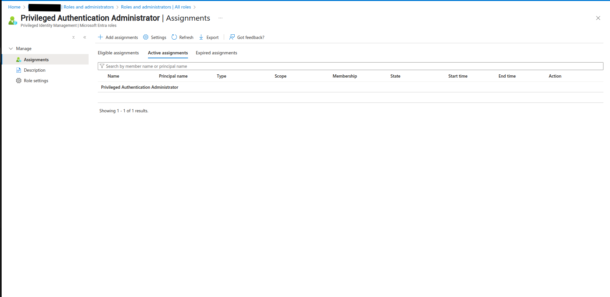
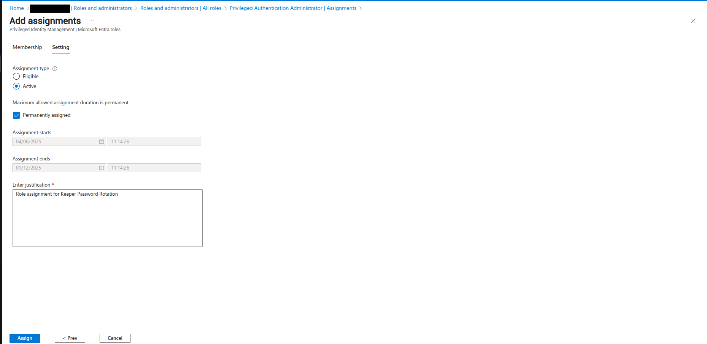
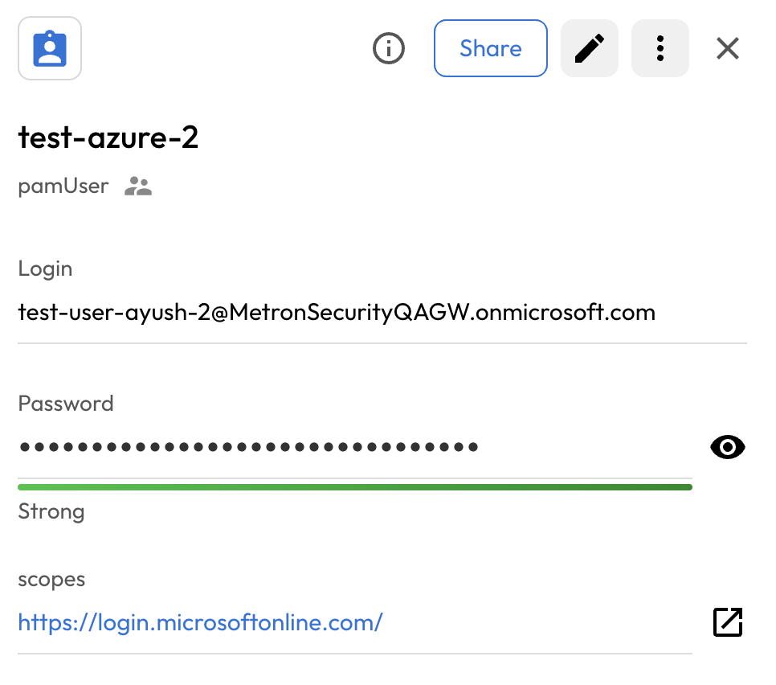

#  User Guide | Keeper Security / Azure Entra ID 

## Overview

This user guide covers the post-rotation script for the Keeper Security / Azure Entra ID User integration. Details on how to use the post-rotation script are available at the [_Keeper Security online documentation_](https://github.com/Keeper-Security/discovery-and-rotation-saas-dev) and will not be repeated here.

## Azure Entra ID
Microsoft Entra ID is a cloud-based identity and access management solution. It is a directory and identity management service that operates in the cloud and offers authentication and authorization services to various Microsoft services, such as Microsoft 365, Dynamics 365, Microsoft Azure and third-party services.

## Pre-requisite

In order to use the post-rotation script, you will need the following prerequisites:

**msgraph and azure-identity library :**  Ensure that the boto3 connector library is installed in your python environment.
        
    pip install msgraph-sdk
    pip install azure-identity

**2. Azure Application Security Credentials:** Azure uses the security credentials to authenticate and authorize your requests. To rotate password here we need application security credentials. 

## Steps to create Keeper security records and Azure Entra ID:

### 1.  Application Setup to rotate user password in Azure:
Perform the below steps to setup the Azure application to rotate the password.
 
- Create an application in microsoft azure entra id.

    

- Create a client secret inside the created application.

    

- Give the `Privileged Authentication Administrator` role to the created application.

    

- Add assignments and select created application to select a member tab.

    

- Select the customized setting accordingly. 
    
    

- Assing the below api permissions to the application.
    
    - User-PasswordProfile.ReadWrite.All

For more follow the [API Documentation](https://learn.microsoft.com/en-us/graph/api/user-update?view=graph-rest-1.0&tabs=http#example-3-update-the-passwordprofile-of-a-user-and-reset-their-password).

### 2.  Execute the script and create config in keeper security:
- Please open a terminal with the virtual environment activated, and execute the following command.

- To enable password rotation for a user, you must first create a configuration inside shared folder within Keeper Vault. This configuration securely stores the credentials needed for automated password rotation. Without setting up this configuration in Keeper Vault, the system will not have the necessary context or access to perform password updates on the target account or system.

      plugin_test config -f <azure_user_python_script> -s <UID_Shared_Folder> -t "Azure Application Security Credential Details"

      Required: Tenant ID
      Admin Tenant ID
      Enter Value : > 

      Required: Client ID
      Admin Client ID
      Enter Value : > 

      Required: Client Secret
      Admin Client Secret
      Enter Value : > 

Please provide the requested details, and this will create a record in the shared folder.

Above command create a Login record inside keeper-vault shared folder.

### 3. Copy the UID:
Executing the above command will generate a UID. Copy this UID as it will be used later.

### 4. Create and add details in New Rotation Record of type PAM User:
To rotate the user's password, you need to create a PAM user record and add the username in the login field. 

## Executing the script for rotating password

Once you have your pre-requisites ready, make sure you cover the following:

- Execute the following command in activtated virtual environment.

        plugin_test run -f <azure_user_python_script> -u <created_pam_user_record> -c <copied_uid_from_step_2>

- The above command rotate the azure entra id user's password and Login URL.

    

