# User Guide | Keeper Security / CISCO APIC 

## Overview
This user guide covers the post-rotation script for the Keeper Security / CISCO APIC integration. Details on how to use the post-rotation script are available at the [_Keeper Security online documentation_](https://github.com/Keeper-Security/discovery-and-rotation-saas-dev) and will not be repeated here.

## CISCO APIC
The [Cisco Application Policy Infrastructure Controller (APIC)](https://www.cisco.com/c/en_in/products/cloud-systems-management/application-policy-infrastructure-controller-apic/index.html) is the central control point for Cisco's Application Centric Infrastructure (ACI) solution. It's a software-defined networking (SDN) controller that manages and enforces policies, provides visibility and control over network resources, and orchestrates network provisioning. 
https://www.cisco.com/c/en/us/td/docs/dcn/aci/apic/all/apic-rest-api-configuration-guide/cisco-apic-rest-api-configuration-guide-42x-and-later/m_using_the_rest_api.html
## Pre-requisites
In order to use the post-rotation script, you will need the following prerequisites:

**1. Requests Library:** Ensure that the requests library is installed in your Python environment. This library is necessary for making HTTP requests to Cisco devices.

**2. Requests library installation:** The Requests library allows you to send HTTP requests easily. Activate a Python virtual environment in your Keeper Gateway environment and install the library using the following command:

    pip install requests

## Steps to Test CISCO APIC 
### 1. Login to Cisco Sandbox: 
- Go to the [Cisco DevNet Sandbox](https://developer.cisco.com/)
- Log in with your Cisco account credentials.

    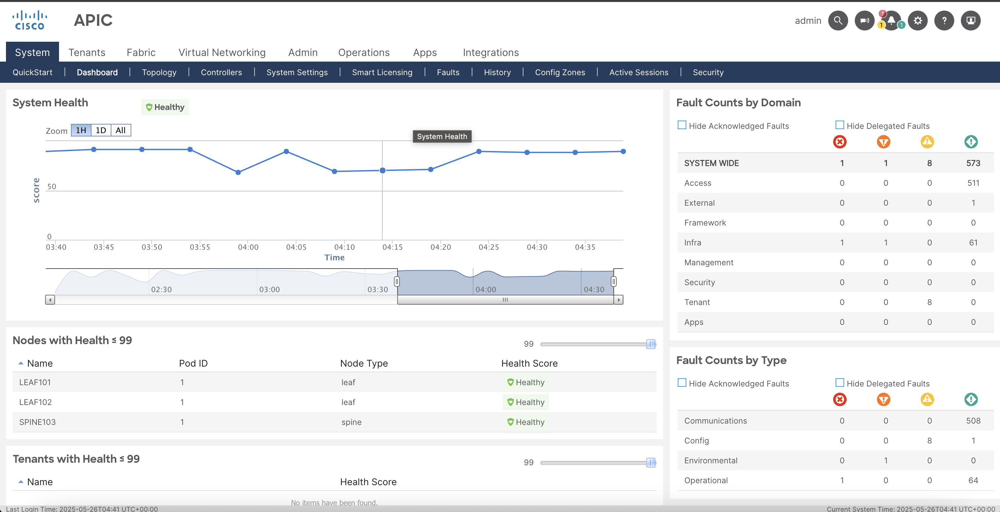

- Select and launch the [sandbox](https://developer.cisco.com/site/sandbox/).

    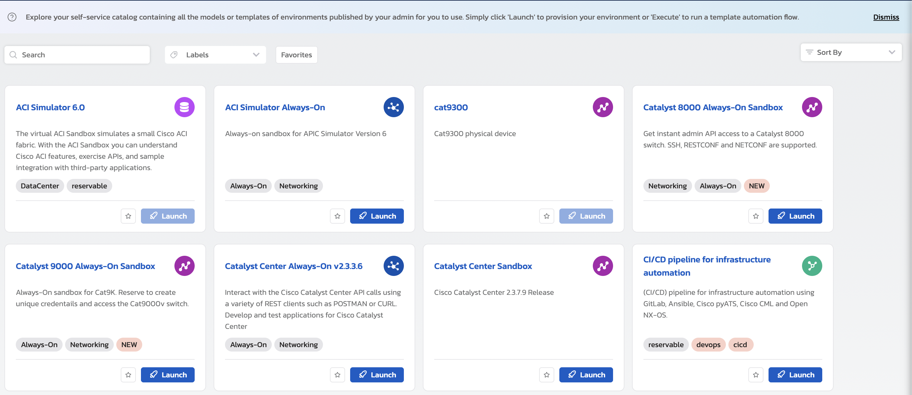

### 2. Select and Launch the Device
- Navigate to the sandbox catalog.
- Select the appropriate sandbox for your Cisco device (e.g., Cisco APIC, etc.).
- Launch the sandbox.

### 4. Create User in Cisco APIC 
- To change user's password admin need to create a user inside Cisco APIC.

    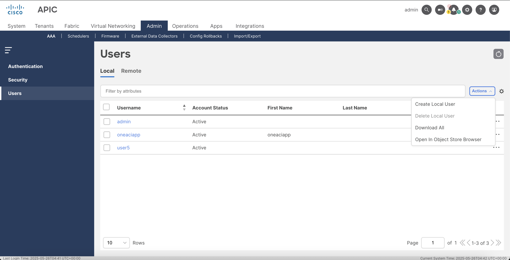

    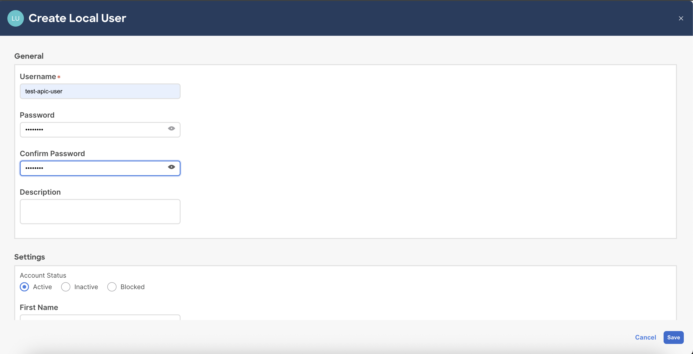

- Check the user's tab, the created user is present in the list. 

    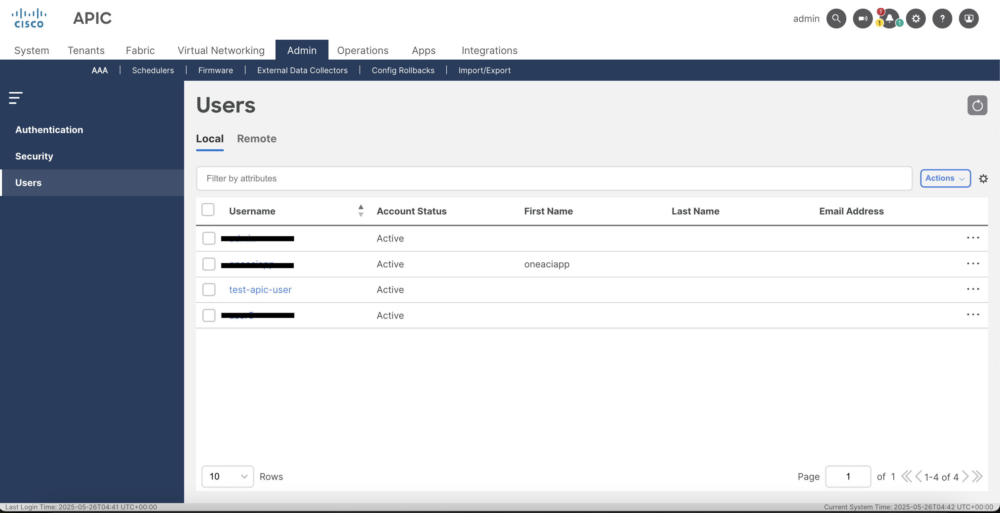

### 4. Receive Details via Email or DevNet Environment

After launching the sandbox, you will receive an email with the connection details or find them in the DevNet Environment under Quick Access.

### 5. Store Developer Credentials

At this point, you will see Developer Credentials— admin-username, and password. Extract the `ssl certificate` and save the certificate in a file name as `ssl-certificate.pem`. 

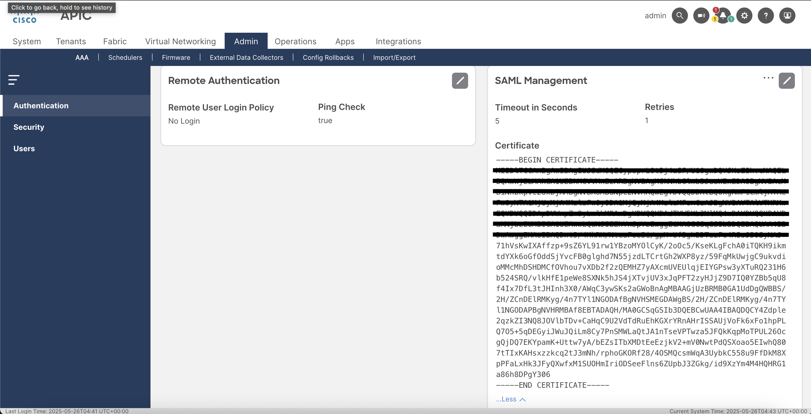

## Steps to create Keeper security records and Cisco APIC
### 1. Create and add details in New Rotation Record of type Login: 
Store the values in a Keeper Security record of type `Login` named as `Cisco Authentication Record` and add an attachment `ssl-certificate.pem` extracted in step 4.

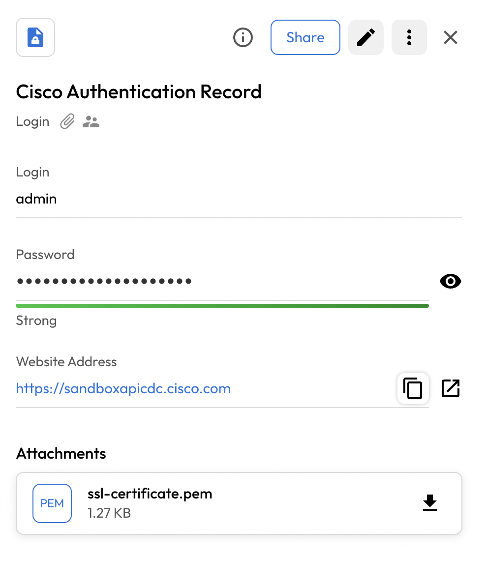

### 2. Create and add details in New Rotation Record of type PAM User:
To rotate the user's password, you need to create a PAM user record and add the username in the login field. 

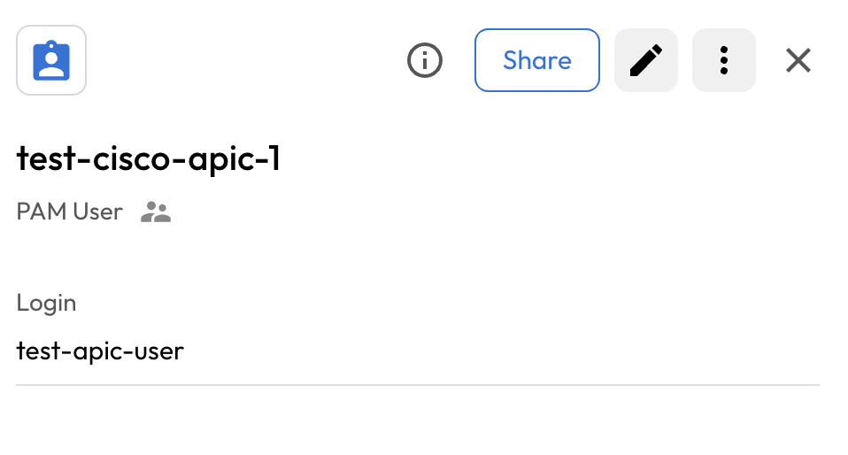

## Executing the script for rotating password
Once you have your pre-requisites ready, make sure you cover the following:

- Execute the following command in activated virtual environment.

        plugin_test run -f <ciso_apic_python_script> -u <created_pam_user_record> -c <copied_uid_of_cisco_authentication_record>
    
    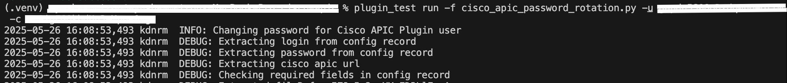

- The above command rotate the cisco apic user's password.

    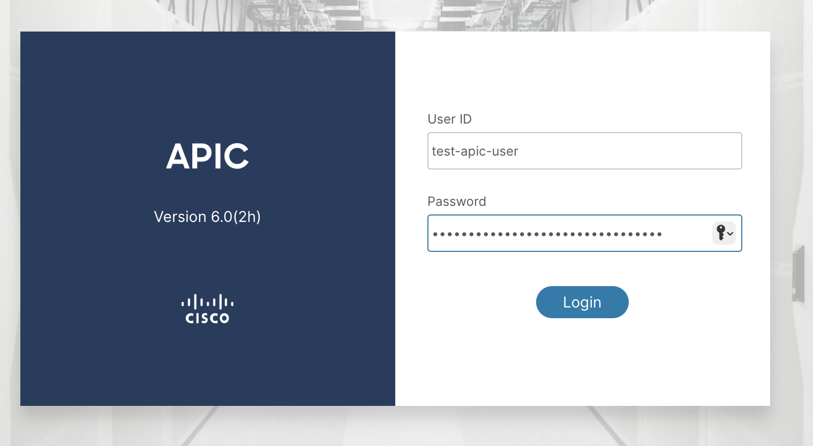

    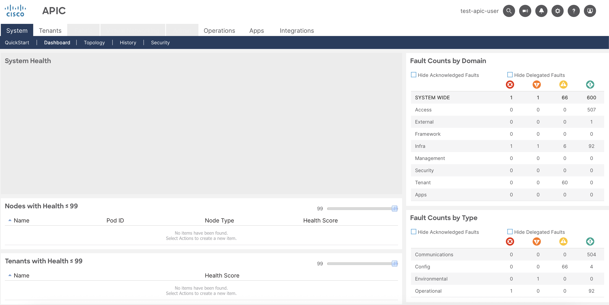

- Keeper Vault PAM User Record is updated.

    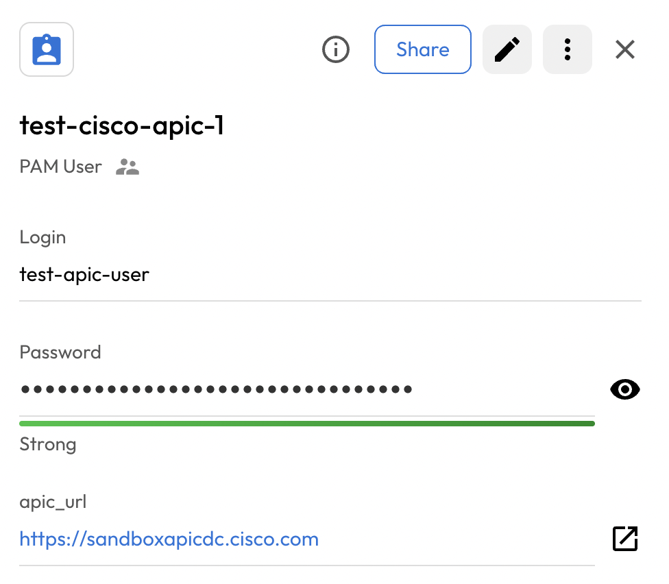
  