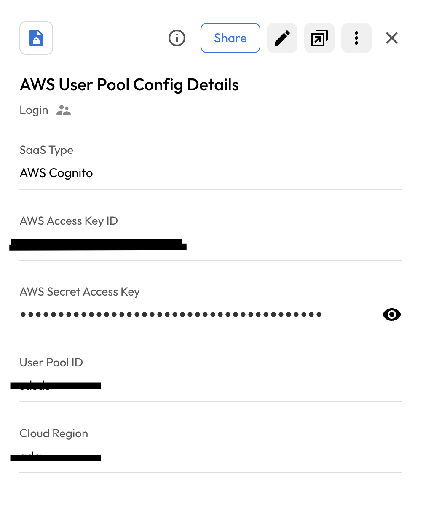
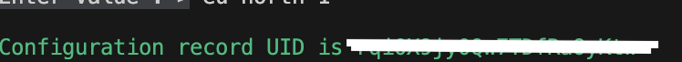
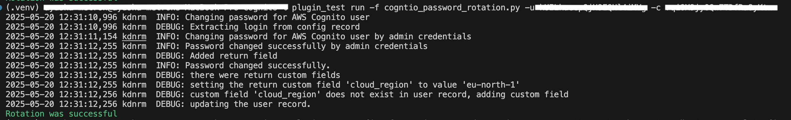
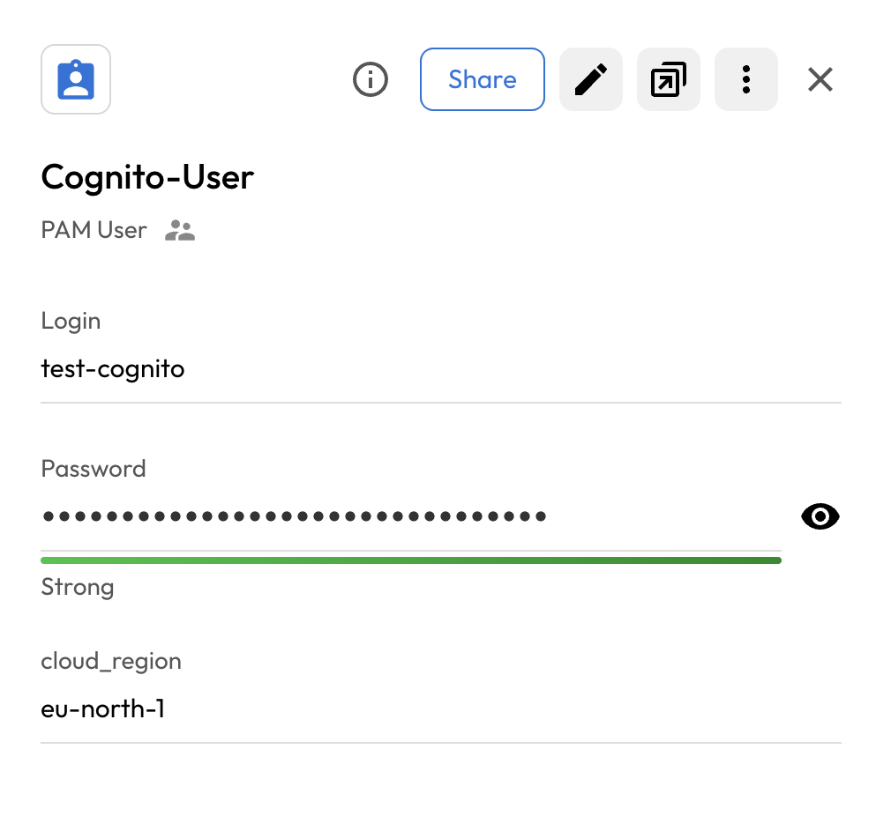

# User Guide | Keeper Security / AWS Cognito 

## Overview

This user guide covers the post-rotation script for the Keeper Security / AWS Cognito integration. Details on how to use the post-rotation script are available at the [_Keeper Security online documentation_](https://github.com/Keeper-Security/discovery-and-rotation-saas-dev) and will not be repeated here.

## AWS Cognito
AWS Cognito is a managed identity service that helps developers easily add user sign-up, sign-in, and access control to their web and mobile applications. It acts as a user directory, authentication server, and authorization service, allowing users to authenticate from built-in user pools or federate with external identity providers like Google or Facebook. 

## Pre-requisites

In order to use the post-rotation script, you will need the following prerequisites:

**1. boto3 Library:** Ensure that the boto3 connector library is installed in your python virtual environment.

    pip install boto3

**2. AWS Security Credentials:**
AWS uses the security credentials to authenticate and authorize your requests. To rotate password here we need admin security credentials [**aws_access_key_id, aws_secret_access_key**].

**3. User Pool:**
To change a user's password in AWS Cognito, you must first create an App Client within the associated User Pool. The App Client provides the necessary credentials for your application to securely interact with Cognito APIs, including operations like user authentication, password changes.

## Steps to create Keeper security records and AWS Cognito

### 1.  Execute the script and create config in keeper security:
- Please open a terminal with the virtual environment activated, and execute the following command.

- To enable password rotation for a user, you must first create a configuration inside shared folder within Keeper Vault. This configuration securely stores the credentials needed for automated password rotation. Without setting up this configuration in Keeper Vault, the system will not have the necessary context or access to perform password updates on the target account or system.

- This command runs within the integrations/<integration_name> directory. User may specify the path to the KSM config file using the **--config** parameter.

      plugin_test -f <cognito_python_file> -s <UID_Shared_Folder> -t "AWS Congito User Pool Details"
    
      Required: AWS Access Key ID
      AWS Access Key ID.
      Enter Value : >

      Required: AWS Secret Access Key
      AWS Secret Access Key.
      Enter Value : > 

      Required: User Pool ID
      User Pool ID.
      Enter Value : >
      
      Required: Cloud Region
      Cloud Region.
      Enter Value : >

    - AWS Access Key ID: Admin Security credentials.
    - AWS Secret Access Key: Admin Security credentials.
    - User Pool ID: The User Pool ID is located within the user pool in AWS Cognito.
    - Cloud Region: Cloud region where user pool is located.

Please provide the requested details, and this will create a record in the shared folder.
    

Above command create a Login record inside keeper folder.
    

### 2. Copy the UID:
Executing the above command will generate a UID. Copy this UID as it will be used later.
    

### 3. Create and add details in New Rotation Record of type PAM User:
To rotate the user's password, you need to create a PAM user record and add the username in the login field. 

## Executing the script for rotating password

Once you have your pre-requisites ready, make sure you cover the following:

- Execute the following command in activtated virtual environment.
    
        plugin_test run -f <coginto_python_script> -u <created_pam_user_record> -c <copied_uid_from_step_2>

    

- The above command rotate the aws cognito user's password.
    
