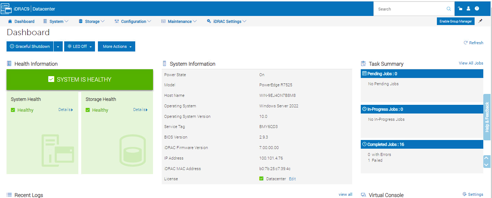
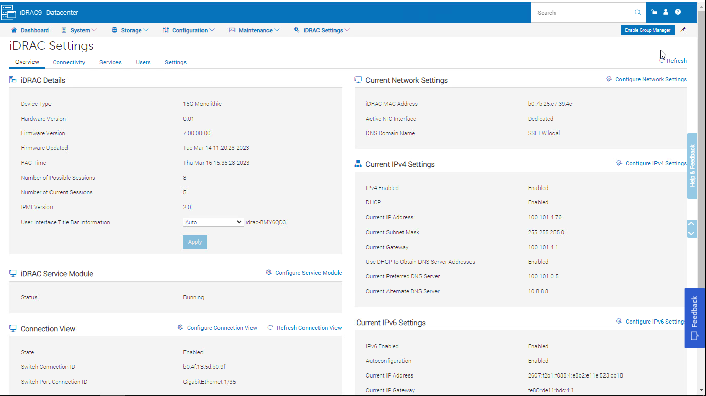
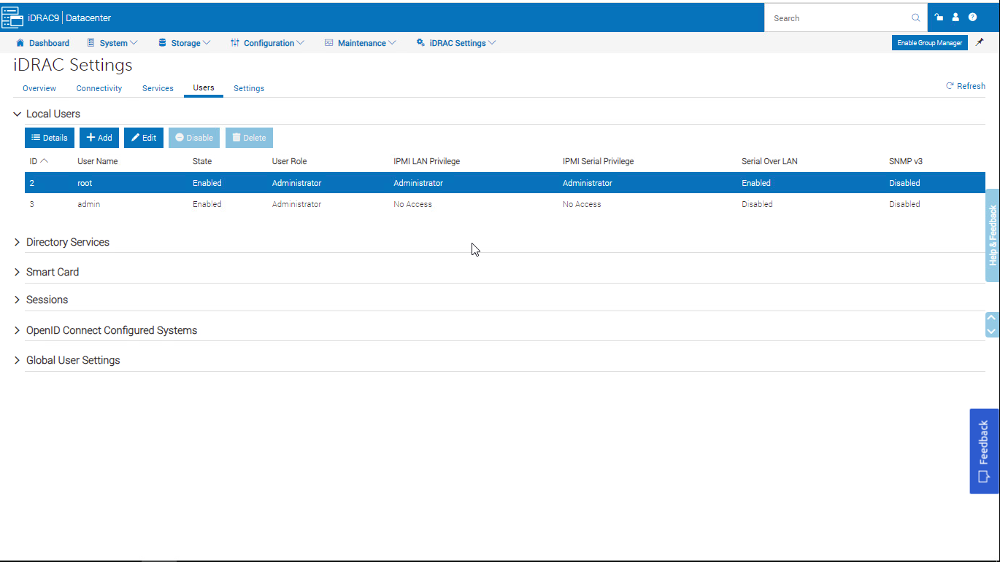
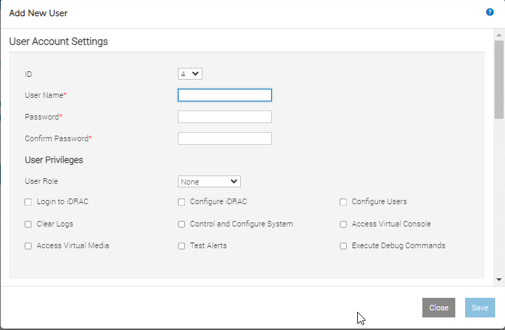
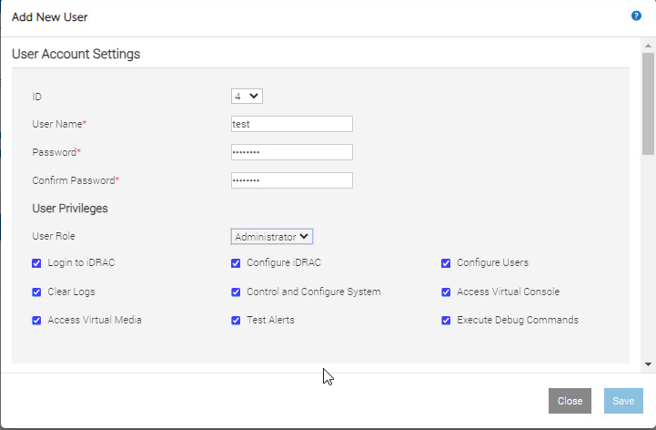
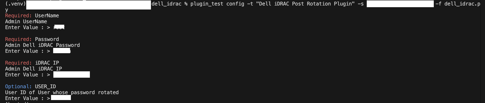
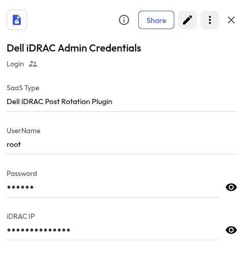
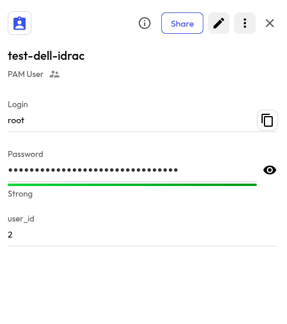

# User Guide | Keeper Security / Dell iDRAC

## Overview
This user guide covers the post-rotation script for the Keeper Security / Dell iDRAC integration. Details on how to use the post-rotation script are available at the [_Keeper Security online documentation_](https://github.com/Keeper-Security/discovery-and-rotation-saas-dev) and will not be repeated here.

## Dell iDRAC
The Integrated Dell Remote Access Controller (iDRAC) is designed for secure local and remote server management and helps IT administrators deploy, update and monitor PowerEdge servers anywhere, anytime.

## Pre-requisites
In order to use the post-rotation script, you will need the following prerequisites:

**1. Requests Library:** Ensure that the requests library is installed in your Python environment. This library is necessary for making HTTP requests to Cisco devices.

**2. Requests library installation:** The Requests library allows you to send HTTP requests easily. Activate a Python virtual environment in your Keeper Gateway environment and install the library using the following command:

    pip install requests

## User setup in Dell iDRAC using sandbox
### 1. Login to Dell iDRAC Sandbox: 
- Go to [Dell Open Manage idrac](https://www.dell.com/en-in/lp/dt/open-manage-idrac) 
- Click on -> **Launch Hands-On Lab** 
- Launch the sandbox instance.
- Open any web browser which have instance of **dell idrac** and **tester api** instance.

### 2. Create User
Follow the below steps to create a user in dell iDRAC 
- Go to **iDRAC Settings** and click on **User** tab.

    

    

- Select the **Local Users** option.

    

- Click on **Add** tab. 

    

    

- Edit the user account settings details and copy the id.

## Steps to create Keeper security records and Dell iDRAC
### 1.  Execute the script and create config in keeper security:
- Please open a terminal with the virtual environment activated, and execute the following command.
- To enable password rotation for a user, you must first create a configuration inside shared folder within Keeper Vault. This configuration securely stores the credentials needed for automated password rotation. Without setting up this configuration in Keeper Vault, the system will not have the necessary context or access to perform password updates on the target account or system.
- This command runs within the integrations/<integration_name> directory. User may specify the path to the KSM config file using the **--config** parameter.
    
      plugin_test config -t "Dell iDRAC Post Rotation Plugin" -s <uid_shared_folder> -f <dell_idrac_python_script>

      Required: UserName
      Admin UserName
      Enter Value : >  

      Required: Password
      Admin Dell iDRAC Password
      Enter Value : > 

      Required: iDRAC IP
      Admin Dell iDRAC IP
      Enter Value : > 

      Optional: USER_ID
      User ID
      Enter Value : > 
      
      - UserName: Admin UserName 
      - Password: Admin Password
      - iDRAC IP: PowerEdge Server IP
      - User ID: User Id of User whose will be password rotated.

> **Note:** User ID field is optional, If it is not created here then this field must be added in Pam User Record.

- Please provide the requested details, and this will create a record in the shared folder.

    

- Above command create a Login record inside keeper folder.

    

### 2. Copy the UID:
Executing the above command will generate a UID. Copy this UID as it will be used later.

### 3. Create and add details in New Rotation Record of type PAM User:
To rotate the user's password, you need to create a PAM user record and add the username in the login field.

> **Note:** If admin have not set the user_id field, user need to create a custom field named as **user_id**.

## Executing the script for rotating password
Once you have your pre-requisites ready, make sure you cover the following:

- Execute the following command in activated virtual environment.
    
        plugin_test run -f <dell_idrac_python_script> -u <created_pam_user_record> -c <copied_uid_from_step_2>

    

- The above command rotate the dell user's password.

    

