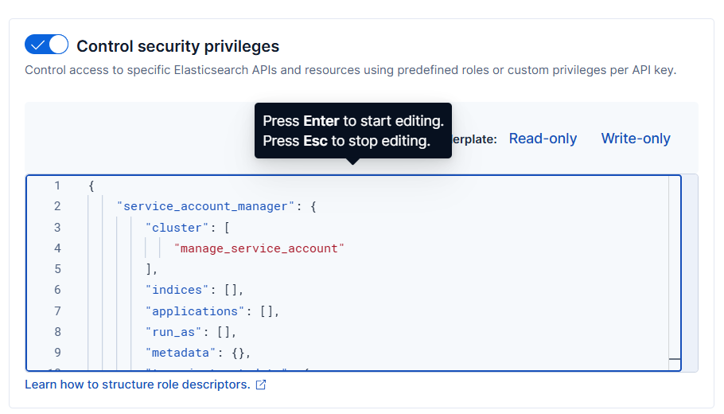

# User Guide | Keeper Security / Elasticsearch Service Account Token

## Overview

This user guide covers the post-rotation script for the Keeper Security / Elasticsearch Service Account Token integration. 
Details on how to use the post-rotation script are available at the 
  [_Keeper Security online documentation_](https://github.com/Keeper-Security/discovery-and-rotation-saas-dev) and 
  will not be repeated here.

## Elasticsearch
[Elasticsearch](https://www.elastic.co/guide/en/elasticsearch/reference/current/what-is-elasticsearch.html) is a distributed, RESTful search and analytics engine capable of addressing a growing number of use cases. 
It provides real-time search and analytics for all types of data including textual, numerical, geospatial, structured, and unstructured data.
Elasticsearch's security features include service account tokens, which provide a secure way for services and applications to authenticate with Elasticsearch without using traditional user credentials.

## Service Account Tokens
Service account tokens in Elasticsearch are authentication credentials designed for programmatic access. Unlike user accounts, service account tokens:
- Are associated with specific service accounts (namespace/service combinations)
- Are ideal for application-to-Elasticsearch communication
- Provide fine-grained access control through role-based permissions

## Pre-requisites
In order to use the post-rotation script, you will need the following prerequisites:

**1. Elasticsearch Library:** Ensure that the elasticsearch library is installed in your Python environment. This library is necessary for making API requests to Elasticsearch clusters.

**2. Elasticsearch library installation:** The Elasticsearch library allows you to interact with Elasticsearch clusters easily. Activate a Python virtual environment in your Keeper Gateway environment and install the library using the following command:

    pip install elasticsearch

**3. Service Account Permissions:** The API key used must have the `manage_service_account` cluster privilege to create and manage service account tokens.

## Steps to Test Elasticsearch Service Account Token Plugin

### 1. Set Up Elasticsearch Environment

#### Understanding Service Accounts
Service accounts in Elasticsearch are defined by a namespace and service combination. Common examples include:
- `elastic/fleet-server` - For Elastic Fleet Server
- `elastic/kibana` - For Kibana service
- Custom combinations like `myapp/backend`

#### Creating a Service Account Token Role
- To manage service account tokens, you need appropriate permissions:
- Log in to the Elasticsearch Dashboard and navigate to **Stack Management**.

    

- Under the **Security** section, click on **Roles**.
- Click on **Create Role** and fill in the required details:
    - **Role Name**: `service_account_manager`
    - **Cluster Privileges**: Add `manage_service_account`

         

         


- Click **Create** to finalize the role creation.

    

#### Creating an API Key for Service Account Management
- To create an API key with service account management permissions:
- Go to **Stack Management** → **Security** → **API Keys**.

    

- Click the **Create API key** button.
- Provide a name for the key (e.g., "Service Account Token Manager") and optionally set an expiration time.

    

- Select the **User API key** and attach the following policy for service account token management:
    ```json
    {
        "service_account_manager": {
            "cluster": [
                "manage_service_account"
            ],
            "indices": [],
            "applications": [],
            "run_as": [],
            "metadata": {},
            "transient_metadata": {
                "enabled": true
            }
        }
    }
    ```

    

- Click **Create API key**.
- A new API key will be generated — copy as it will be needed for the plugin configuration.

    


Common service accounts that typically exist:
- `elastic/fleet-server`
- `elastic/kibana`

## Steps to Create Keeper Security Records and Plugin Integration

### 1. Create Configuration Record
Store the configuration values in a Keeper Security record:

- Execute the following command to create config record in keeper vault:
    ```bash
    plugin_test config -f elasticsearch_serviceaccount_token.py -t "Elasticsearch Service Token Config" -s "shared_folder_uid"
    ```

    

- Fill in the configuration fields with your Elasticsearch details:
    - **Elasticsearch URL**: Your cluster URL
    - **API Key**: The API key created earlier
    - **Service Account Namespace**: e.g., `elastic`
    - **Service Account Service**: e.g., `fleet-server`
    - **Token Name**: Optional custom name for the token

### 2. Create PAM User Record
- Create a record of type **PAM User** inside the Keeper Vault.
- Enter a username that will be used as the default token name if not specified in configuration.
- This record will store the generated service account token.

    

## Executing the Plugin for Service Account Token Creation

Once you have your prerequisites ready, execute the plugin:

- Run the following command in your activated virtual environment:

    ```bash
    plugin_test run -f elasticsearch_serviceaccount_token.py -u <pam_user_record_uid> -c <config_record_uid>
    ```

- The plugin will:
    1. Delete any existing token with the same name
    2. Create a new service account token
    3. Store the token securely in the PAM User record

    

- The Keeper Vault PAM User Record will be updated with:
    - **Service Account Token**: The generated token value
    - **Token Name**: The name of the created token
    - **Service Account**: The namespace/service combination

    
