# User Guide | Keeper Security / Elasticsearch API Key

## Overview
This user guide covers the post-rotation script for the Keeper Security / Elasticsearch API Key integration. 
Details on how to use the post-rotation script are available at the 
  [_Keeper Security online documentation_](https://github.com/Keeper-Security/discovery-and-rotation-saas-dev) and 
  will not be repeated here.

## Elasticsearch
[Elasticsearch](https://www.elastic.co/guide/en/elasticsearch/reference/current/what-is-elasticsearch.html) is a distributed, RESTful search and analytics engine capable of addressing a growing number of use cases. 
It provides real-time search and analytics for all types of data including textual, numerical, geospatial, structured, and unstructured data.

### Features
#### This Elasticsearch API Key SaaS plugin:
1. Retrieve information about the existing API key stored in the PamUser record to preserve role descriptors
2. Create a new API key using the same name ans same role descriptor as the one in the PamUser record.
3. Invalidate the old API key stored in the PamUser record.
4. Update the PamUser record with the new API key in encoded format.

## Prerequisites

### Library
**Elasticsearch library installation:** The Elasticsearch library allows you to interact with Elasticsearch clusters easily. Activate a Python virtual environment in your Keeper Gateway environment and install the library using the following command:

    pip install elasticsearch

### Required Elasticsearch Permissions

The admin user configured in the plugin must have the following cluster privileges:
- `manage_api_key` - For creating, getting, and invalidating API keys
- `manage_security` - For security operations

Example role configuration:
```json
{
  "cluster": ["manage_api_key", "manage_security", "manage_own_api_key"],
  "indices": []
}
```

### User Record Configuration

The user record must contain:
- **api_key_encoded** field: The current API key in encoded format (base64 of `id:api_key`)

## Steps to Test Elasticsearch API Key Plugin
### 1. Create Elasticsearch role 
- Log in to Elastic Search and navigate to **Stack Management**. 

    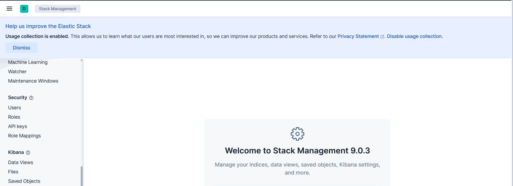

- Go to the **Roles** section and click on **Create Role**.  

    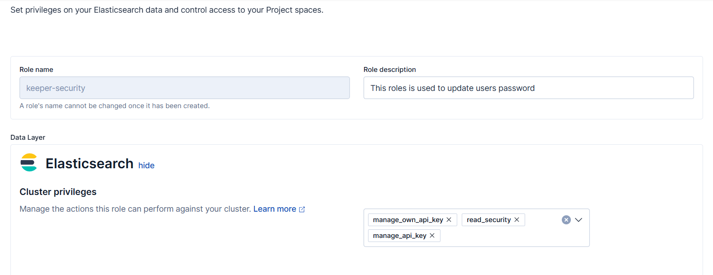

- Attach the **manage_own_api_key**, **manage_security** and **manage_api_key** roles inside cluster privileges
- Click **Create Role** to save the new role configuration.  

### 2. Create User and assign created role
- Under **Stack Management**, click on **Users**.  

    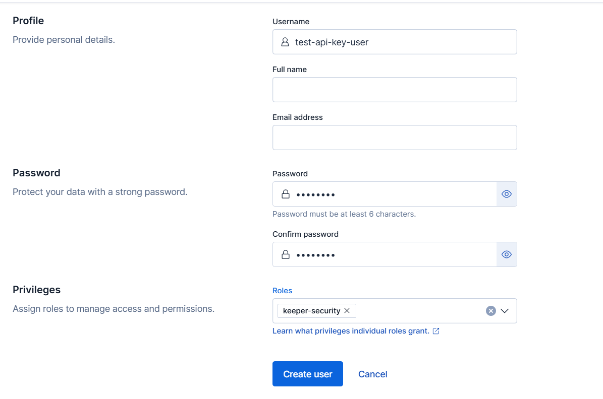

- Create a new user and assign the created role to the user.
- Click **Create User** to finalize the user setup.  

### 3. Create an API Key 
- Under **Stack Management**, click on **API keys**. 
- Click **API key**

    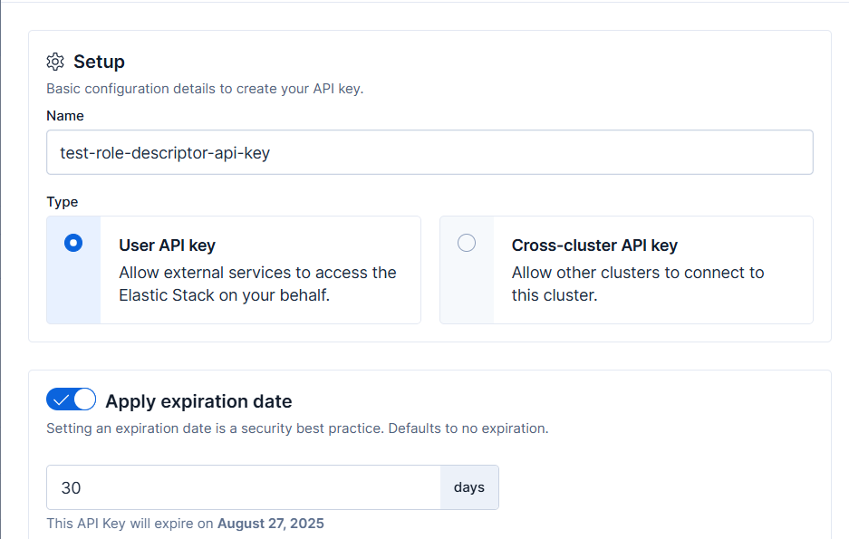

- Enter a name for the new API key and specify details such as the expiration type.
- Select **User API Key** and add the necessary role descriptors using JSON format 

    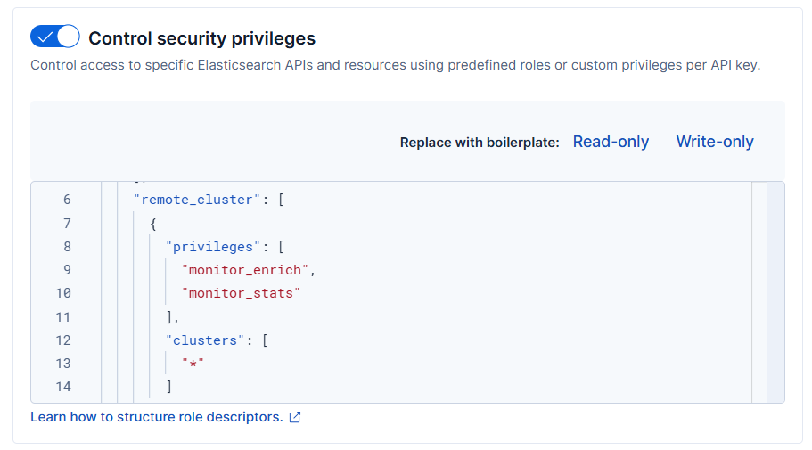

-  Click **Create API key** to save the new API Key configuration.  

    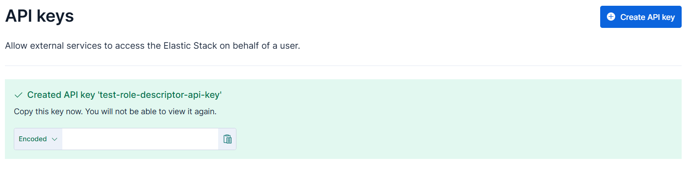


> **Note:**  The role descriptors attached during role creation will be applied to any new API key generated for that role.

> **Note:** By default, the rotate API token expires after 30 days. Users can change this duration by modifying the TOKEN_EXPIRATION_IN_DAYS constant in the elasticsearch_api_key.py file.

### API Key Format

The plugin expects the current API key stored in the **PamUser** record within Keeper Vault to be provided in an **encoded** format—specifically, base64 encoded as `id:api_key`. This is the standard format returned by Elasticsearch when generating API keys.
- label:   `api_key_encoded`
- Example: `VnVhQ2ZHY0JDZGJrUW0tZTVhT3g6dWkybHAyYXhUTm1zeWFrdzl0dk5udw==`


## Configuration

### Plugin Configuration Fields

1. **Elasticsearch URL** (Required)
   - The URL to your Elasticsearch cluster
   - Example: `https://localhost:9200` or `https://your-cluster.elastic-cloud.com:9243`

2. **Admin Username** (Required)
   - Username for basic authentication
   - Must have API key management privileges

3. **Admin Password** (Required, Secret)
   - Password for basic authentication

4. **Verify SSL** (Optional, Default: False)
   - `True`: Validate SSL certificates
   - `False`: Skip validation

5. **SSL Certificate Content** (Optional, Secret)
   - Custom CA certificate content in .crt format
   - Only needed when using custom certificates with SSL verification enabled


## Rotation Process

1. **Extract API Key ID**: Decodes the provided API key to extract the key ID
2. **Get Current Key Info**: Retrieves role descriptors and metadata from the existing key
3. **Create New Key**: Creates a new API key with identical role descriptors
4. **Invalidate Old Key**: Safely invalidates the previous API key
5. **Return New Credentials**: Provides the new API key information

## Return Fields

After successful rotation, the plugin returns:
- **API Key Name**: The name of API key value
- **api_key_enocded**: Rotated Base64 encoded `id:api_key`

## Steps to Create Keeper Security Records and Plugin Integration

### 1. Create Configuration Record
Store the configuration values in a Keeper Security record:

- Execute the following command to create config record in keeper vault:
    ```bash
    plugin_test config -f elasticsearch_api_key.py -t "Elasticsearch API Key" -s "shared_folder_uid"
    ```
   
    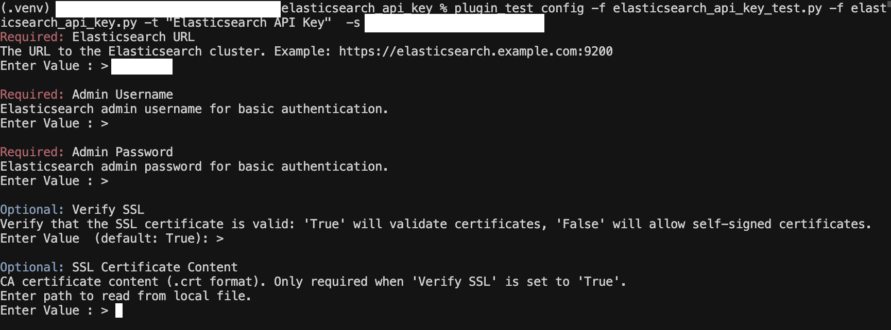

- Fill in the configuration fields with your Elasticsearch details:
    - **Elasticsearch URL**: Your cluster URL
    - **Admin UserName**: Admin UserName
    - **Admin Password**: Admin User Password
    - **Verify SSL**: Boolean Value
    - **SSL Certificate Content**: Certificate content of (.crt) file

- The above command will create a config record inside the keeper vault.

     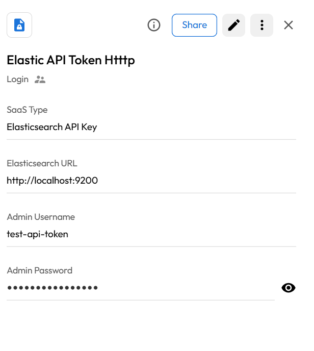


### 2. Create PAM User Record
- Create a record of type **PAM User** inside the Keeper Vault.
- Enter a username, as there is no use of elasticsearch, user may use `test` as login.
- Create a field named as `api_key_encoded` and add the token name.
- This record will store the encoded api key.

    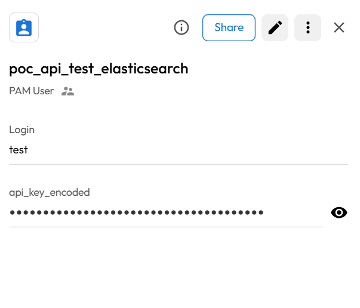


## Executing the Plugin for ElasticSearch API Key

Once you have your prerequisites ready, execute the plugin:

- Run the following command in your activated virtual environment:
```bash
plugin_test run -f elasticsearch_api_key.py -u <pam_user_record_uid> -c <config_record_uid>
```

   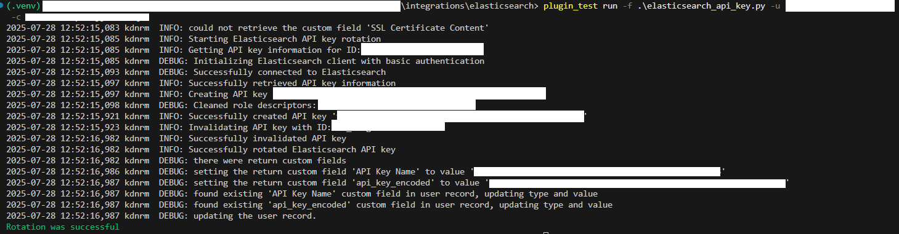

The above command will rotate the API key in elastic search.

   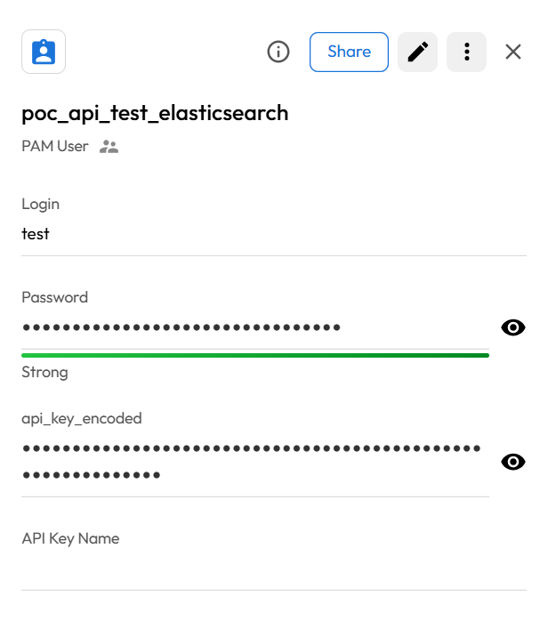


## Limitations

- **No Rollback Support**: API key rotation cannot be rolled back since the old key is permanently invalidated
- **Requires Encoded Format**: The API key must be in the base64 encoded format
- **Admin Privileges Required**: The admin user must have API key management permissions ["manage_api_key", "manage_security"]