# User Guide | Keeper Security / Elasticsearch User

## Overview

This user guide covers the post-rotation script for the Keeper Security / Elasticsearch User integration. 
Details on how to use the post-rotation script are available at the 
  [_Keeper Security online documentation_](https://github.com/Keeper-Security/discovery-and-rotation-saas-dev) and 
  will not be repeated here.

## Elasticsearch
[Elasticsearch](https://www.elastic.co/guide/en/elasticsearch/reference/current/what-is-elasticsearch.html) is a distributed, RESTful search and analytics engine capable of addressing a growing number of use cases. 
It provides real-time search and analytics for all types of data including textual, numerical, geospatial, structured, and unstructured data.
Elasticsearch's security features allow for user authentication and role-based access control to protect your data and cluster.

## Pre-requisites
In order to use the post-rotation script, you will need the following prerequisites:

**1. Elasticsearch Library:** Ensure that the elasticsearch library is installed in your Python environment. This library is necessary for making API requests to Elasticsearch clusters.

**2. Elasticsearch library installation:** The Elasticsearch library allows you to interact with Elasticsearch clusters easily. Activate a Python virtual environment in your Keeper Gateway environment and install the library using the following command:

    pip install elasticsearch

## Steps to Test Elasticsearch User Plugin

### 1. Set Up Elasticsearch Environment

#### Creating a User in Elasticsearch
- To create a user in Elasticsearch, follow these steps:
- Log in to the Elasticsearch Dashboard and navigate to **Stack Management**.

    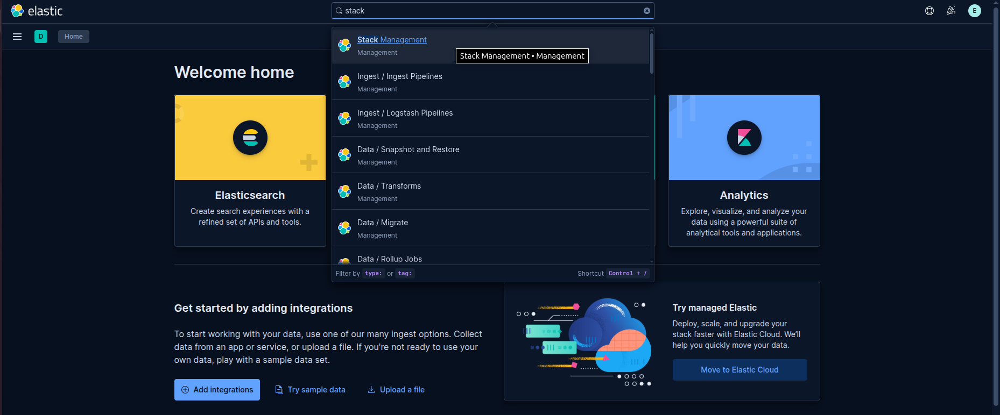

- Under the **Security** section, click on **Users**.
- Click on Create User and fill in the required details such as:
    - **Username**
    - **Email**
    - **Password**

         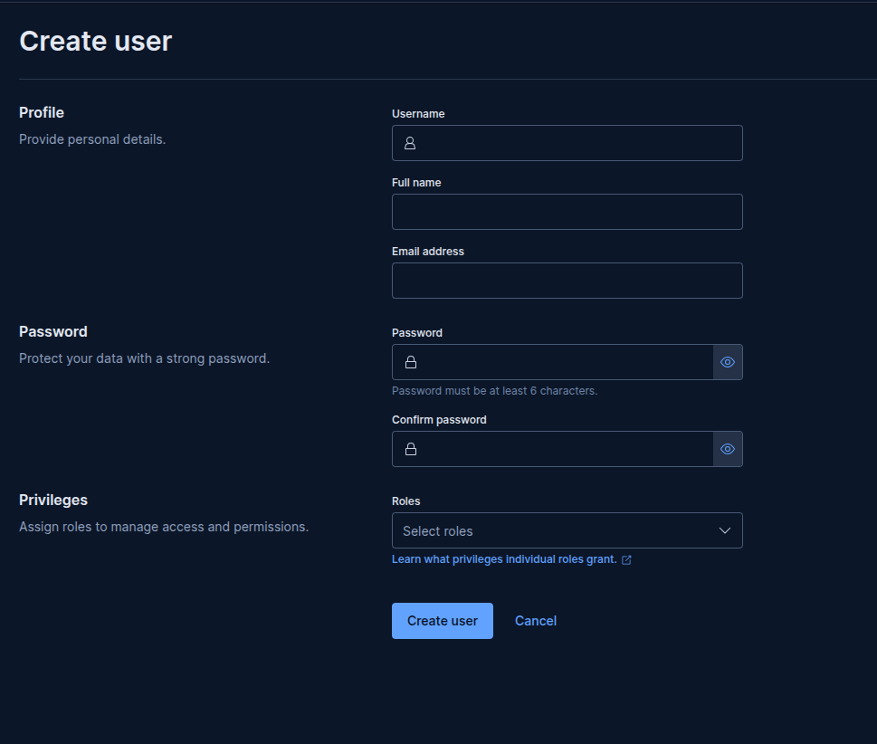

- (Optional) Assign one or more roles to the user if needed.
- Click **Create** to finalize the user creation.

    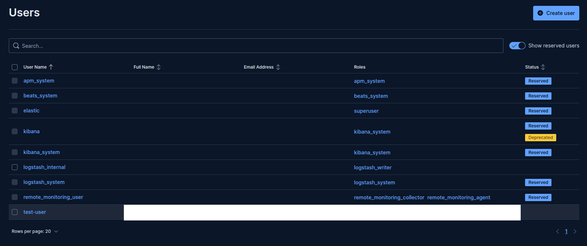

#### Role:
To perform user management operations such as password rotation using an API key, the associated user or role must have appropriate permissions.
- Under the **Security** section, click on **Roles**.

    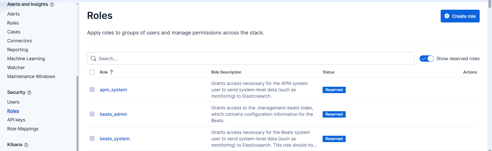

- Click on **Create Role**.
- Add the details of role like name and click **Create role**
- Role is created, now attaching this role to api key.

#### Creating an API Key
- To create an API key in Elasticsearch:
- Go to **Stack Management** → **Security** → **API Keys**.

    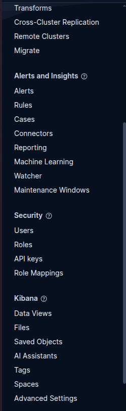

- Click the **Create API key** button.
- Provide a name for the key and optionally set an expiration time in the Apply expiration field.

    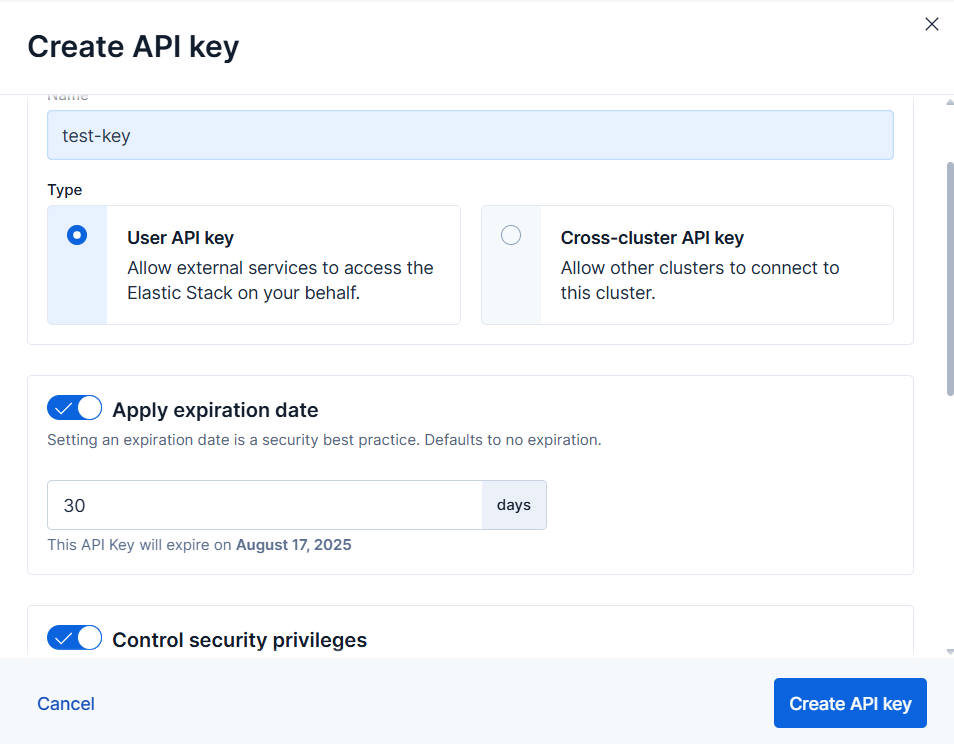

- Add the expiration date.
- Select the **User API key** and attach the below policy. 
    ```bash
    {
        "<role-name>": {
            "cluster": [
            "manage_security",
            "manage"
            ],
            "indices": [],
            "applications": [],
            "run_as": [],
            "metadata": {},
            "transient_metadata": {
            "enabled": true
            }
    }
    ```

    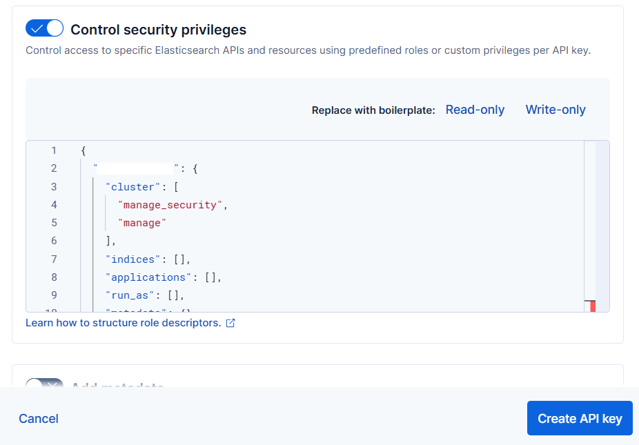

- Click **Create API key**.
- A new API key will be generated — copy and securely store it, as it will be needed to configure authentication in your application.

    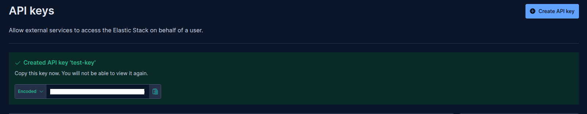


## Steps to Create Keeper Security Records and Elasticsearch Integration

### 1. Create and Add Details in New Configuration Record of type Login:
Store the configuration values in a Keeper Security record of type `Login` named as `Elasticsearch Configuration Record`:

- Execute the following command to create config record in keeper vault:
    ```bash
    plugin_test config -f elasticsearch_user.py -t "Elasticsearch Configuration Record" -s "shared_folder_uid"
    ```

    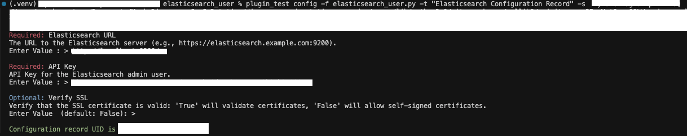


### 2. Create and Add Details in New Rotation Record of type PAM User:
- Create a record of type **PAM User** inside the Keeper Vault.
- Enter the username copied from the previous step.
- This will create a record of type **PAM User**. 

    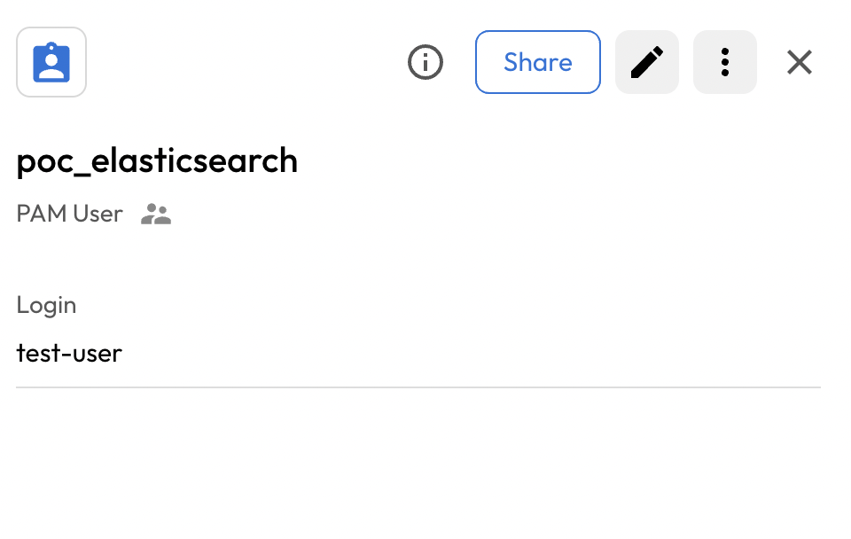


## Executing the Script for Rotating Password
Once you have your pre-requisites ready, make sure you cover the following:

- Execute the following command in your activated virtual environment:

    ```bash
    plugin_test run -f elasticsearch_user.py -u <pam_user_record_uid> -c <config_record_uid>
    ```

- The above command rotate the Elastic Search User Password

    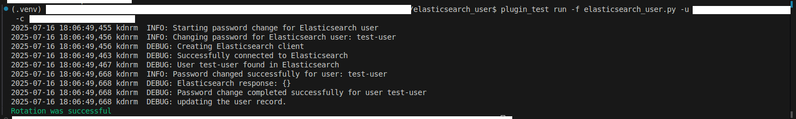


- Keeper Vault PAM User Record is updated.

    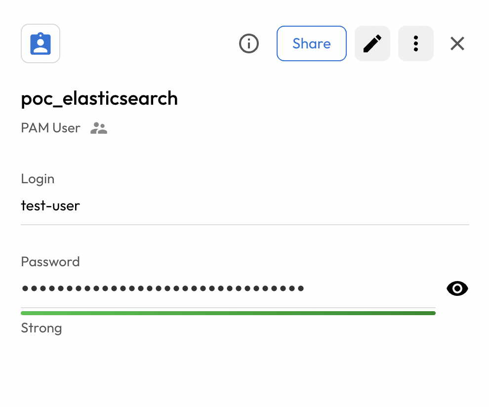
