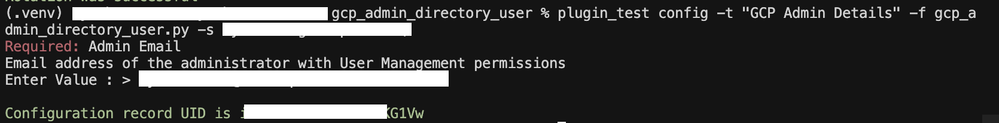
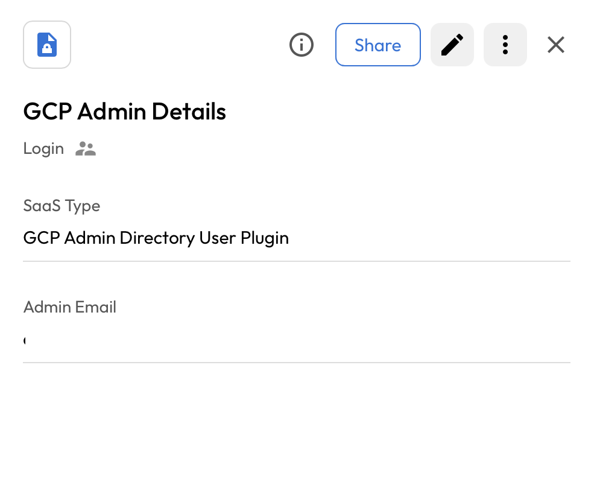

# User Guide | Keeper Security / GCP Admin Directory 

## Overview
This user guide covers the post-rotation script for the Keeper Security / Google Admin Directory integration. Details on how to use the post-rotation script are available at the [_Keeper Security online documentation_](https://github.com/Keeper-Security/discovery-and-rotation-saas-dev) and will not be repeated here.

## GCP Admin Directory 
In Google Cloud Platform (GCP), an "admin directory" typically refers to the Admin SDK Directory API, which is a RESTful API that allows administrators to programmatically manage users, groups, devices, and other resources associated with a Google Workspace or Cloud Identity account. It's a core component for managing the identity and access aspects of a Google Cloud environment. 

## Pre-requisites
In order to use the post-rotation script, you will need the following prerequisites:

**1. Google Auth Library:** The google-auth library for Python provides functionalities for authenticating to Google APIs using various methods. This library is a core component for Python applications interacting with Google Cloud services and other Google APIs.

    pip install google-auth

**2. Google-Api-Python-Client:** The google-api-python-client is a Python library that provides a way to interact with Google APIs. It simplifies the process of making requests to various Google services, handling authentication and authorization with fewer lines of code.

    pip install google-api-python-client

## Steps to Test Google Admin Directory 
### 1. Login to google cloud console: 
- Go to the [cloud console](https://console.cloud.google.com)
- Log in with your Admin Google Cloud credentials.

### 2. Create a Service Account:
- Select the appropriate project for creating service account.
- Navigate to the **IAM and Admin** tab and select the **Service Accounts** section and click on **Create service account**.

    

- Add the service account name and click on **Create and continue**.

    

- User may add **Principals with access** accordingly. 
- Click on **Continue** and select **Done** at the bottom of the page.
- Service Account with all permission is created.

### 3. Authorize Domain-Wide Delegation: 
- The service account created above requires approval for Domain-Wide Delegation of Authority.
- To authorize this, use an admin email account to grant the necessary permissions.
- [Perform Google Workspace domain-wide delegation of authority](https://developers.google.com/workspace/cloud-search/docs/guides/delegation)
- Add the below **OAuth Scopes** for authorize wide delegation authority. 
          https://www.googleapis.com/auth/admin.directory.user

### 4. Generate service account json file:
- Go to the **Service Accounts** section and select the service account you created.
-  Navigate to the **Keys** section and **Create a new key** with the **JSON** format.

    

### 5. Enable Admin SDK:
- Go to the **API & Services** section in the Google Cloud Console.

    

- Click on **Enabled APIs & Services**.
- Click the **+ ENABLE APIS AND SERVICES** button at the top.
- In the search bar, type **Admin SDK API**.

    

- Select it from the results and click **Enable**.

    

## Steps to create Keeper security records
### 1. Execute the script and create config in keeper security:
- Please open a terminal with the virtual environment activated, and execute the following command.
- This command runs within the integrations/<integration_name> directory. User may specify the path to the KSM config file using the **--config** parameter.

      plugin_test config -f <gcp_admin_directory_python_script> -s <shared_folder_uid> -t "GCP Admin Details"

      Required: Admin Email
      Email address of the administrator with User Management permissions
      Enter Value : > 

      - Admin Email: Admin Email ID (Admin Email ID with User Management Admin Permission)

    
- Please provide the requested details, and this will create a login record in the shared folder.

    

### 2. Copy the UID:
Executing the above command will generate a UID. Copy this UID as it will be used later.

### 3. Add the service account json file:
- Access the Keeper Vault and navigate to the shared folder associated with the UID for the created configuration.
- Search for the record with the title used for the created configuration.
- Upload the service account JSON file to the previously created Login record.

    

> **Note:** The service account json file should be name as **service_account.json**

### 4. Create and add details in New Record of type PAM User:
To rotate the user's password, you need to create a PAM user record and add the email in the login field.

## Executing the script for rotating password
Once you have your pre-requisites ready, make sure you cover the following:

- Execute the following command in activated virtual environment.
    
        plugin_test run -f <gcp_admin_directory_python_script> -u <created_pam_user_record> -c <copied_uid_from_step_2>

    

- The above command rotate the gcp admin directory user's password.

    

