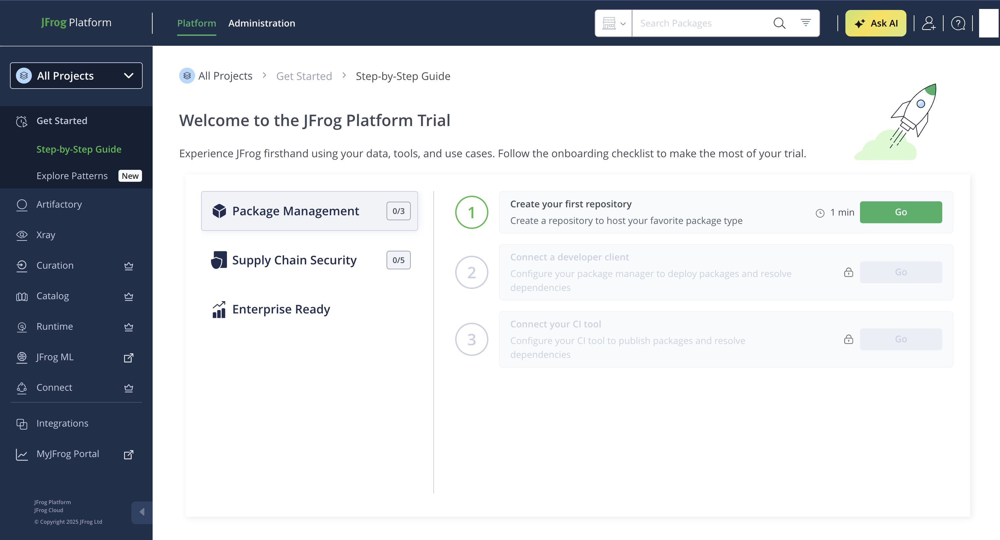
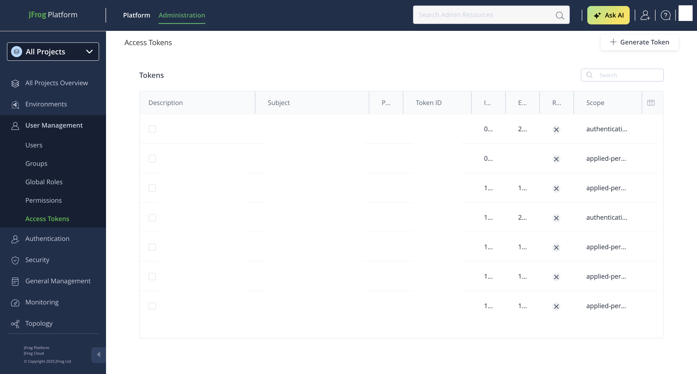
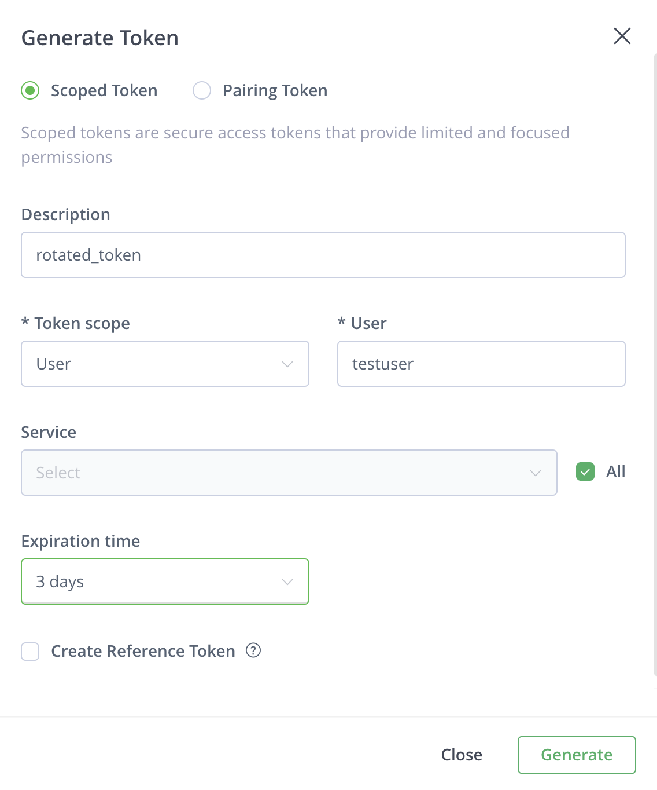
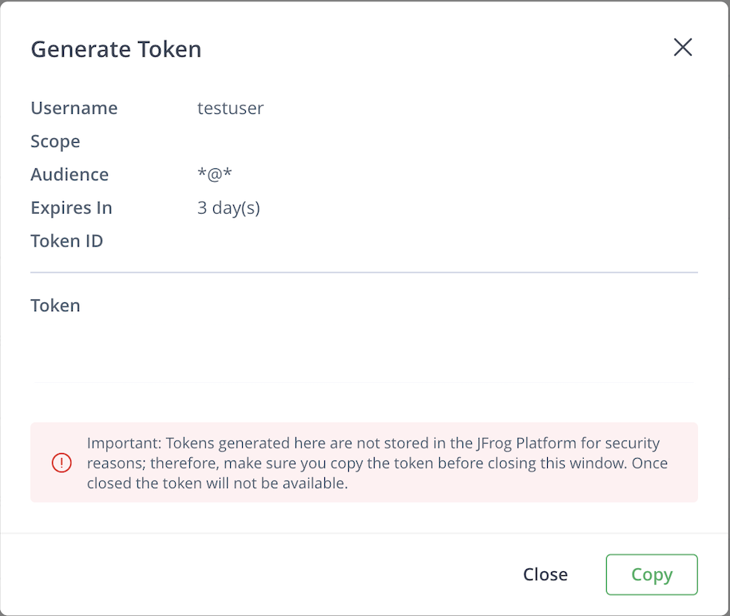
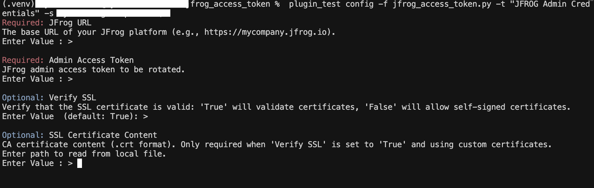
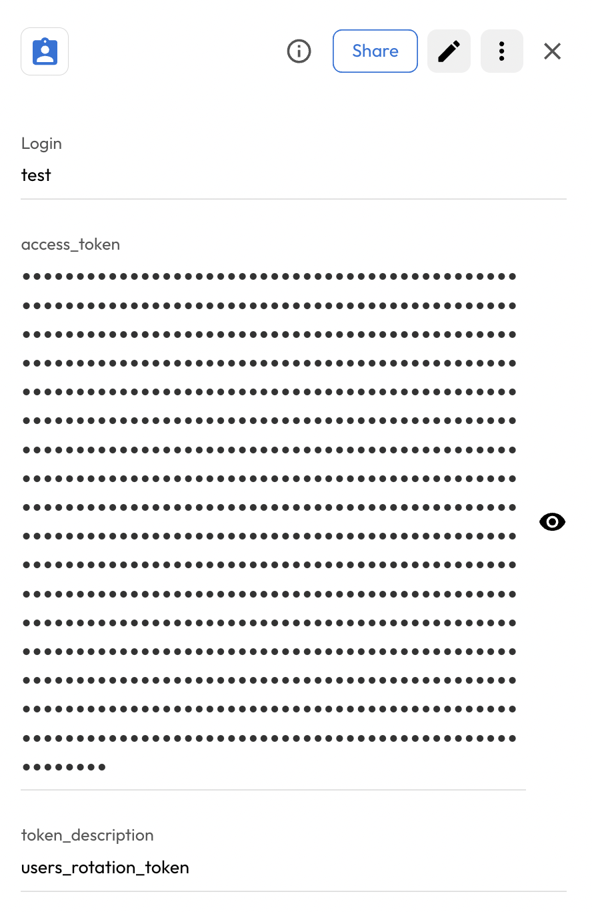
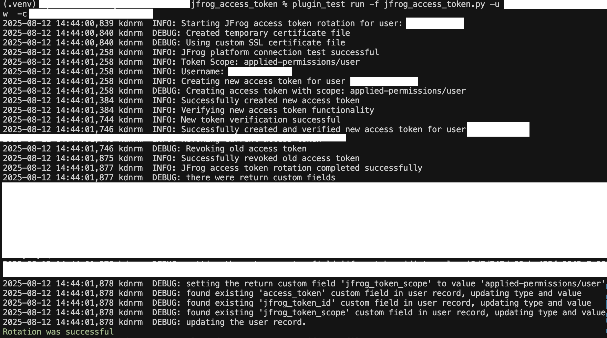
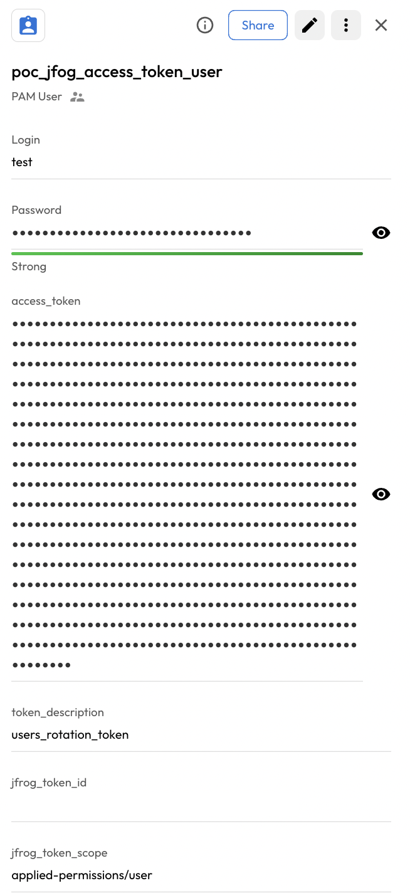

# User Guide | Keeper Security / JFrog Access Token

## Overview

This user guide covers the post-rotation script for the Keeper Security / JFrog Access Token integration. 
Details on how to use the post-rotation script are available at the 
  [_Keeper Security online documentation_](https://github.com/Keeper-Security/discovery-and-rotation-saas-dev) and 
  will not be repeated here.

## JFrog Platform
[JFrog Platform](https://jfrog.com/platform/) is a universal DevOps platform that provides end-to-end automation for managing and securing software artifacts throughout the development lifecycle.
JFrog's access tokens provide a secure alternative to username/password authentication and can be scoped to specific permissions.
The platform includes Artifactory, Xray, Distribution, Pipelines, and other tools for comprehensive DevOps operations.

## Pre-requisites
In order to use this post-rotation script, ensure the following prerequisites::

**1. Requests Library:** Ensure that the requests library is installed in your Python environment. This library is necessary for making HTTP API requests to JFrog platform.

**2. Requests library installation:** The Requests library allows you to interact with JFrog platform APIs easily. Activate a Python virtual environment in your Keeper Gateway environment and install the library using the following command:

    pip install requests

## Steps to Test JFrog Access Token Plugin

### 1. Set Up JFrog Platform Environment

#### Creating an Admin Access Token in JFrog
- To create an admin access token in JFrog, follow these steps:
- Log in to the JFrog Platform and navigate to your profile.

    

- Go to **User Profile** → **Access Tokens**.
- Click on **Generate** to create a new access token.

    

- Configure the token settings:
    - **Token Name** (e.g., "Keeper Rotation Token")
    - **Token Scope** (e.g., "Admin")
    - **Expiration Time** (optional)

        

- Click **Generate** to create the token.
- Copy and securely store the generated access token, as it will not be displayed again.

    

#### Permissions:
To perform token management operations such as access token rotation using an admin token, the associated user must have appropriate permissions.
- Ensure the user has **Admin** permissions on the platform.

## Steps to Create Keeper Security Records and JFrog Integration

### 1.Execute the command to create config details:
Store the configuration values in a Keeper Security record of type `Login` named as `JFrog Access Token Configuration Record`:

- Execute the following command to create config record in keeper vault:
    ```bash
    plugin_test config -f jfrog_access_token.py -t "JFrog Access Token Configuration Record" -s "shared_folder_uid"

    Required: JFrog URL
    The base URL of your JFrog platform (e.g., https://mycompany.jfrog.io).
    Enter Value : > 

    Required: Admin Access Token
    JFrog admin access token with permissions to create and revoke tokens.
    Enter Value : > 

    Optional: Verify SSL
    Verify that the SSL certificate is valid: 'True' will validate certificates, 'False' will allow self-signed certificates.
    Enter Value  (default: False): > 

    Optional: SSL Certificate Content
    CA certificate content (.crt format). Only required when 'Verify SSL' is set to 'True' and using custom certificates.
    Enter path to read from local file.
    Enter Value : > 


    - JFrog URL : URL of JFrog platform
    - Admin Access Token : Generated admin access token from JFrog
    - Verify SSL : Boolean value
    - SSL Certificate Content : (.crt) file content
    ```

    

### 2. Create and Add Details in New Rotation Record of type PAM User:
- Create a record of type **PAM User** inside the Keeper Vault.
- Add the following custom fields:
    - **access_token**: The current JFrog access token to be rotated
    - **token_description**: Description for the new token (e.g., "Production API Access")
    - **jfrog_token_scope**: (Optional) Token scope. If not provided, it will be extracted from the current token.
- This will create a record of type **PAM User**. 

    


## Executing the Script for Rotating Access Token
Once prerequisites are ready, complete the following:

- Execute the following command in your activated virtual environment:

    ```bash
    plugin_test run -f jfrog_access_token.py -u <pam_user_record_uid> -c <config_record_uid>
    ```

- The above command rotate the JFrog Access Token

    


- Keeper Vault PAM User Record is updated.

    

