# User Guide | Keeper Security / JFrog User Password Rotation

## Overview

This user guide covers the post-rotation script for the Keeper Security / JFrog User Password Rotation integration. 
Details on how to use the post-rotation script are available at the 
  [_Keeper Security online documentation_](https://github.com/Keeper-Security/discovery-and-rotation-saas-dev) and 
  will not be repeated here.

## JFrog Platform
[JFrog Platform](https://jfrog.com/platform/) is a comprehensive DevSecOps platform that provides universal repository management, 
CI/CD pipeline optimization, and DevSecOps automation across the entire software development lifecycle. 
The platform includes Artifactory for binary repository management, Xray for security and compliance scanning, 
and Pipelines for CI/CD automation. JFrog's security features include robust user authentication, 
role-based access control (RBAC), and comprehensive audit trails to protect your artifacts and pipelines.

Reference for [Jfrog Rest API's](https://jfrog-external.fluidtopics.net/r/jfrog-rest-apis/jfrog-platform-rest-apis) 

## Pre-requisites
In order to use this post-rotation script, ensure the following prerequisites:

**1. Requests Library:** Ensure that the requests library is installed in your Python environment. This library is necessary for making HTTP API requests to JFrog platforms.

**2. Requests library installation:** The requests library allows you to interact with JFrog REST APIs easily. Activate a Python virtual environment in your Keeper Gateway environment and install the library using the following command:

    pip install requests

## Steps to Test JFrog User Password Rotation Plugin

### 1. Set Up JFrog Environment

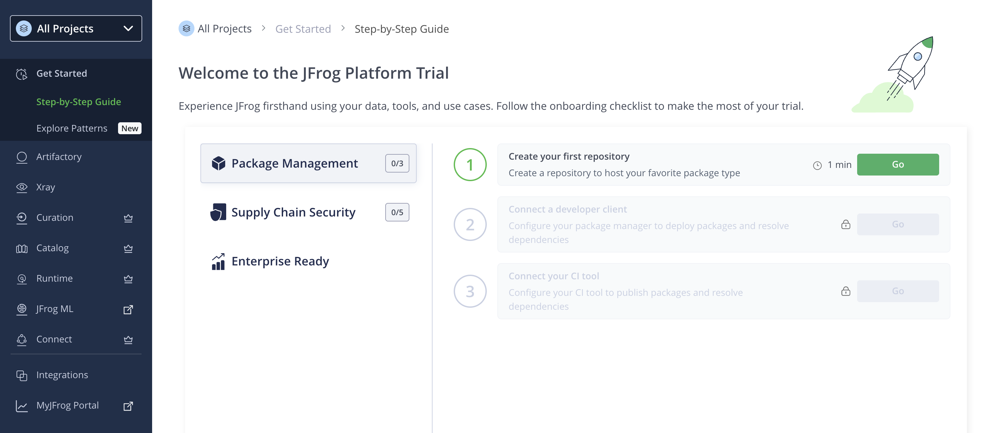

#### Creating a User in JFrog Platform
- To create a user in JFrog, follow these steps:
- Log in to the JFrog Platform and navigate to **Administration** → **User Management** → **Users**.
    
    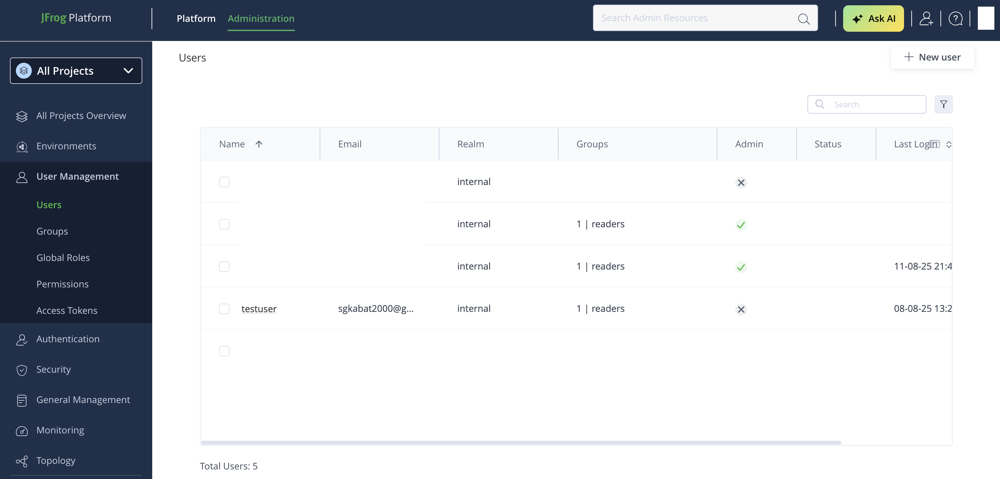

- Click on **New User** and fill in the required details such as:
    - **Username**
    - **Email**
    - **Password**

         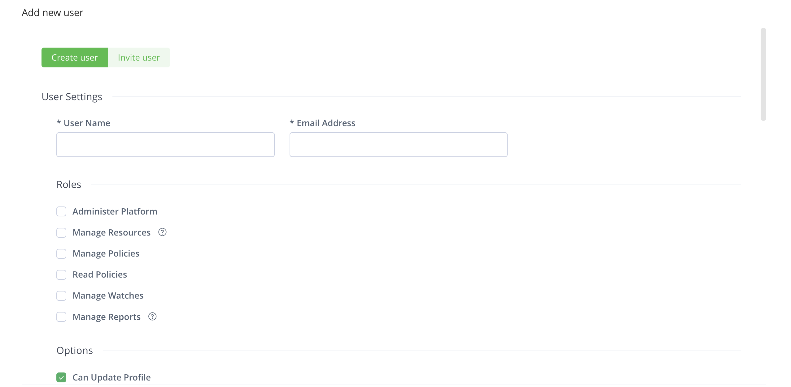

- (Optional) Assign one or more groups/roles to the user if needed.
- Click **Save** to finalize the user creation.

    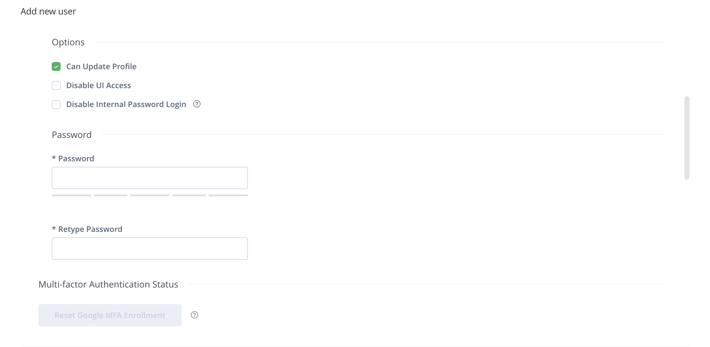

#### Creating an Admin Access Token
To perform user management operations such as password rotation, user need an admin access token with appropriate permissions.

- Navigate to **Administration** → **User Management** → **Access Tokens**.
- Click on **Generate Token**
- Select the **Scoped Token**

    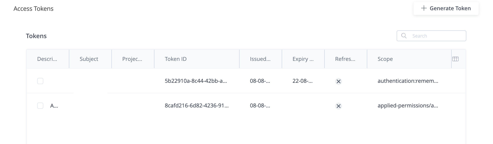

- Provide a description for the token and optionally set an expiration time.

    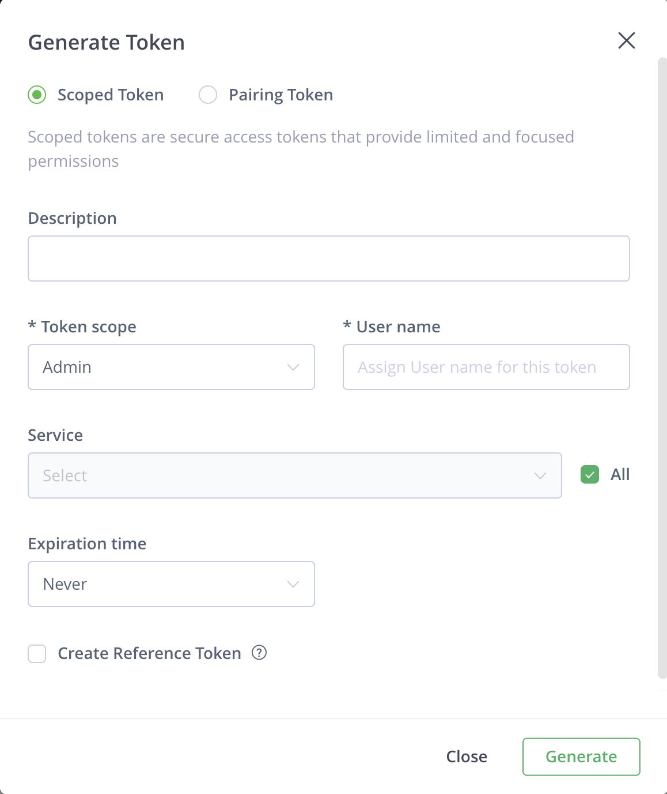

- Select the **Admin** as Token scope and permissions. 
- Add the username for the username field.
    
    ```bash
    Service: Applied to all repositories
    Permissions: 
    - Admin
    ```

- Click **Generate**.
- A new access token will be generated — copy and securely store it, as it will be needed to configure authentication in your application.

    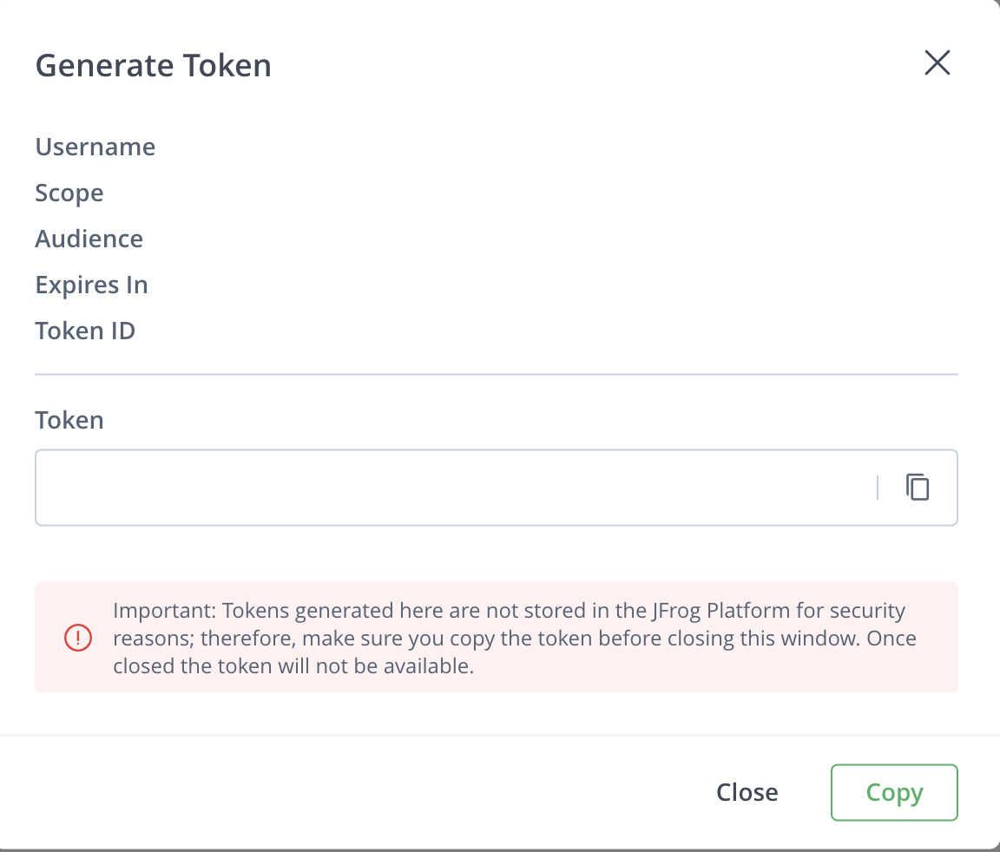

- For more, [Reference For Generate API Token]( https://docs.brinqa.com/docs/connectors/jfrog-artifactory/)

#### Required Permissions
The admin access token must have the following permissions to successfully rotate user passwords:
- **Admin**: Perform administrative operations


## Steps to Create Keeper Security Records and JFrog Integration

### 1. Execute the command to create admin config record:
Sets the configuration values in a Keeper Security record of type `Login` named as `JFrog Configuration Record`:

- Execute the following command to create config record in keeper vault:
    ```bash
    plugin_test config -f jfrog_users.py -t "JFrog Configuration Record" -s "shared_folder_uid"

    Required: JFrog URL
    The base URL of your JFrog platform (e.g., https://mycompany.jfrog.io).
    Enter Value : > 

    Required: Admin Access Token
    JFrog admin access token for authentication.
    Enter Value : > 

    Optional: Verify SSL
    Verify that the SSL certificate is valid: 'True' will validate certificates, 'False' will allow self-signed certificates.
    Enter Value  (default: True): > 

    Optional: SSL Certificate Content
    CA certificate content (.crt format). Only required when 'Verify SSL' is set to 'True' and using custom certificates.
    Enter path to read from local file.
    Enter Value : > 


    - JFrog URL : Base URL of your JFrog platform
    - Admin Access Token : Generated admin access token from JFrog
    - Verify SSL : Boolean value (True/False)
    - SSL Certificate Content : (.crt) file content for custom certificates
    ```

    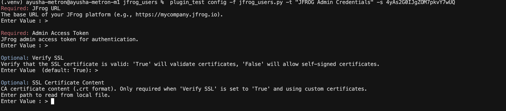

- The above command will generate the admin config record in Keeper Vault.

    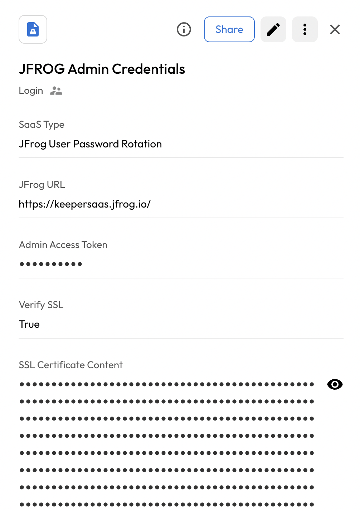

### 2. Create and Add Details in New Rotation Record of type PAM User:
- Create a record of type **PAM User** inside the Keeper Vault.
- Enter the username copied from the previous step.
- This will create a record of type **PAM User**. 
   
    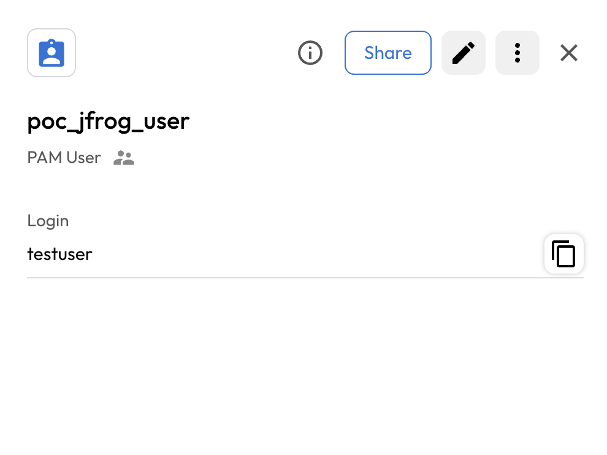

## Executing the Script for Rotating Password
Once your pre-requisites ready, make sure cover the following:

- Execute the following command in your activated virtual environment:

    ```bash
    plugin_test run -f jfrog_users.py -u <pam_user_record_uid> -c <config_record_uid>
    ```

- The above command will rotate the JFrog User Password

    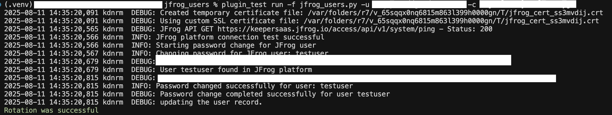

- Keeper Vault PAM User Record is updated with the new password.

    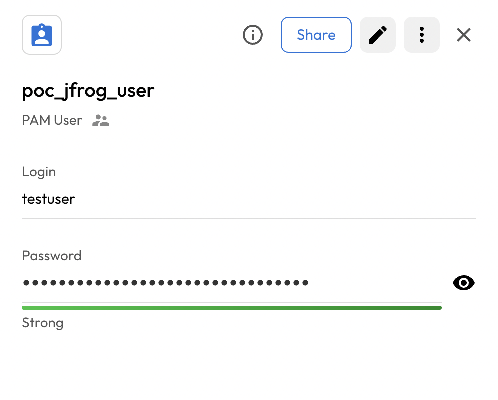

## Configuration Parameters

### Required Parameters
- **JFrog URL**: The base URL of your JFrog platform (e.g., `https://mycompany.jfrog.io`)
- **Admin Access Token**: A valid JFrog admin access token with user management permissions

### Optional Parameters
- **Verify SSL**: Whether to verify SSL certificates (`True` or `False`, default: `True`)
- **SSL Certificate Content**: Custom CA certificate content for SSL verification (only needed when using custom certificates with SSL verification enabled)


## API Endpoints Used

The plugin uses the following JFrog Access API endpoints:
- **Health Check**: `GET /access/api/v1/system/ping`
- **User Verification**: `GET /access/api/v2/users/{username}`
- **Password Change**: `PUT /access/api/v2/users/{username}/password`
