# User Guide | Keeper Security / OKTA User 

## Overview
This user guide covers the post-rotation script for the Keeper Security / Okta integration. Details on how to use the post-rotation script are available at the [_Keeper Security online documentation_](https://github.com/Keeper-Security/discovery-and-rotation-saas-dev) and will not be repeated here.

## Okta Overview
Okta is an enterprise-grade cloud-based identity and access management (IAM) platform. It helps organizations manage digital identities, streamline user authentication and authorization, and secure access to applications and data. Okta offers features like single sign-on (SSO), multi-factor authentication (MFA), user lifecycle management, and integration with various applications. 

## Pre-requisites
In order to use the post-rotation script, you will need the following prerequisites:

**1. Requests Library:** Ensure that the requests library is installed in your Python environment. This library is necessary for making HTTP requests to Cisco devices.

**2. Requests library installation:** The Requests library allows you to send HTTP requests easily. Activate a Python virtual environment in your Keeper Gateway environment and install the library using the following command:
    
    pip install requests

**3. Login in Okta using admin credentials:**
Navigate to Okta web page.

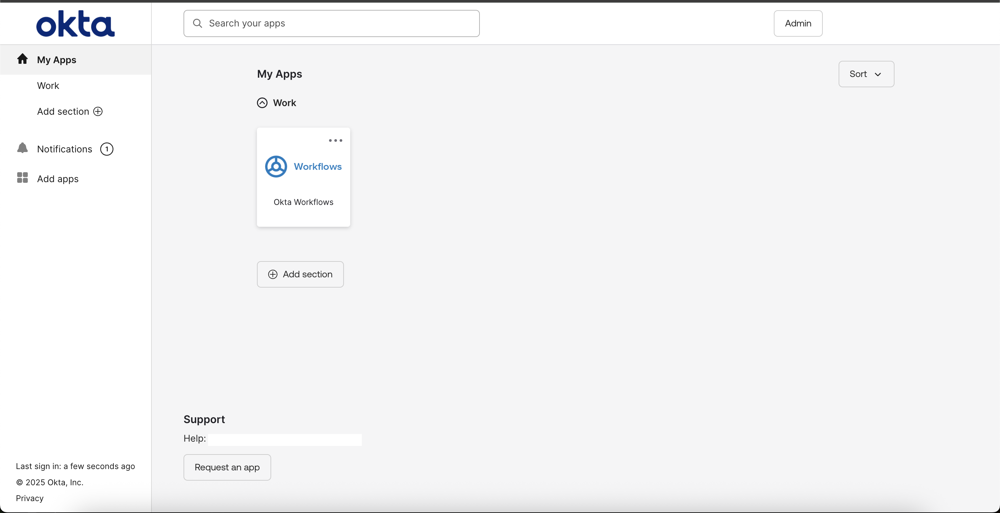

- The plugin uses an Okta API token generated from an Admin account to authenticate and perform user password rotation securely. This token must have permissions to manage users.

- Go to **Admin** Section.
    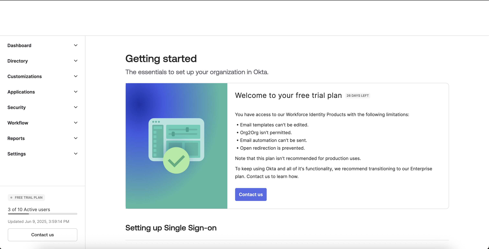

**4. Create a user inside Okta directory:**
Ensure the target user exists in the Okta directory. This user should have a valid email (username) and an existing password, which will be replaced during the rotation process.

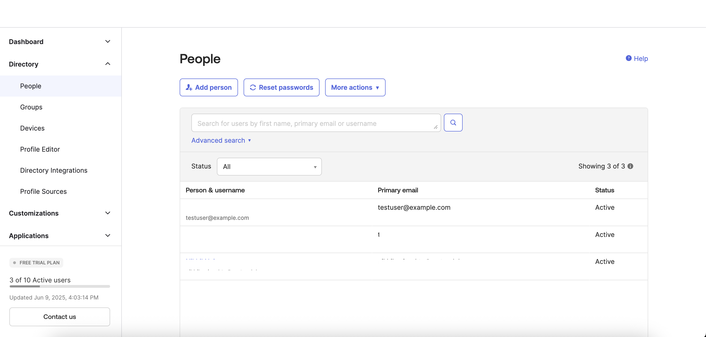

- Click on **Add People**.

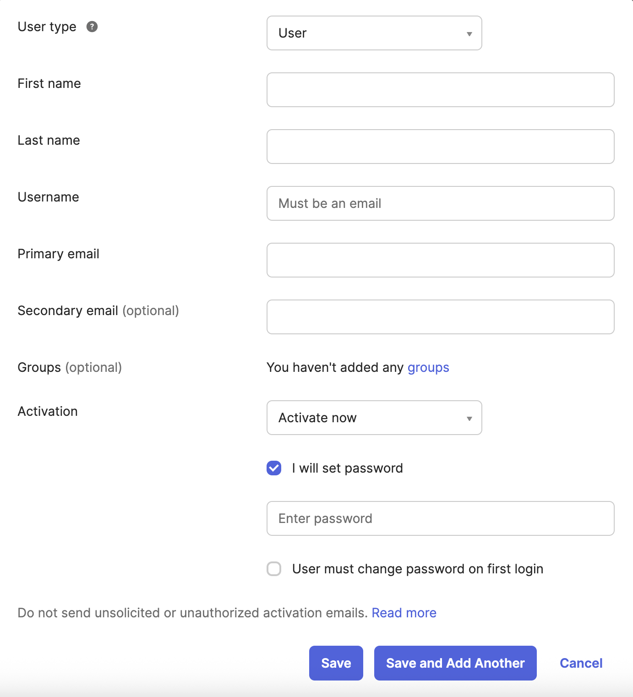

**5. Generate an API Token in Okta:**
Create an API token in your Okta Admin Dashboard by navigating to **Security → API → Tokens**. This token is used to authenticate API requests made by the plugin and should have sufficient privileges to manage users and change passwords.

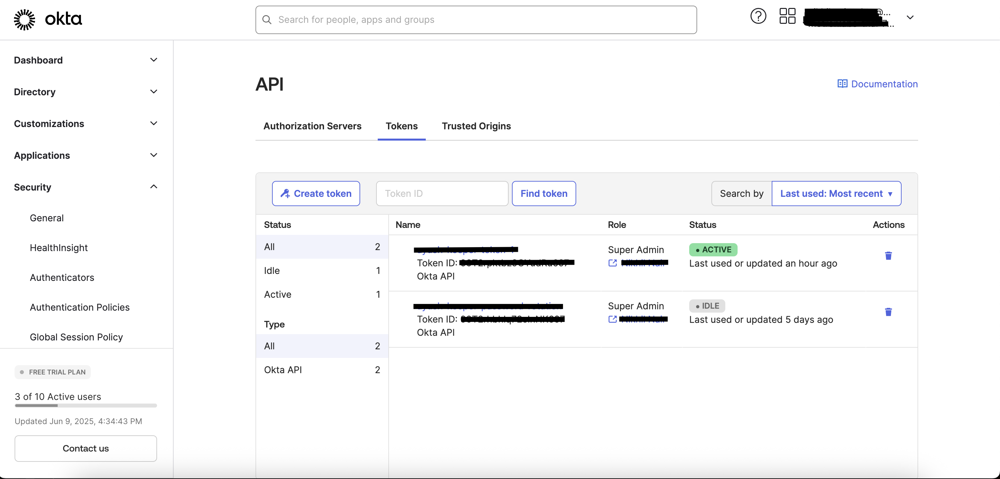

- Select the **Any IP** option from the below dropdown.

    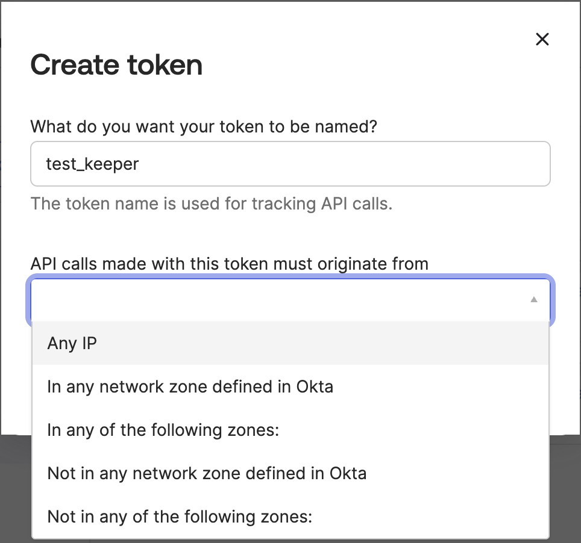

- User must able to see the below settings, once token is created.

    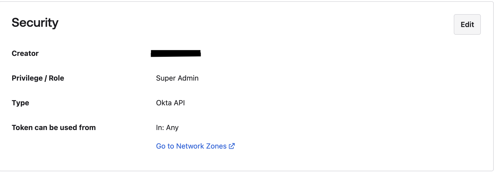

## Steps to create Keeper security records and Okta user

### 1.  Execute the script and create config in keeper security:
- Please open a terminal with the virtual environment activated, and execute the following command.
- To enable password rotation for a user, you must first create a configuration inside shared folder within Keeper Vault. This configuration securely stores the credentials needed for automated password rotation. Without setting up this configuration in Keeper Vault, the system will not have the necessary context or access to perform password updates on the target account or system.

      plugin_test config -f okta_user.py -t "Okta Admin Token Credential" -s "<shared_folder_uid>"

      Required: Subdomain
      Subdomain of Okta account ended with '.okta.com'
      Enter Value : > 

      Required: API Token
      API Token from Okta
      Enter Value : > 

      - Subdomain: Subdomain of you Okta account. 
        Example: **trial1234.okta.com**
      - API Token: API Token fetched from Okta. 
    
Please provide the requested details, and this will create a record in the shared folder.

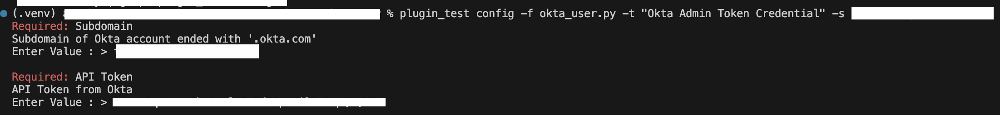

Above command create the authentication details record inside Keeper Vault.

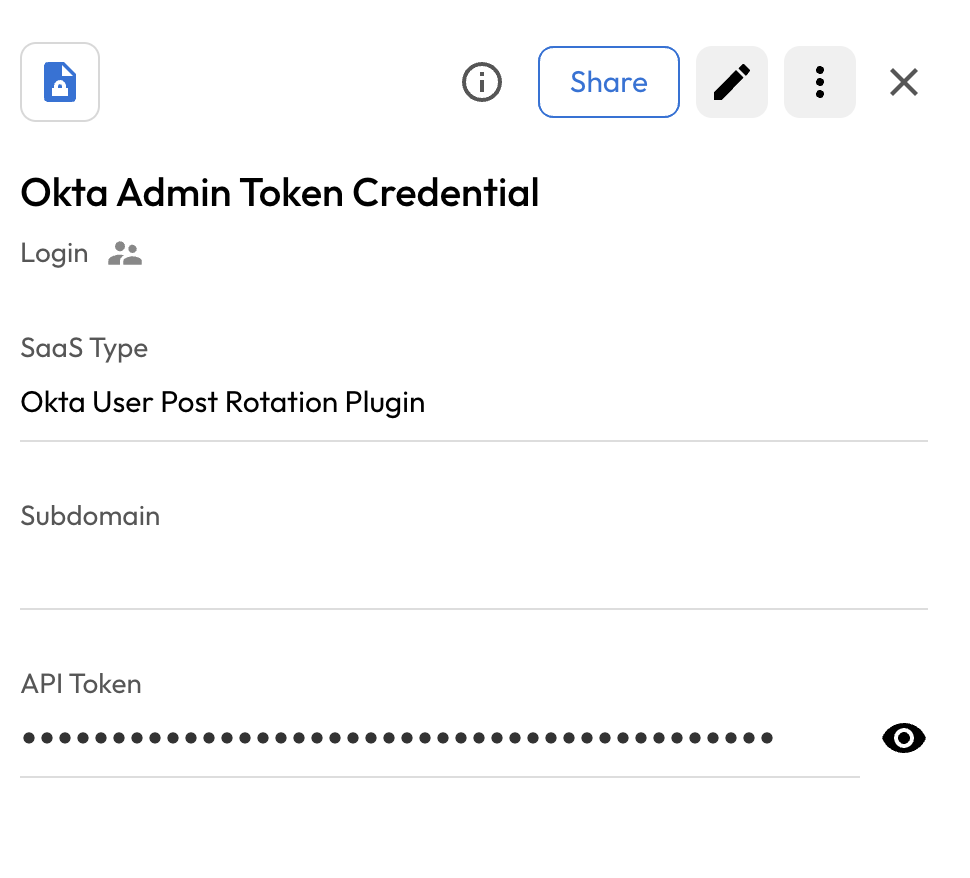

### 2. Copy the UID:
Executing the above command will generate a UID. Copy this UID as it will be used later.

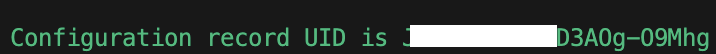

### 3. Create and add details in New Rotation Record of type PAM User:
To rotate the user's password, you need to create a PAM user record and add the username in the login field. 

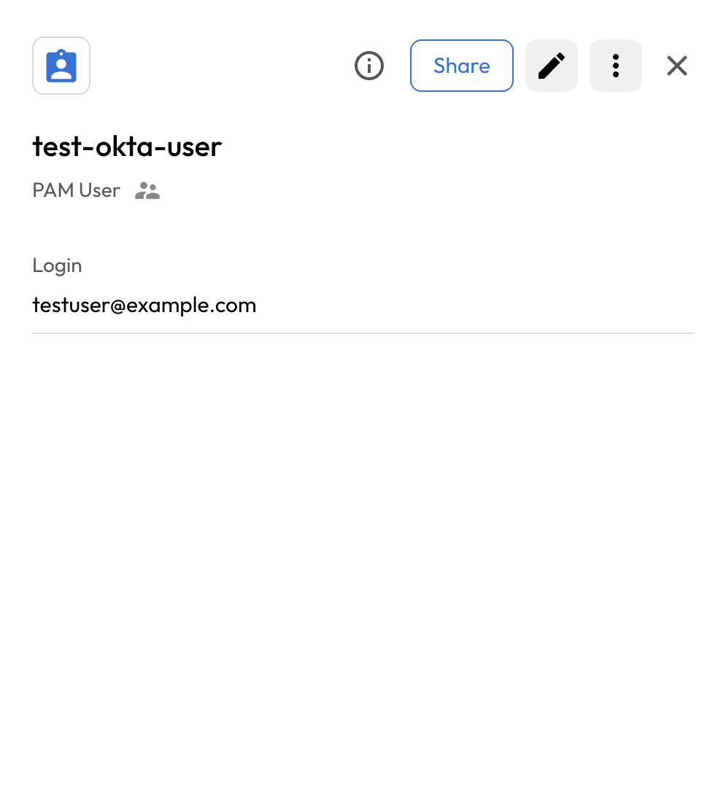

## Executing the script for rotating password

Once you have your pre-requisites ready, make sure you cover the following:

- Execute the following command in activated virtual environment.

        plugin_test run -f <okta_user_python_script> -u <created_pam_user_record> -c <copied_uid_from_step_2>

    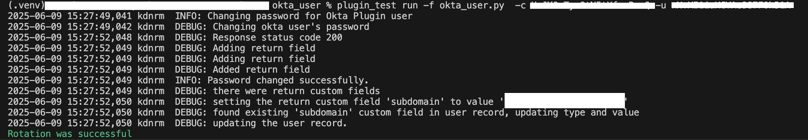

- The above command rotate the okta user's password and add okta subdomain custom field inside keeper vault.

    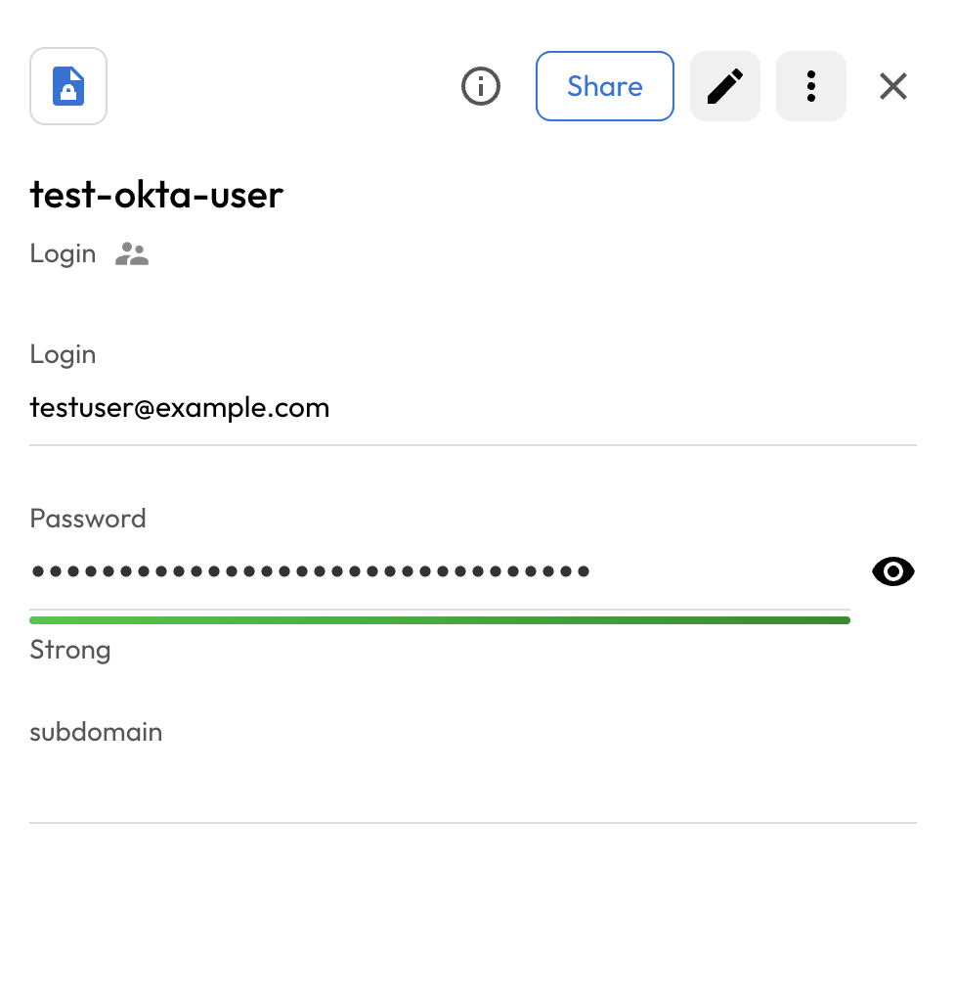