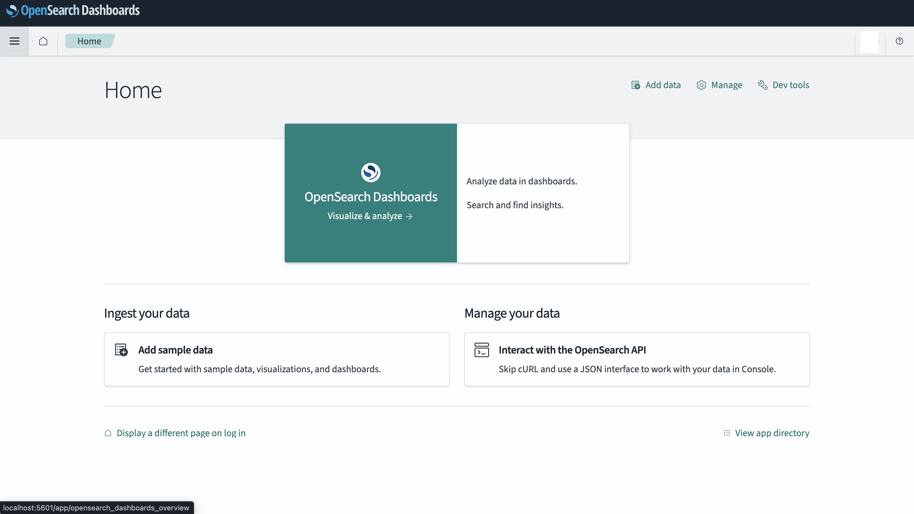
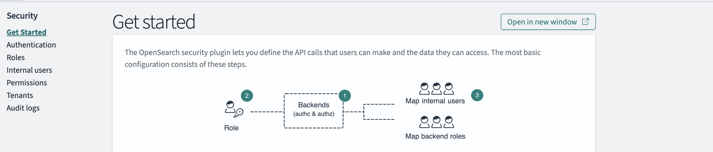
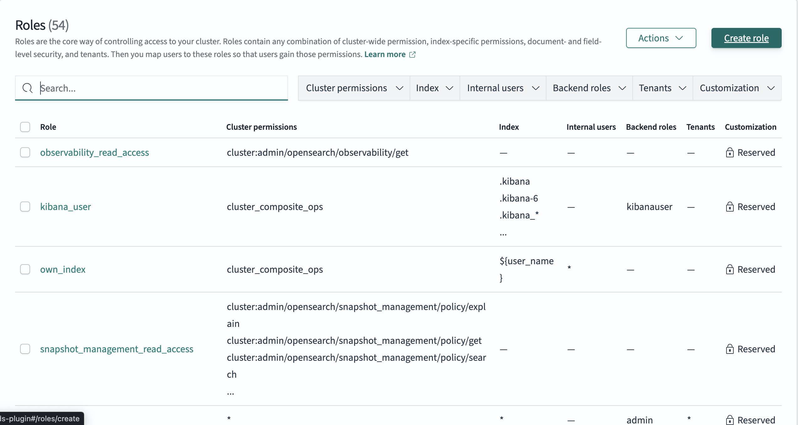
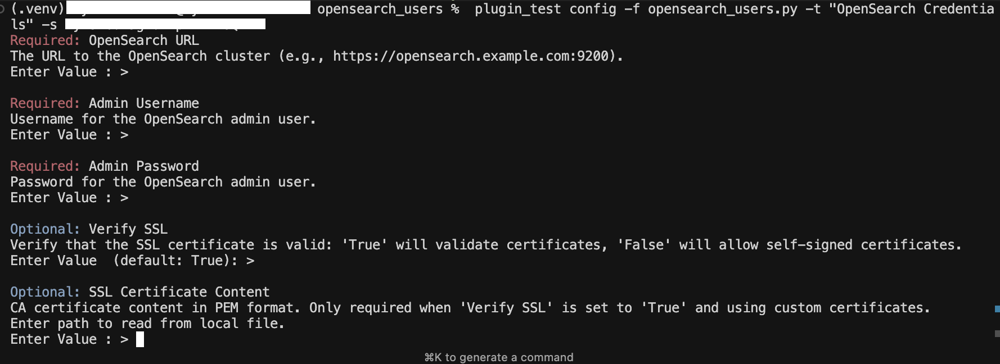
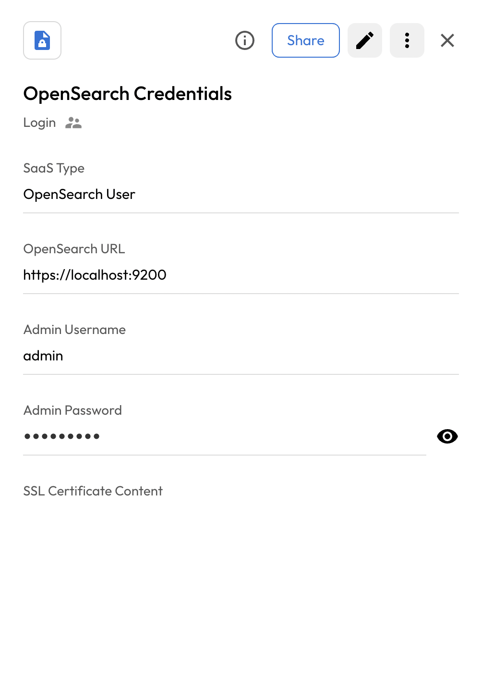
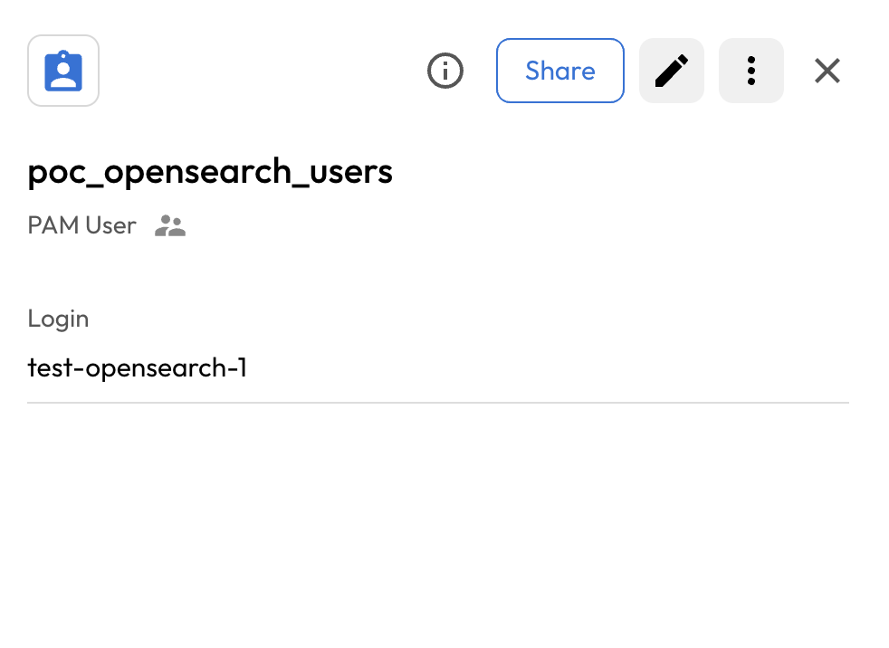
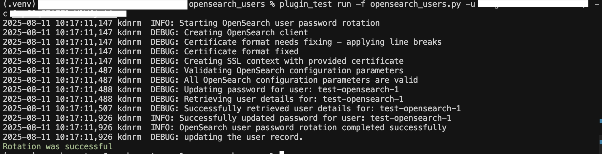
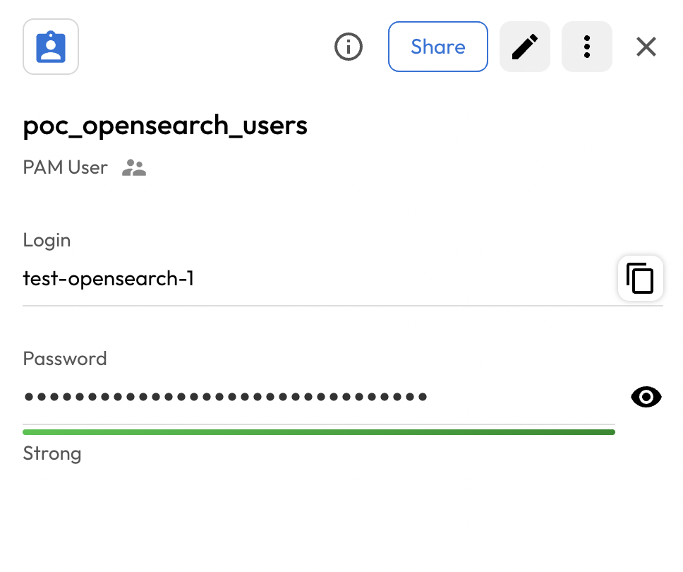

# User Guide | Keeper Security / OpenSearch User

## Overview

This user guide covers the post-rotation script for the Keeper Security / OpenSearch User integration. 
Details on how to use the post-rotation script are available at the 
  [_Keeper Security online documentation_](https://github.com/Keeper-Security/discovery-and-rotation-saas-dev) and 
  will not be repeated here.

## OpenSearch

[OpenSearch](https://opensearch.org/docs/latest/what-is-opensearch/) is a community-driven, open-source search and analytics suite derived from Apache 2.0 licensed Elasticsearch 7.10.2 & Kibana 7.10.2. 
It consists of a search engine daemon, OpenSearch, and a visualization and user interface, OpenSearch Dashboards.
OpenSearch's security features allow for user authentication and role-based access control to protect your data and cluster.

## Pre-requisites

In order to use the post-rotation script, you will need the following prerequisites:

**1. OpenSearch Library:** Ensure that the opensearch-py library is installed in your Python environment. This library is necessary for making API requests to OpenSearch clusters.

**2. OpenSearch library installation:** The OpenSearch library allows you to interact with OpenSearch clusters easily. Activate a Python virtual environment in your Keeper Gateway environment and install the library using the following command:

    pip install opensearch-py

## Steps to Test OpenSearch User Plugin

### 1. Set Up OpenSearch Environment

  

#### Creating a User in OpenSearch

- To create a user in OpenSearch, follow these steps:
- Log in to the OpenSearch Dashboard and navigate to **Security**.

    

- Under the **Security** section, click on **Internal Users**.
- Click on Create User and fill in the required details such as:
    - **Username**
    - **Email**
    - **Password**


- (Optional) Assign one or more roles to the user if needed.
- Click **Create** to finalize the user creation.

#### Role:

To perform user management operations such as password rotation using admin credentials, the associated user or role must have appropriate permissions.
- Under the **Security** section, click on **Roles**.

    

- Click on **Create Role**.
- Add the details of role like name and required permissions:
- `restapi:admin/internalusers`
- Click **Create role**

#### Creating an Admin User

- To create an admin user in OpenSearch:
- Go to **Security** → **Users**.

    

- Click the **Create User** button.
- Provide admin user details:
    - **Username**: admin (or your preferred admin username)
    - **Password**: Strong admin password
    - **Backend roles**: admin
    - **Roles**: all_access or custom role with security management permissions


- Click **Create User**.
- This admin user will be used for authentication in the plugin configuration.

## Steps to Create Keeper Security Records and OpenSearch Integration

### 1. Create and Add Details in New Configuration Record of type Login:

Store the configuration values in a Keeper Security record of type `Login` named as `OpenSearch Configuration Record`:

- Execute the following command to create config record in keeper vault:
    ```bash
    plugin_test config -f opensearch_users.py -t "OpenSearch Configuration Record" -s "shared_folder_uid"

    Required: OpenSearch URL
    The URL to the OpenSearch server (e.g., https://opensearch.example.com:9200).
    Enter Value : > 

    Required: Admin Username
    Username for the OpenSearch admin user.
    Enter Value : > 

    Required: Admin Password
    Password for the OpenSearch admin user.
    Enter Value : > 

    Optional: Verify SSL
    Verify that the SSL certificate is valid: 'True' will validate certificates, 'False' will allow self-signed certificates.
    Enter Value  (default: True): > 

    Optional: SSL Certificate Content
    CA certificate content (.pem format). Only required when 'Verify SSL' is set to 'True' and using custom certificates.
    Enter path to read from local file.
    Enter Value : > 


    - OpenSearch URL : URL of OpenSearch cluster
    - Admin Username : Admin username with user management permissions
    - Admin Password : Admin user password
    - Verify SSL : Boolean value (True/False)
    - SSL Certificate Content : (.pem) file content for custom certificates
    ```

    

- This will create a record inside keeper vault.

    

### 2. Create and Add Details in New Rotation Record of type PAM User:

- Create a record of type **PAM User** inside the Keeper Vault.
- Enter the username of the OpenSearch user you want to rotate.
- Add a custom field with label **username** and the OpenSearch username as the value.
- This will create a record of type **PAM User**. 

    

## Executing the Script for Rotating Password

Once you have your pre-requisites ready, make sure you cover the following:

- Execute the following command in your activated virtual environment:

    ```bash
    plugin_test run -f opensearch_users.py -u <pam_user_record_uid> -c <config_record_uid>
    ```

- The above command rotates the OpenSearch User Password

    

- Keeper Vault PAM User Record is updated with the new password.

    

## Configuration Details

### Required Configuration Items

| Field | Description | Required | Type |
|-------|-------------|----------|------|
| **OpenSearch URL** | The URL to the OpenSearch cluster (e.g., `https://opensearch.example.com:9200`) | Yes | URL |
| **Admin Username** | Username for the OpenSearch admin user | Yes | Text |
| **Admin Password** | Password for the OpenSearch admin user | Yes | Secret |

### Optional Configuration Items

| Field | Description | Required | Default | Type |
|-------|-------------|----------|---------|------|
| **Verify SSL** | Whether to validate SSL certificates (`True`/`False`) | No | True | Boolean |
| **SSL Certificate Content** | Custom CA certificate content in PEM format | No | - | Text |

### PAM User Fields

The following fields must be configured in the PAM user record:

| Field | Description | Required | Example |
|-------|-------------|----------|---------|
| **username** | The OpenSearch username to rotate | Yes | `app-user` |

## Security Considerations

### Authentication
- Uses HTTP Basic Authentication with admin credentials
- Supports both HTTP and HTTPS connections
- Configurable SSL certificate verification
- Automatic certificate format fixing for malformed PEM content

### Permissions
The admin user requires the following permissions:
- `restapi:admin/internalusers`
- Access to the Security API endpoints

## API Endpoints Used

The plugin utilizes the following OpenSearch Security API endpoints:

- `GET /_plugins/_security/api/internalusers/{username}` - Retrieve user details
- `PUT /_plugins/_security/api/internalusers/{username}` - Update user password
