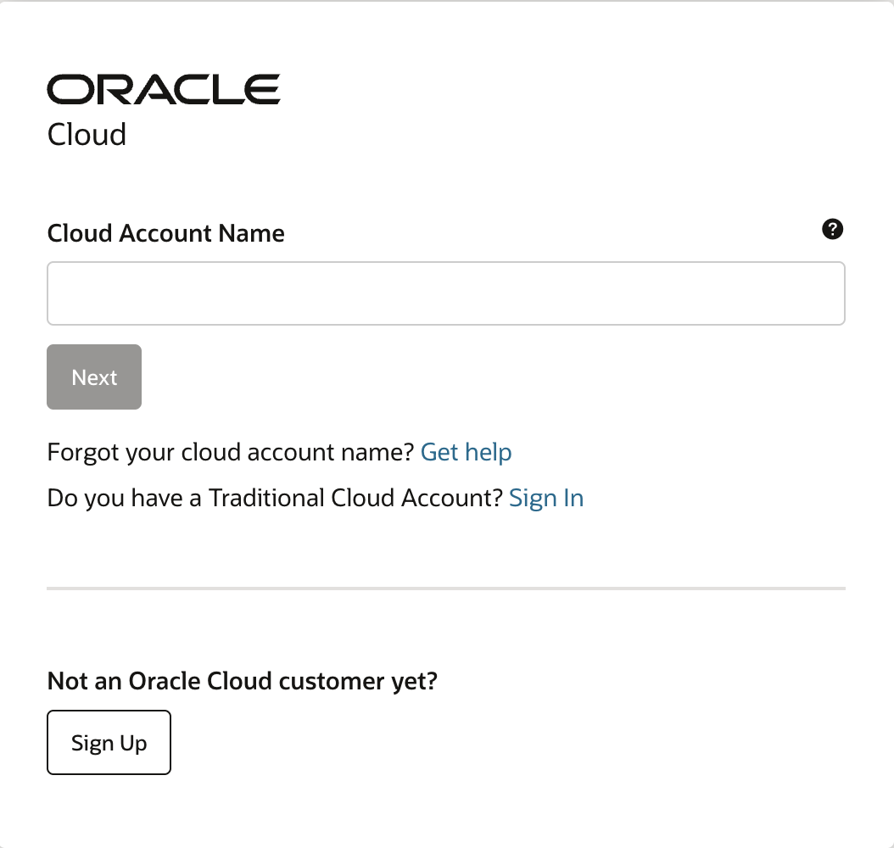
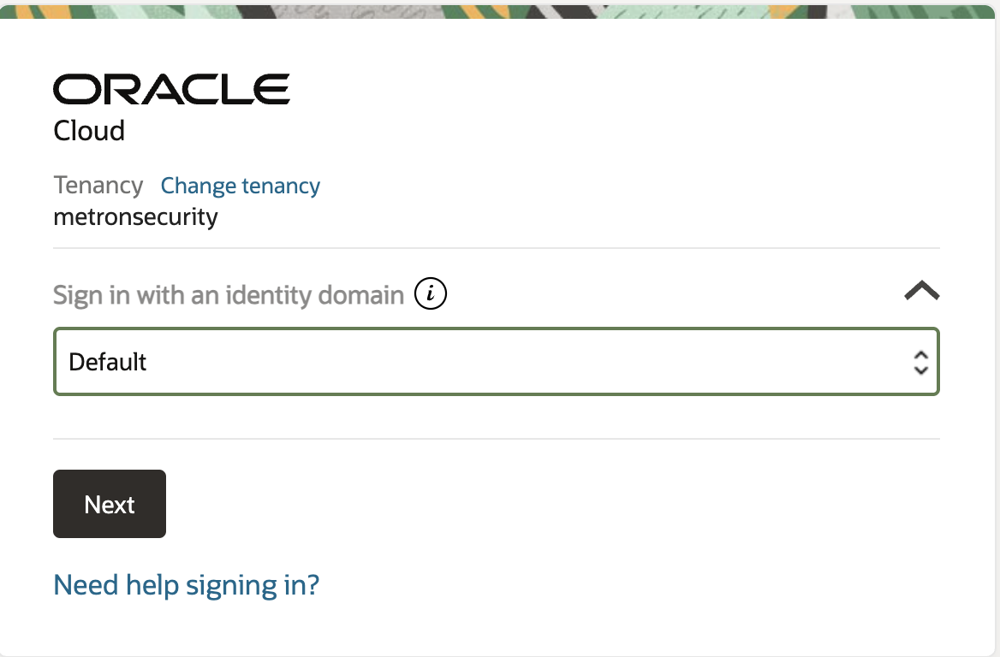
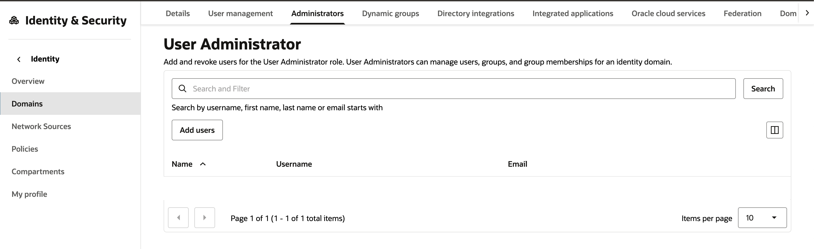
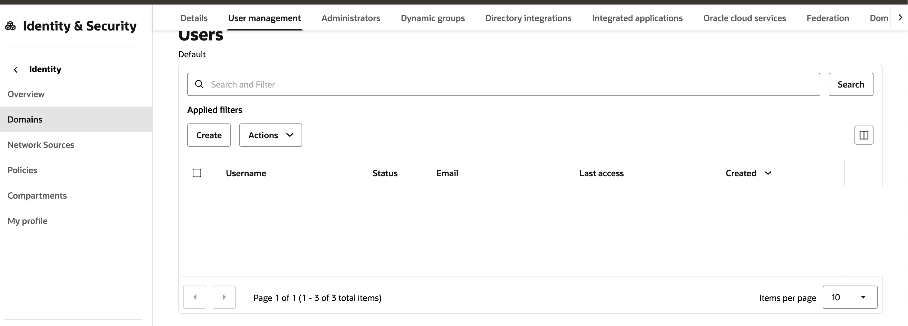
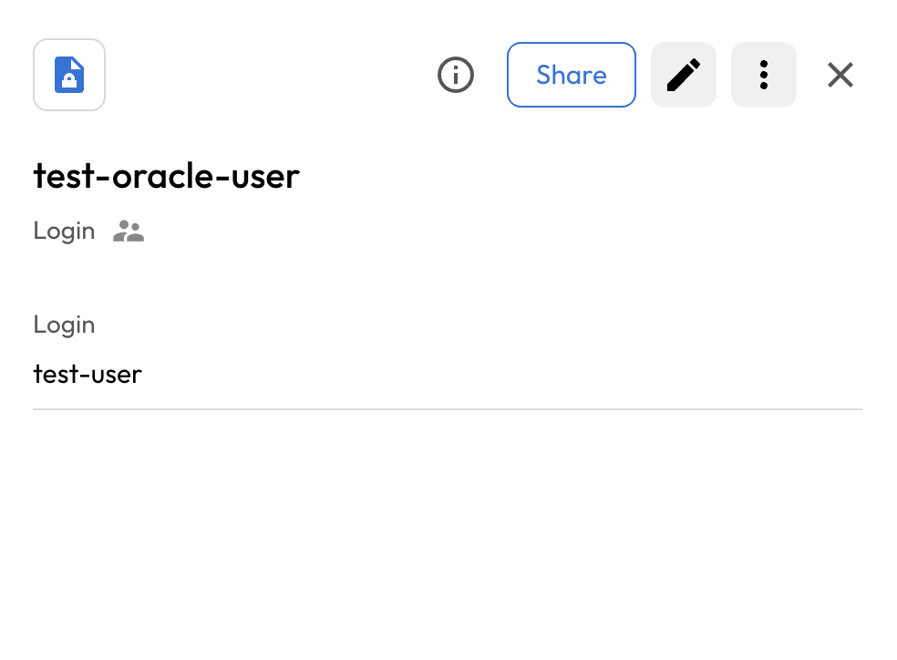
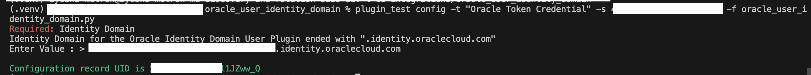
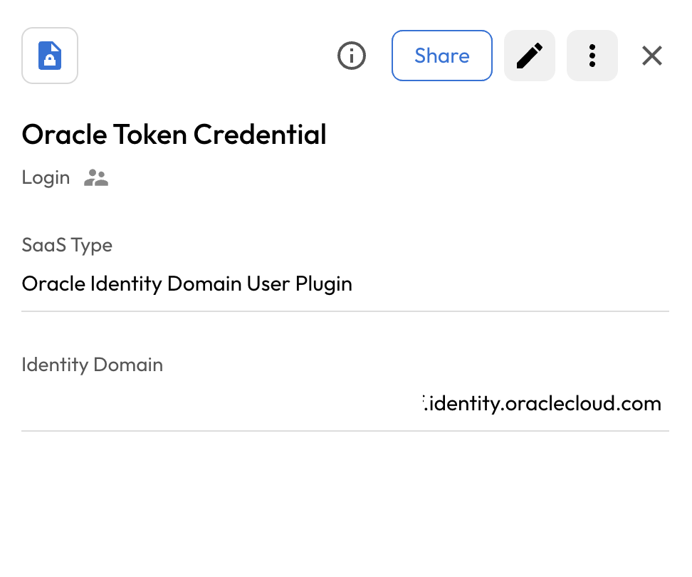
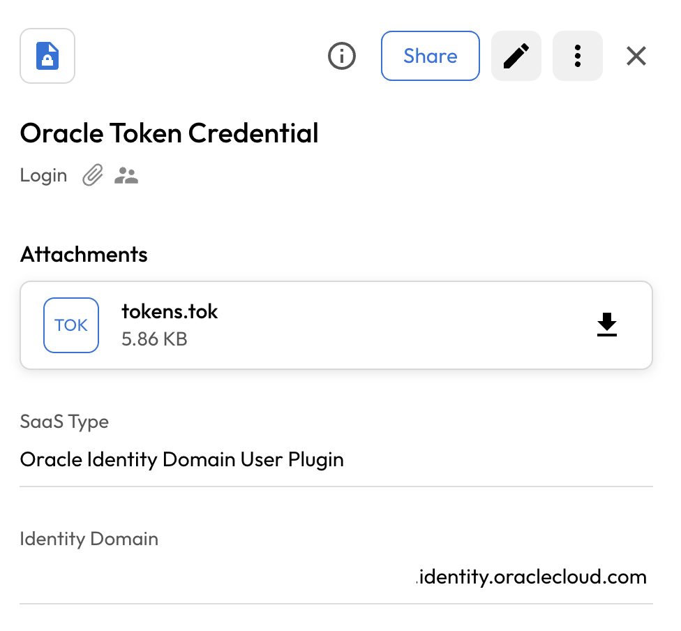
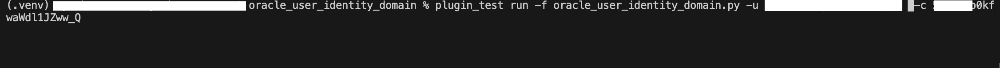
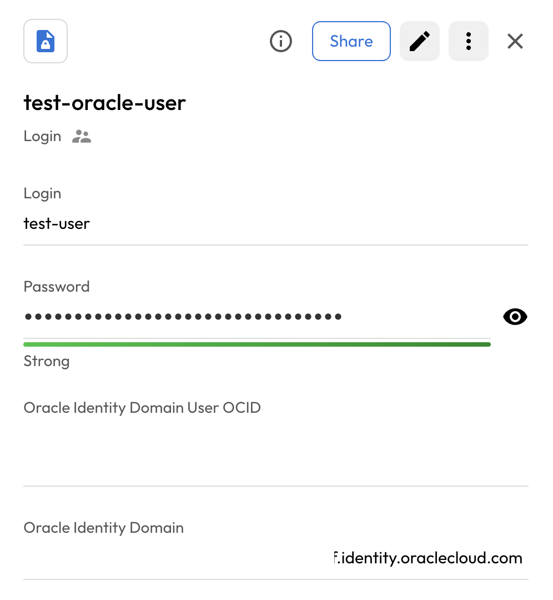

# User Guide | Keeper Security / Oracle Identity-Domain Cloud 

## Overview
This user guide covers the post-rotation script for the Keeper Security / Oracle Identity-Domain integration. Details on how to use the post-rotation script are available at the [_Keeper Security online documentation_](https://github.com/Keeper-Security/discovery-and-rotation-saas-dev) and will not be repeated here.

## OCID
Oracle Identity Domains are a core component of Oracle Cloud Infrastructure (OCI) Identity and Access Management (IAM), serving as a container for managing users, roles, and security settings within a specific cloud environment.

## Pre-requisites
In order to use the post-rotation script, you will need the following prerequisites:

**1. Requests Library:** Ensure that the requests library is installed in your Python environment. This library is necessary for making HTTP requests to update user's password in oracle identity domain.

**2. Requests library installation:** The Requests library allows you to send HTTP requests easily. Activate a Python virtual environment in your Keeper Gateway environment and install the library using the following command:

    pip install requests

## Steps to Test Oracle Identity Domain Cloud Password Rotation
### 1. Setup in Oracle Identity Domain Cloud
- Go to the [Oracle Cloud](https://www.oracle.com/cloud/sign-in.html?redirect_uri=https%3A%2F%2Fcloud.oracle.com%2F)
- Enter the Cloud Account Name

    

- Choose the appropriate Identity Domain

    

- Login with the Oracle Credentials.
- Click on the profile icon, then select **Identity Domain: name_of_selected_domain** from the menu.
- Navigate to the **Administrator** tab and assign the **User Administrator** role to the selected user.

    

- Go to the **My Profile** tab and select the **Token and Keys** section and download the **Invokes identity domain APIs** from the bottom of the page.

### 2. Create User in Oracle Identity Domain Cloud
- To create a user, go to the **Domains** section, choose your domain, and then click on the **User Management** tab.

    

- Click the **Create** button and enter the required user details.
- Copy the username — it will be needed later when adding the user as a PAM (Privileged Access Management) record.

> **Note:** After creating the user, ensure they log in successfully at least once. This step is required to prevent the system from prompting a password change on first login.

- For more details [Reference for API Documentation](https://docs.oracle.com/en/cloud/paas/iam-domains-rest-api/op-admin-v1-users-id-patch.html)

## 3. Create a PAM User Record 
- Create a record of type **PAM User** inside the Keeper Vault.
- Enter the username copied from the previous step.
- This will create a record of type **PAM User**. 

    

### 4. Create a login record and add token attachment
Once you have your pre-requisites ready, make sure you cover the following:

- Execute the following command in activated virtual environment.

      plugin_test config -f <oracle_user_python_script> -t "Oracle Token Credential" -s <shared_uid>

      Required: Identity Domain
      Identity Domain for the Oracle Identity Domain User Plugin ended with ".identity.oraclecloud.com"
      Enter Value : >

      - Identity Domain: Enter the Identity domain. 
      - The identity domain can be found in the **details** section of the Domain page.

    

- This action will create a SaaS-type record inside the Keeper Vault.

    

- Upload the downloaded access token as an attachment to the newly created user record.

    

- Copy the UUID generated upon successful execution of the command.
> **Note:** Ensure the attachment is named exactly as `tokens.tok`.

## 5. Executing the script for rotating password
Once you have your pre-requisites ready, make sure you cover the following:

- Execute the following command in activated virtual environment.

      plugin_test run -f <oracle_user_python_script> -u <uid_created_pam_user_record> -c <copied_uid_of_oracle_token_credential_authentication_record>

    

- The above command rotate the oracle identity domain user's password.

    

- Keeper Vault PAM User Record is updated.

