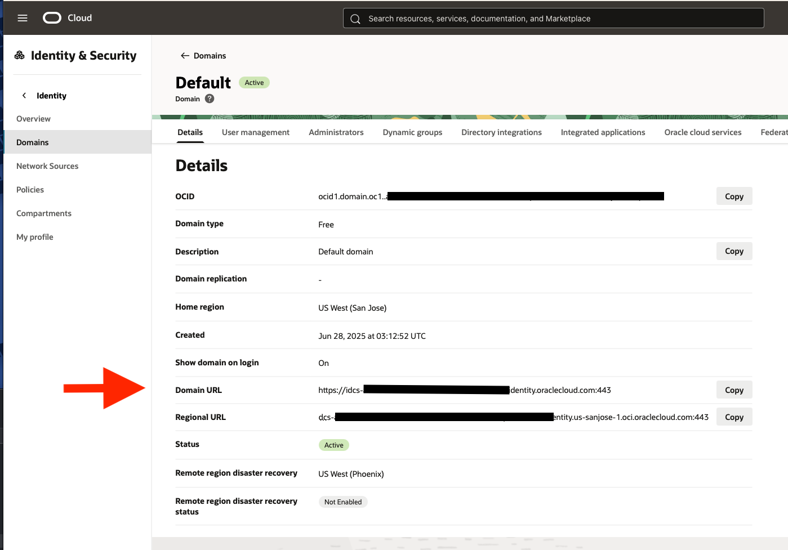
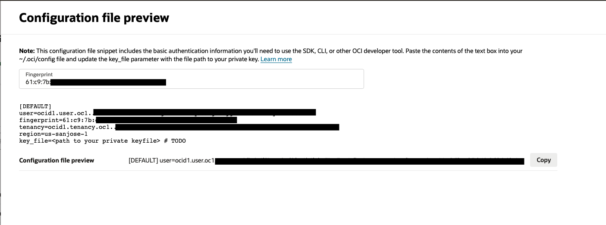

# User Guide | Keeper Security / Oracle Identity Domain User

## Overview

This user guide covers the SaaS plugin for the Keeper Security / Oracle Domain Identity User integration. 

## Oracle Domain Identity User
[Oracle Domain Identity User](https://docs.oracle.com/en-us/iaas/Content/identity-domains/identity-domains.htm) are
  the IAM users of Oracle's Domain Identity.

### Required Setup/Information

The SaaS configuration requires values from your Oracle Domain Identity account.
In your OCI account, select the Identity Domain you wish to use with this plugin.

#### Domain Details

Select the **Details** tab, if not selected.
On the **Detail** page only the value for **Domain URL** is needed.



* **Domain URL** - The **Domain URL** on the detail page is the **Domain URL** field in the SaaS Configuration.

#### API keys

To get the API keys information, select the **User management** tab.
And in the **Users** section, select the user you wish to be used for to administrate the users.
This user should have permissions to change other user's passwords.
Click on the **API keys** tab.
You can either create a new API key or use an existing if you have the private key PEM.

If an API key does not currently exist, click on the **Add API key** button.
The next step is to click the **Download private key** button.
This will create a private key PEM file and download it to your machine.
After the private key PEM file has downloaded, the **Add** button on the bottom of the page will be enabled.
Click the **Add** button and it will display the **Configuration file preview**.

If using an existing API key, click the three dots, on the right side of the screen, for the key and click **View Configuration file**.



* **user** - `user` in the preview is the **Admin OCID** field. 
  It should start with `ocid#.user.oc#..`
* **fingerprint** - `fingerprint` in the preview is the **Public Key Fingerprint** field. 
  It should be pattern like `xx:xx:xx:xx:xx:xx:xx:xx:xx:xx:xx:xx:xx:xx:xx:xx`.
* **tenancy** - `tenancy` in the preview is the **Tenancy OCID** field. 
  It should start with `ocid#.tenancy.oc#..`
* **region** - `region` in the preview is the **Home Region** field. 

The SaaS configuration field is **Private Key Content**. 
This is the content of private key PEM file was downloaded when creating the new API key. 
Copy the content of the file and paste it into the **Private Key Content** field.

## Commander

### Create SaaS Configuration Record

In Commander, the `pam action saas config` command is used to create a SaaS Configuration record.
This record currently is a **Login** record where the custom fields are used for settings.

First check if the **Oracle Identity Domain User** plugin is available.
Using the `pam action saas config` command with `--list` flag will show all plugins available to your Keeper Gateway.

```
My Vault> pam action saas config -g <GATEWAY UID> --list

Available SaaS Plugins
 * Custom One (Custom) - Plugin has no description.
 * Oracle Identity Domain User (Catalog) - Change a user password in Oracle Identity Domain.
 ...
 * Snowflake (Builtin) - For Snowflake, rotate the password for a user.
```

If **Oracle Identity Domain User** is in the list, you can use this plugin.

Before creating the SaaS Configuration Record, you can get a preview of fields you will be prompted for values.
Next use `pam action saas config`, with `--info` flag and `-p "Oracle Identity Domain User"`, to get information about this plugin.
```
My Vault> pam action saas config -g <GATEWAY> -p "Oracle Identity Domain User" --info

Oracle Identity Domain User
  Type: catalog
  Author: Keeper Security (pam@keepersecurity.com)
  Summary: Change a user password in Oracle Identity Domain.
  Documents: https://github.com/Keeper-Security/discovery-and-rotation-saas-dev/blob/main/integrations/oracle_user_identity_domain/README.md

  Fields
   * Required: Domain URL - Domain URL. Found in Identity & Security -> Domains -> Domain.
   * Required: Admin OCID - The "user" part of the OCI config. Starts with "ocid1.user..."
   * Required: Public Key Fingerprint - The "fingerprint" part of the OCI config. Looks like "XX:XX:XX....."
   * Required: Private Key Content - The content of the Private Key PEM file.
   * Required: Tenancy OCID - The "tenancy" part of the OCI config. Looks like "ocid1.tenancy...".
   * Required: Home Region - The "region" part of the OCI config. Looks like "us-sanjose-1"
```

Next use `pam action saas config`, with `--create` flag and `-p "Oracle Identity Domain User"`, to create a SaaS Configuration Record.
You will be prompted to enter values for the fields.
For the **Private Key Content** field, enter the path to the private key PEM file.
If you cut-and-paste the key, the new lines will break the following field inputs.


```
My Vault> pam action saas config -g <GATEWAY UID> -p "Oracle Identity Domain User" --create

Domain URL
Description: Domain URL. Found in Identity & Security -> Domains -> Domain.
Field is required.
Enter value > https://idcs-XXXXXX.identity.oraclecloud.com:443

Admin OCID
Description: The "user" part of the OCI config. Starts with "ocid1.user..."
Field is required.
Enter value > ocid1.user.oc1..XXXXXX

Public Key Fingerprint
Description: The "fingerprint" part of the OCI config. Looks like "XX:XX:XX....."
Field is required.
Enter value > xx:xx:xx:xx:xx:xx:xx:xx:xx:xx:xx:xx:xx:xx:xx:xx

Private Key Content
Description: The content of the Private Key PEM file..
Field is required.
Enter a file path to load value from file.
Enter value > /path/to/admin@exmaple.com-2025-07-04T21_34_28.765Z.pem

Tenancy OCID
Description: The "tenancy" part of the OCI config. Looks like "ocid1.tenancy..."
Field is required.
Enter value > ocid1.tenancy.oc1..XXXXXX

Home Region
Description: The "region" part of the OCI config. Looks like "us-sanjose-1"
Field is required.
Enter value > us-ashburn-1

Title for the SaaS configuration record> Oracle Identity Domain User Config

Created SaaS configuration record with UID of XXXXXXXXXXXXXX

Assign this configuration to a user using the following command.
  pam action saas add -c XXXXXXXXXXXXXX -u <PAM User Record UID>
  See pam action saas add --help for more information.
```

Once you have a SaaS Configuration record, it can be assigned to a user using the `pam action saas add` command.

```
My Vault> pam action saas add -c XXXXXXXXXXXXXX -u YYYYYYYYYYYY

Added Oracle Identity Domain User to the user record.
```

Now when the user's password is rotated, the user's password in Oracle Identity Domain User will also be updated.

## Keeper Vault

Currently Keeper Vault does not support SaaS management.


