# User Guide | Keeper Security / ServiceNow

## Overview
This user guide covers the post-rotation script for the Keeper Security / ServiceNow integration. Details on how to use the post-rotation script are available at the [_Keeper Security online documentation_](https://github.com/Keeper-Security/discovery-and-rotation-saas-dev) and will not be repeated here.

## ServiceNow
ServiceNow is a cloud-based platform as a service (PaaS) that provides a wide range of solutions for automating and managing various enterprise workflows. It focuses on streamlining processes, improving efficiency, and enhancing the user experience through automation and digital transformation.

## Pre-requisites
In order to use the post-rotation script, you will need the following prerequisites:

**1. Requests Library:** Ensure that the requests library is installed in your Python environment. This library is necessary for making HTTP requests to Service-Now.

**2. Requests library installation:** The Requests library allows you to send HTTP requests easily. Activate a Python virtual environment in your Keeper Gateway environment and install the library using the following command:

    pip install requests

## Steps to Test ServiceNow 
### 1. Login to Service Now Developer Page:
- Visit the [ServiceNow Developer Portal](https://signon.service-now.com/x_snc_sso_auth.do?pageId=login).

    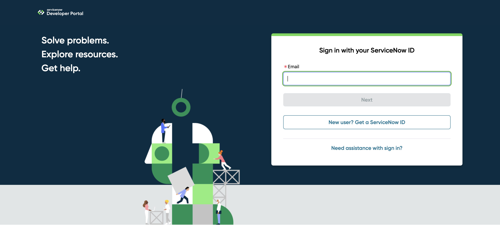
    
- Sign in using your ServiceNow credentials.
- **Start Building** your ServiceNow developer instance.

    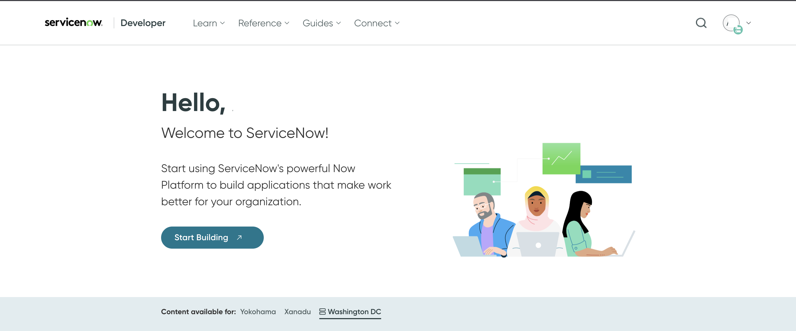

- Typically, launching the dev instance logs you in automatically. If not, follow the steps below to log in manually.
- Click the profile icon and select **Manage Instance Password**.

    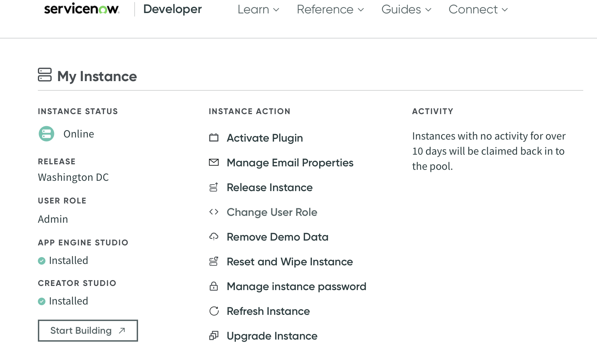

- In the **Manage Instance Password** section, you’ll find your **instance UR**L, **admin username**, and **password**.

    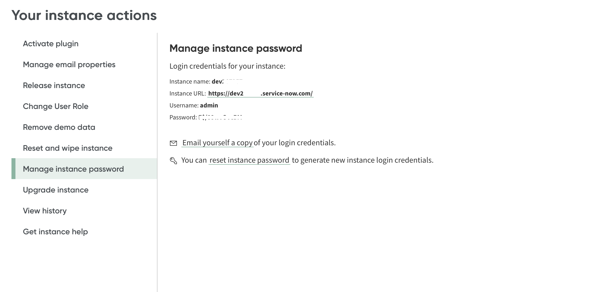

- Use these credentials to log into your developer instance.

### 2. Create a User in ServiceNow
- Navigate to **All** > **System Security** > **Users and Groups**, then select the **Users** tab.

    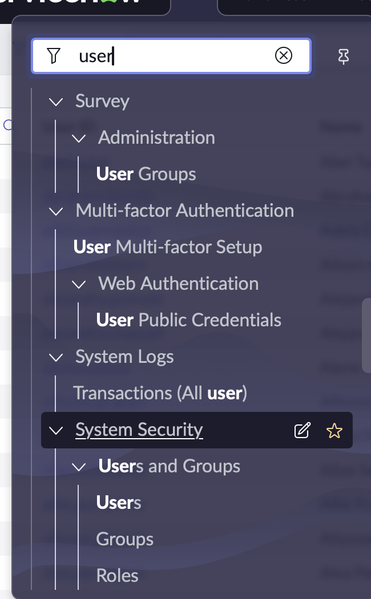

- To create a new user, click **New** and fill in the required details.

    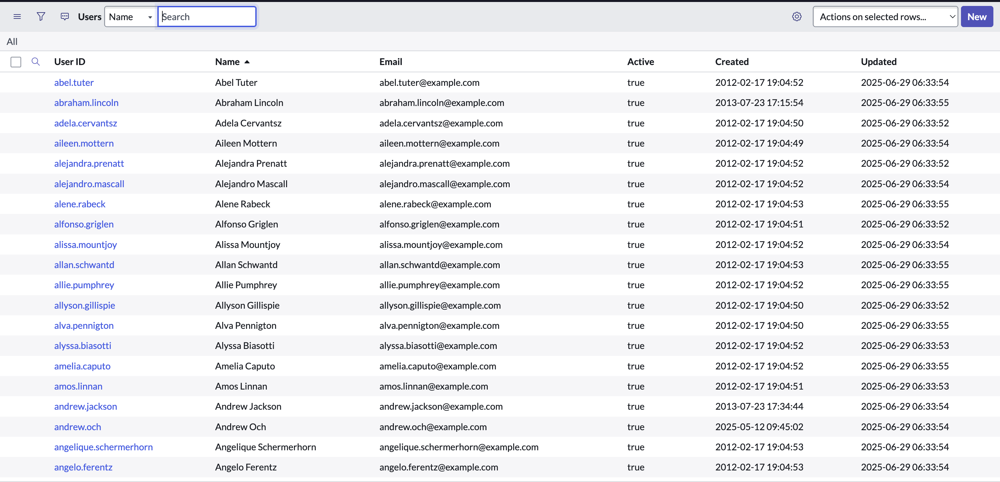

- Copy the username.
- Click **Submit** to add the user.

    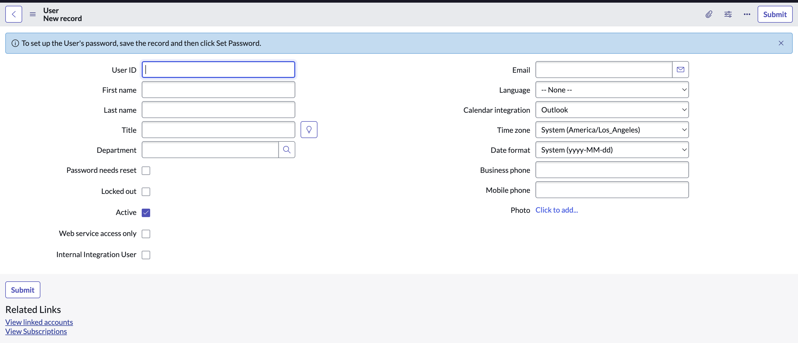

- To set a password for the new user, select the user and click **Set Password**.
- If the user needs to reset their password after login, enable the **Password needs reset** option.

## 3. Create a PAM User Record 
- Create a record of type **PAM User** inside the Keeper Vault.
- Enter the username copied from the previous step.
- This will create a record of type **PAM User**.

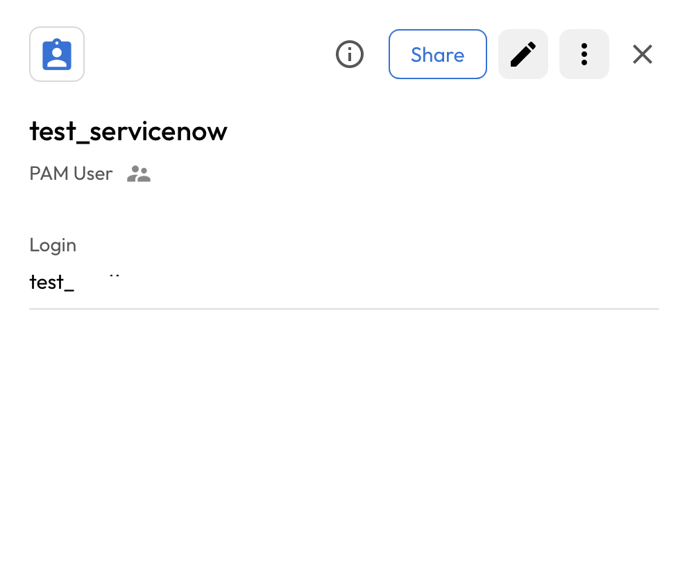

### 4. Create a login record 
Once you have your pre-requisites ready, make sure you cover the following:

- Execute the following command in activated virtual environment.

      plugin_test config -f <servicenow_user_python_script> -t "Service Now Instance Admin Details" -s <shared_uid>

      Required: Admin Username
      ServiceNow administrator username.
      Enter Value : >

      Required: Admin Password
      Password for the ServiceNow administrator.
      Enter Value : >

      Required: ServiceNow Instance URL
      Base URL of the ServiceNow instance (e.g. https://<instance>.service-now.com).
      Enter Value : >

      - Admin Username: Admin UserName of ServiceNow instance.
      - Admin Password: Admin Password of ServiceNow instance
      - ServiceNow Instance URL: Service Now Instance URL

- Copy the UUID generated upon successful execution of the command.

    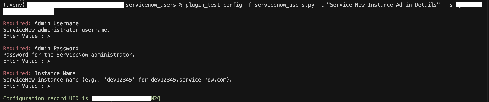

- This action will create a Record inside the Keeper Vault.

    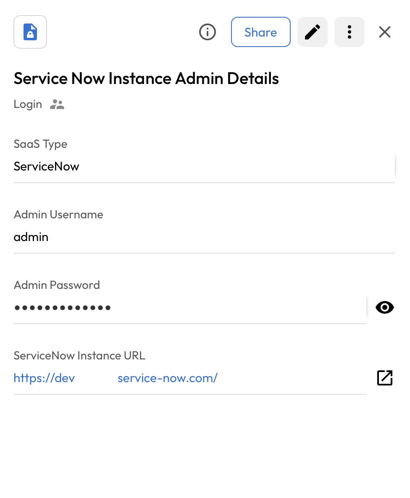

## 5. Executing the script for rotating password
Once you have your pre-requisites ready, make sure you cover the following:

- Execute the following command in activated virtual environment.
      
      plugin_test run -f <servicenow_user_python_script> -u <uid_created_pam_user_record> -c <copied_uid_of_servicenow_users_authentication_record>

- The above command rotate the ServiceNow user's password.

    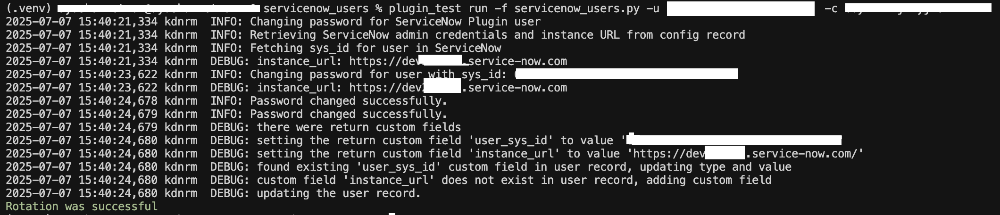

- Keeper Vault PAM User Record is updated.

    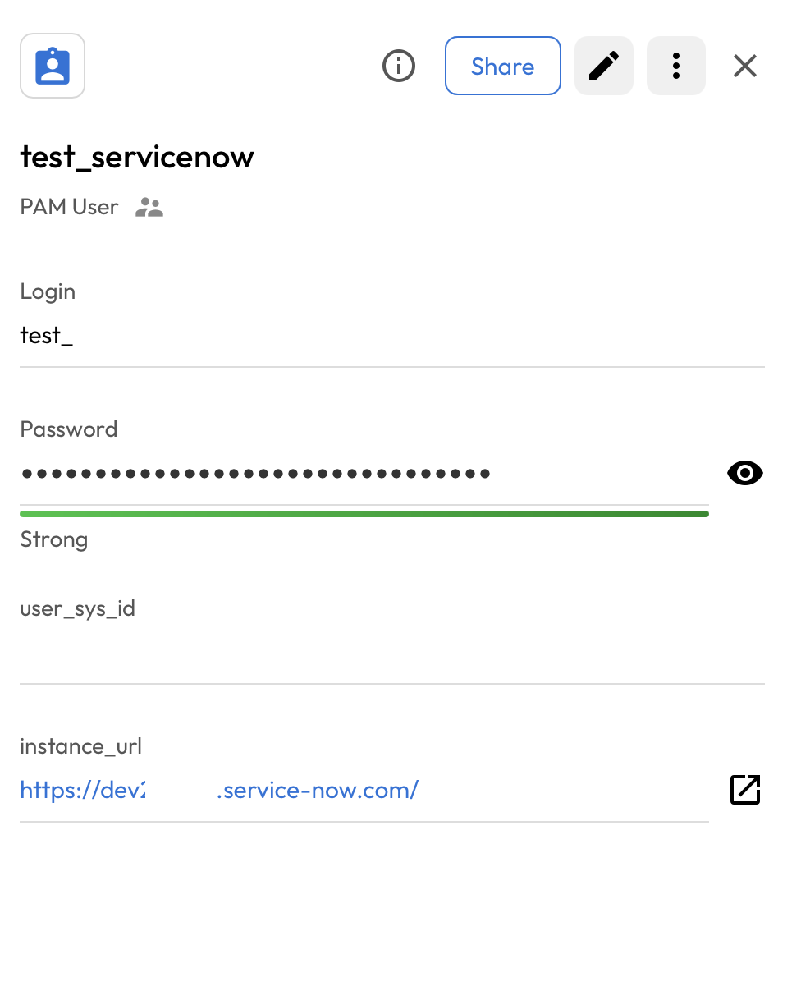