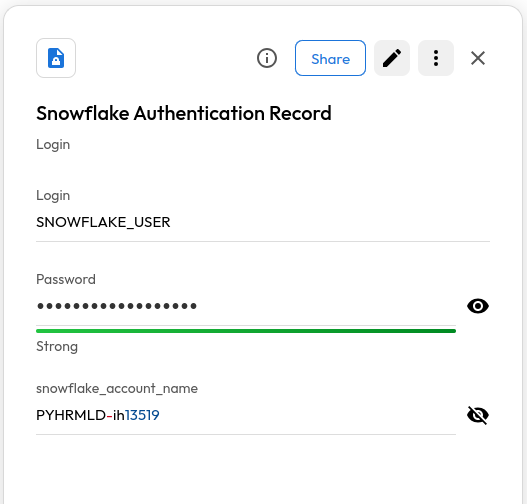
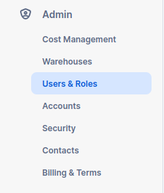
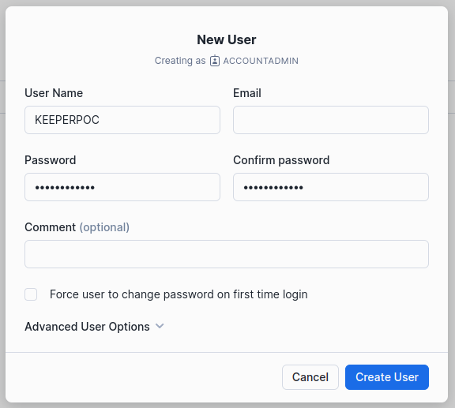
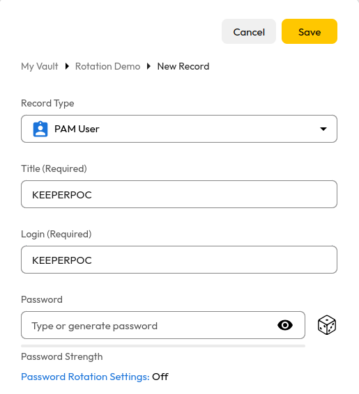
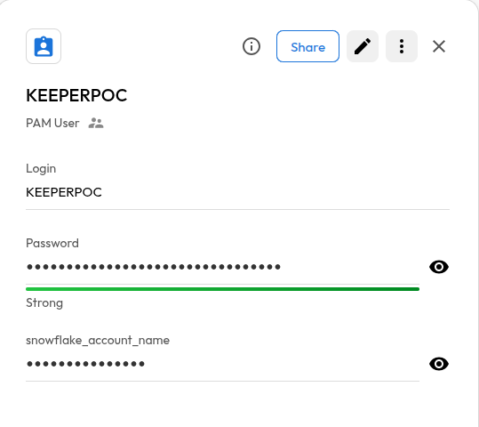

# User Guide | Keeper Security / Snowflake 

## Overview

This user guide covers the post-rotation script for the Keeper Security / Snowflake integration. Details on how to use the post-rotation script are available at the [_Keeper Security online documentation_](https://github.com/Keeper-Security/discovery-and-rotation-saas-dev) and will not be repeated here.

## Pre-requisites

In order to use the post-rotation script, you will need the following prerequisites:

**1. snowflake.connector Library:** Ensure that the snowflake connector library is installed in your python virtual environment.

### Snowflake connector installation

The Snowflake Connector for Python provides an interface for developing Python applications that can connect to Snowflake and perform all standard operations. You should have snowflake connector library installed in your python environment to successfully run the post-rotation script. To install snowflake connector, activate a Python virtual environment in your environment and run the following command:

    pip install snowflake-connector-python

## Steps to create Keeper security records and Snowflake user

### 1. Store Snowflake Admin Credentials

Store the Snowflake admin credentials in a Keeper Security record of type `Login` named as `Snowflake Authentication Record`. You will need this Keeper Security record name in order to run the post-rotation script.

### 2. Add custom field to Snowflake Authentication Record

- Add a custom field named `snowflake_account_name` to the Snowflake Authentication Record and set its value to account name of your snowflake account

    

### 3. Create a Snowflake User

- Login to your Snowflake account.
- From the left hand side menu, go to `Admin` -> `User & Roles`.

    
- Click on `Add User` button present at the top right.
- Add user details and uncheck the `Force user to change password on first time login`. Then click on `Create User`.

    

### 4. Create a New Rotation Record of type PAM User

- Create a New Rotation Record of type PAM User. Keep the title same as
the user name of the snowflake user we created previously.


### 5. Add details to the PAM User record

- Add the user name of the snowflake user in the `Login` field.
- Keep the `Password` field empty.

    


## Executing the script

Once you have your pre-requisites ready, make sure you cover the following:

1. Ensure that the post-rotation script references the Keeper Security record containing your Snowflake admin credentials.

Once this is done, attach the post-rotation script to a Keeper Security PAM user record using the Keeper Security [_documentation_](https://docs.keeper.io/en/v/secrets-manager/secrets-manager/password-rotation/post-rotation-scripts). When this record has its secrets rotated, the post-rotation script will run and update the password for given snowflake user.

- Please open a terminal with the virtual environment activated, and execute the following command.

```shell
plugin_test -f snowflake_password_rotation.py -u XXXX -c YYYY
```


- Update the `-u <PAM User Record UID>` and `-c <Snowflake Authentication Record UID>`  details. 

- The password has been rotated and updated with the newly generated one.
    
    