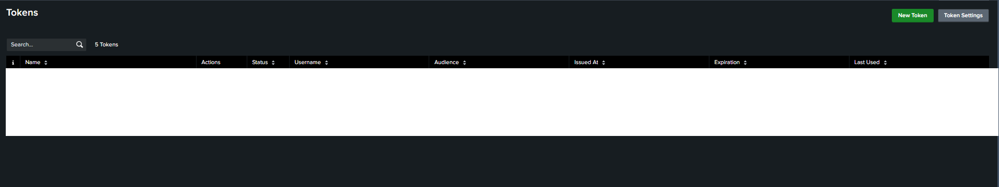
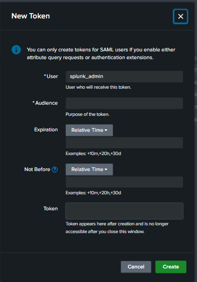
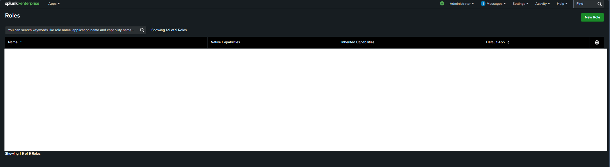
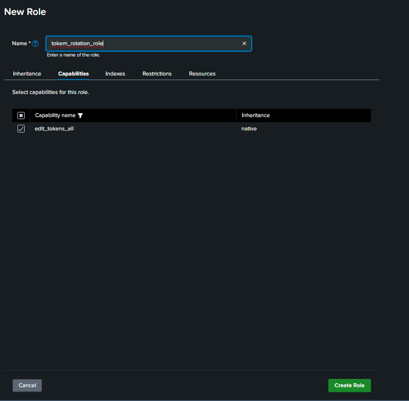
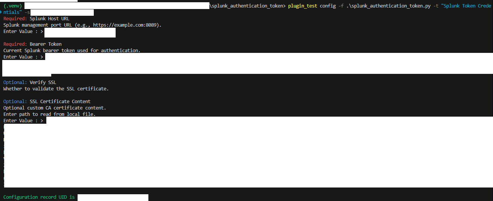
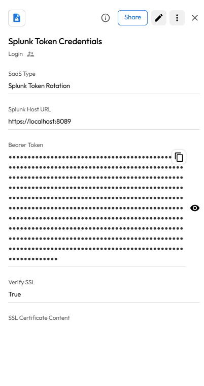
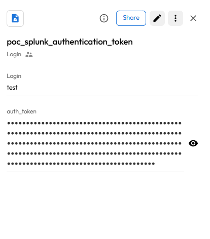
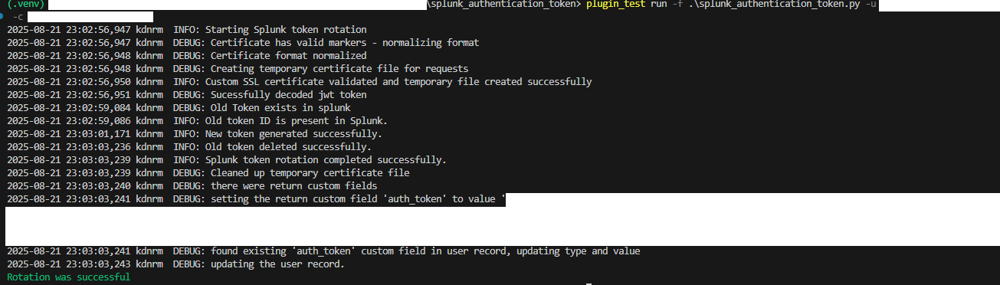
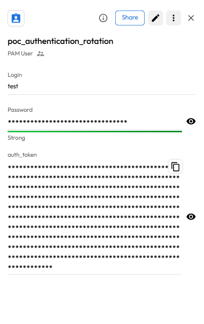

# User Guide | Keeper Security / Splunk Authentication Token
## Overview

This user guide covers the post-rotation script for the Keeper Security / Splunk Authentication Token integration.
Details on how to use the post-rotation script are available at the [Keeper Security online documentation](https://github.com/Keeper-Security/discovery-and-rotation-saas-dev) and will not be repeated here.

## Splunk

[Splunk](https://www.splunk.com/) is a software platform used to search, analyze, and visualize machine-generated big data.
It provides real-time operational intelligence by collecting, indexing, and correlating real-time data in a searchable repository.

For secure automation, Splunk supports authentication tokens that allow applications to authenticate without using username/password combinations.

## Pre-requisites

In order to use the post-rotation script, you will need the following prerequisites:

1. **Requests Library:** The plugin uses the requests library to interact with the Splunk REST API.
Ensure it's installed in your Python environment:

    ```bash
    pip install requests
    ```

## Steps to Test Splunk Authentication Token Plugin
### Set Up Splunk Environment
Creating an Authentication Token in Splunk
- Log in to the Splunk Web UI.
- Go to **Settings** > **Tokens** (or generate using REST API).

    

- Create a new authentication token for an admin or service user.

    

- Copy the token value securely. This token will be used in plugin configuration.

### Token User Role Configuration

The user associated with the token must have appropriate capabilities to perform role-based or user operations.
- Navigate to **Settings** > **Roles**.

    

- Assign the following capability to the token's user role:
- `edit_roles_all` – Required to edit roles and assign permissions to users.

    

- Click on **Create Role**.

## 2. SSL Certificate Configuration

**Security Note:** HTTPS is strongly recommended for production environments.

If your Splunk instance uses a custom SSL certificate:
- Obtain the CA certificate in .pem format.
- SSL verification will be enforced if a certificate is provided.
- You can either:
    - Recommended: Provide the certificate content in the "SSL Certificate Content" field.
    - Not Recommended: Set "Verify SSL" to "False" only for testing purposes (not secure).

## Plugin Configuration

Configure the plugin with the following required parameters:

- `Splunk Host URL:` The base URL to your Splunk management API (e.g., https://splunk.local:8089)
- `Authentication Token:` Token string used to authenticate API requests
- `Verify SSL:` Boolean toggle to enforce SSL certificate validation (True or False)
- `SSL Certificate Content:` Optional CA certificate content (PEM format) if using custom certs

## Testing the Plugin
### 1. Create Configuration Record

Use the following command to create a configuration record in Keeper Vault:
```bash 
plugin_test config -f splunk_authentication.py -t "Splunk Token Configuration Record" -s "shared_folder_uid"

Required: Splunk Host URL
Splunk management port URL (e.g., https://localhost:8089).
Enter Value : > 

Required: Authentication Token
The Splunk authentication token used to authenticate requests.
Enter Value : > 

Optional: Verify SSL
Verify that the SSL certificate is valid: 'True' will validate certificates, 'False' will allow self-signed certificates.
Enter Value (default: True): > 

Optional: SSL Certificate Content
CA certificate content (.pem format). Only required when 'Verify SSL' is set to 'True' and using custom certificates.
Enter path to read from local file.
Enter Value : > 
```



- This will create a configuration record inside Keeper Vault:

    

### 2. Create PAM User Record
- Inside Keeper Vault, create a new record of type PAM User.
- Enter the login field as `test`, as there is no use it so we can use the mock value.
- Add the rotation token in the custom field for the label as `auth_token`.

    

## Executing the Script for Rotating Token

Once configuration and PAM records are ready, run the following command:
```bash
plugin_test run -f splunk_authentication.py -u <pam_user_record_uid> -c <config_record_uid>
```



- This command performs the token-based authentication and rotates or validates credentials as needed.
- The Keeper Vault record is updated with any changes such as a newly generated token.

    

## Troubleshooting
### 1. Cannot Connect to Splunk
- Check URL: Ensure the host includes https:// and correct port (default: 8089).
- Network Access: Verify Keeper Gateway can reach the Splunk instance.
- Service Status: Ensure Splunk is running and responding to API requests.

### 2. SSL Certificate Issues
- Certificate Format: Must be PEM, with correct BEGIN/END markers.
- Certificate Chain: Full chain must be present for verification.
- Expired Certificate: Ensure it’s valid and trusted.

### 3. Token Authentication Failures
- Token Validity: Ensure the token hasn't expired or been revoked.
- User Permissions: The token's user must have the edit_roles_all capability.
- Token Scope: Token must allow access to necessary endpoints.

### 4. User Management Issues
- User Exists: Target Splunk user must exist.
- User Enabled: Ensure the account is active and not locked.
- Policy Compliance: Any updated password or token must meet Splunk’s security policy.

For more information, refer to the [Splunk REST API Authentication Tokens documentation](https://docs.splunk.com/Documentation/Splunk/latest/RESTREF/RESTauthentication#authentication.2Ftokens)

For more information, refer to [Splunk authentication token documentation](https://docs.splunk.com/Documentation/Splunk/9.4.2/Security/CreateAuthTokens#Use.2C_manage.2C_and_delete_tokens)