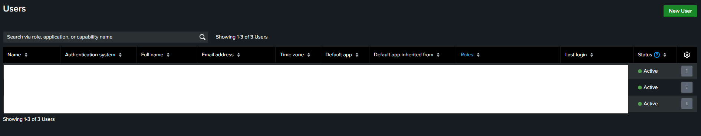
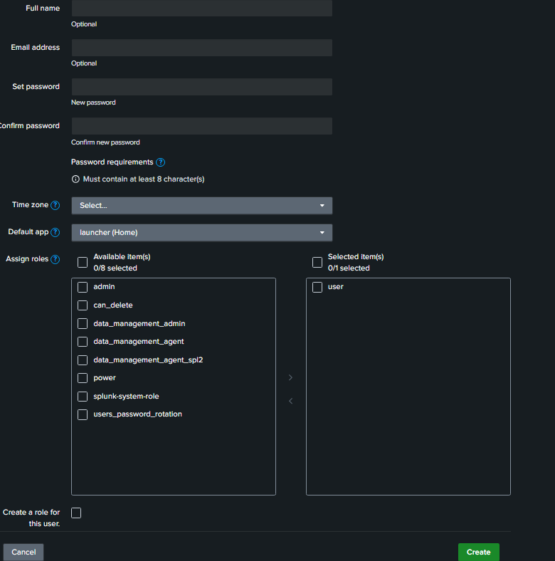
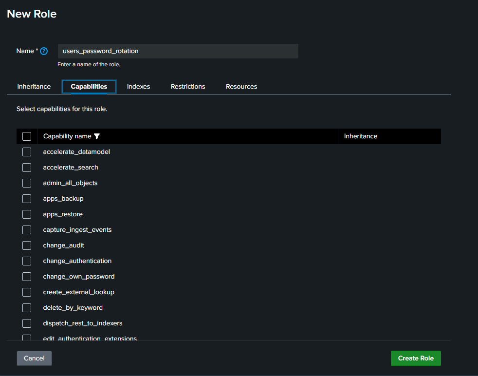
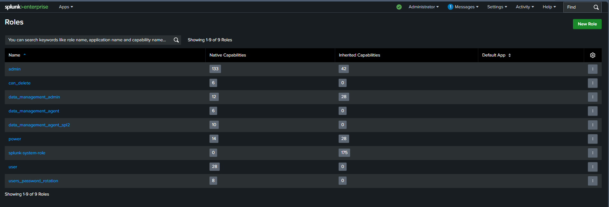
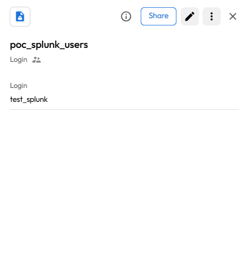
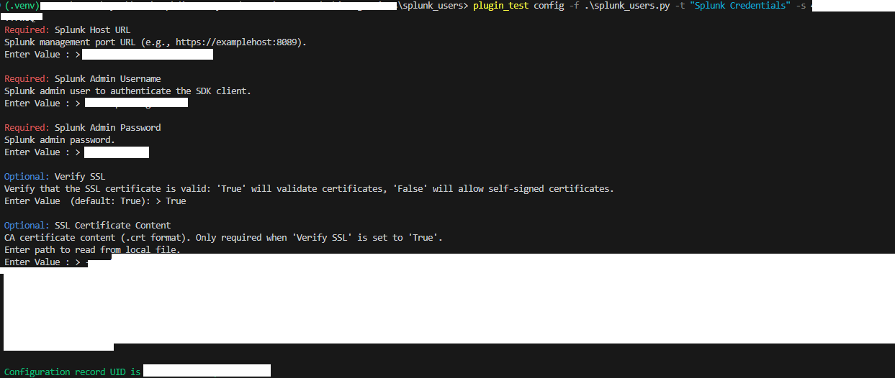
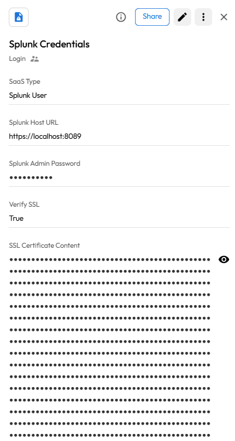
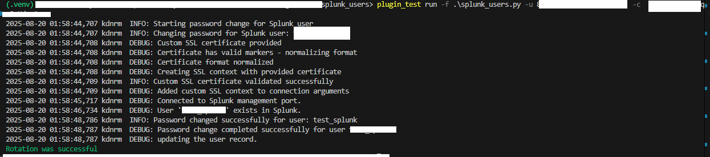
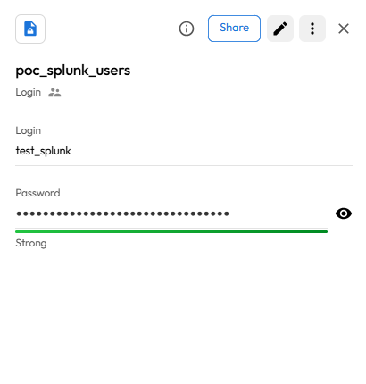

# User Guide | Keeper Security / Splunk User

## Overview

This user guide covers the post-rotation script for the Keeper Security / Splunk User integration. 
Details on how to use the post-rotation script are available at the 
  [_Keeper Security online documentation_](https://github.com/Keeper-Security/discovery-and-rotation-saas-dev) and 
  will not be repeated here.

## Splunk
[Splunk](https://www.splunk.com/) is a software platform used to search, analyze, and visualize machine-generated big data. 
It provides real-time operational intelligence by collecting, indexing, and correlating real-time data in a searchable repository.
Splunk's user management features allow for authentication and role-based access control to protect your data and environment.

## Pre-requisites
In order to use the post-rotation script, you will need the following prerequisites:

**1. Splunk SDK Library:** Ensure that the Splunk SDK for Python is installed in your Python environment. This library is necessary for making API requests to Splunk instances.

**2. Splunk SDK installation:** The Splunk SDK allows you to interact with Splunk instances easily. Activate a Python virtual environment in your Keeper Gateway environment and install the library using the following command:

    pip install splunk-sdk 

## Steps to Test Splunk User Plugin

### 1. Set Up Splunk Environment

#### Creating a User in Splunk
- To create a user in Splunk, follow these steps:
- Log in to the Splunk Web interface and navigate to **Settings** > **Users**.

    

- Click on **New User** and fill in the required details such as:
    - **Username**
    - **Full Name**
    - **Email Address**
    - **Password**

         

- (Optional) Assign one or more roles to the user if needed.
- Click **Create** to finalize the user creation.


#### Role Configuration:
To perform user management operations such as password rotation, the admin user needs appropriate permissions.
- Under **Settings** > **Roles**, ensure your admin user has the following capabilities:

    

- Under the table select **Capabilities**, add the below capabilities:
    - `edit_user` - Required to modify user accounts
    - `list_users` - Required to verify user existence
    - `edit_roles` - Required to modify roles

    

#### Admin User Setup:
- Create or use an existing admin user account that will be used for password rotation operations.
- This admin user should have sufficient privileges to modify other user accounts.
- Note down the admin username and password as these will be required in the plugin configuration.

    

### 2. SSL Certificate (Optional)
If your Splunk instance uses a custom SSL certificate or self-signed certificate:
- Obtain the CA certificate file (.crt or .pem format)
- You can either:
  - Set "Verify SSL" to "False" to disable SSL verification.
  - Provide the custom certificate content in the "SSL Certificate Content" field

### 3. Plugin Configuration
- Configure the plugin with the following required parameters:
  - **Splunk Host URL**: The URL to your Splunk management port (typically https://your-splunk-host:8089)
  - **Admin Username**: Username of the admin account that can modify users
  - **Admin Password**: Password of the admin account
  - **Verify SSL**: Whether to verify SSL certificates (True/False)
  - **SSL Certificate Content**: Custom SSL certificate content (optional)

## Testing the Plugin

### 1. Create Configuration Record
- Execute the following command to create config record in keeper vault:
    ```bash
    plugin_test config -f splunk_users.py -t "Splunk Configuration Record" -s "shared_folder_uid"

    Required: Splunk Host URL
    Splunk management port URL (e.g., https://localhost:8089).
    Enter Value : > 

    Required: Splunk Admin Username
    Username for the Splunk admin account that can modify users.
    Enter Value : > 

    Required: Splunk Admin Password
    Password for the Splunk admin account.
    Enter Value : > 

    Optional: Verify SSL
    Verify that the SSL certificate is valid: 'True' will validate certificates, 'False' will allow self-signed certificates.
    Enter Value  (default: True): > 

    Optional: SSL Certificate Content
    CA certificate content (.crt format). Only required when 'Verify SSL' is set to 'True' and using custom certificates.
    Enter path to read from local file.
    Enter Value : > 


    - Splunk Host URL : URL of Splunk management port
    - Admin Username : Username of admin account
    - Admin Password : Password of admin account  
    - Verify SSL : Boolean value
    - SSL Certificate Content : (.crt) file content
    ```

    

- This will create a config record in keeper vault

    

### 2. Create and Add Details in New Rotation Record of type PAM User:
- Create a record of type **PAM User** inside the Keeper Vault.
- Enter the username of the Splunk user whose password you want to rotate.
- This will create a record of type **PAM User**. 

    


## Executing the Script for Rotating Password
Once you have your pre-requisites ready, make sure you cover the following:

- Execute the following command in your activated virtual environment:

    ```bash
    plugin_test run -f splunk_users.py -u <pam_user_record_uid> -c <config_record_uid>
    ```

- The above command rotates the Splunk User Password

    

- Keeper Vault PAM User Record is updated with the new password.

    


For more information, refer to the [Splunk SDK for Python documentation](https://dev.splunk.com/enterprise/docs/python/sdk-python/).

For more information, refer to the [Splunk Rest API for Users Password Rotation](https://docs.splunk.com/Documentation/Splunk/9.4.2/RESTREF/RESTaccess#authorization.2Ftokens.2F.7Bname.7D)